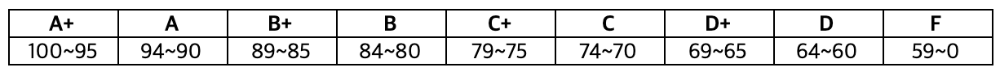
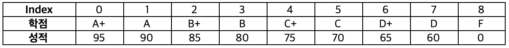

# **부스트코스 코칭스터디(CS50)**

네이버 커넥트재단의 부스트코스 코칭스터디 과정을 이행하며 얻은 지식에 대해 정리합니다.

[1. 컴퓨팅 사고](#1-컴퓨팅-사고) / [1장 과제](#1장-과제)  
[2. C 언어](#2-C-언어) / [2장 과제](#2장-과제)  
[3. 배열](#3-배열) / [3장 과제](#3장-과제)  
[4. 알고리즘](#4-알고리즘) / [4장 과제](#4장-과제)  
[5. 메모리](#5-메모리) / [5장 과제](#5장-과제)  
[6. 자료구조](#6-자료구조) / [6장 과제](#6장-과제)  


### **1. 컴퓨팅 사고**

**컴퓨터 사고란?**
- 문제를 해결하기 위한 접근 방법의 하나(문제를 정복해나가는 방법)
- 컴퓨팅 사고의 과정 (분해 - 패턴 인식 - 추상화 - 알고리즘 설계)
	1. 분해(Decomposition)
		- 문제를 나누어 확인하거나, 어떻게 문제를 나누면 될 지 생각해내는 과정
	2. 패턴 인식(Pattern Recognition)
		- 어떠한 예측(통찰)을 위해 각각의 조각의 유사한 점과 차이점을 찾아내는 과정
	3. 추상화(Abstraction)
		- 패턴들을 만들어낸 원리를 찾아내는 과정
	4. 알고리즘 설계(Algorithm design)
		- 유사한 문제들을 해결하기 위한 절차적인 명령(과정)을 만드는 것

**What's Computer Science?**
- It's just the process of solving problem.  


**비트(bit)** : binary digit의 줄임말로 컴퓨터의 기본 측정 단위	
		
**데이터 크기 별 표현**  
  


**ASCII Code**
- American Standard Code for Information Interchange 의 약자
- 각 문자를 7bits로 표현하여 128개(2^7)의 문자 표현 가능 
- 영어와 숫자, 몇가지 특수기호로 한정되어 있음
출처 : [네이버 지식백과(컴퓨터 개론)](https://terms.naver.com/entry.nhn?docId=2270339&cid=51173&categoryId=51173)  

**Unicode**
- 각 나라의 언어를 모두 표현하기 위해 나온 코드 체계
- 언어와 상관없이 모든 문자를 16bits로 표현하여 65,536자를 표현 가능
출처 : [네이버 지식백과(컴퓨터 개론)](https://terms.naver.com/entry.nhn?docId=2270340&cid=51173&categoryId=51173)

**Algorithm**
- It's just step by step instruction for solving some problem
- 입력(input)에서 받은 자료를 출력(output)형태로 만드는 처리 과정
- 입력값을 출력값의 형태로 바꾸기 위해 수행되어야 하는 **명령 규칙들의 순서적 나열**
- 알고리즘 평가 시 **정확도**도 중요하나, 작업 완료까지의 **효율성**도 중요하다.

### **1장 과제**

**개인 미션**

1. 아래 준비물이 준비되어있다는 가정 하에, 3살짜리 아이라도 이해하고 실행할 수 있도록 라면 끓이는 방법을 의사코드(Pseudo code)로 표현해봅시다. 자신만의 라면끓이는 노하우가 있다면 꼭 공유해주세요!  
 * 준비물 : 라면, 건더기스프, 양념스프, 수도꼭지, 라면냄비, 가스레인지, 젓가락, 달걀, 기타 자신만의 노하우가 담긴 재료 혹은 도구

	1. 라면냄비를 집어든다.
	2. 수도꼭지를 돌려 물이 나오게 한다.
	3. 라면냄비에 물 550ml(2컵과 3/4컵)를 받는다.
	4. 라면냄비를 가스레인지 위에 올려 놓는다.
	5. 가스레인지에 불을 켠다.
	6. 만약, 물이 끓는다면,
	7.	라면, 건더기스프, 양념스프를 넣는다.
	8. 그게 아니고 물이 안 끓는다면 
	9.	6번으로 돌아간다.
	10. 면이 익을 때 까지,
	11.	젓가락으로 면을 들어 바람을 쐬어 준다.
	12. 계란을 넣어 준다
	14. 젓가락으로 계란을 풀어 익혀준다.
	15. 상을 차리고 맛있게 먹는다. 


2. 스크래치를 활용하여 간단한 프로그램을 만들어봅시다. 프로그램의 형태와 입력, 출력 결과 모두 아무런 제약이 없습니다. 상상의 나래를 펼쳐보세요! (https://scratch.mit.edu/)

**팀 미션**

1. 컴퓨터는 왜 사람이 사용하는 수 체계와 다른 2진수를 사용하게 되었는지, 그리고 왜 기술이 진보한 지금까지도 2진수를 사용하고 있을지 조사와 논의를 통해 정리해봅시다.
* tip : 정확한 답이 있는 것이 아닙니다. 논의와 검색을 통해 근거있는 이유를 주장해봅시다.  

	- 강의를 토대로 이야기 해본다면, 이는 전기와 관련이 깊을 것이다. 0과 1로 표현되는 2진수 체계는 전원의 켜짐과 꺼짐만이 표현되는 전기와 많이
	닯아 있다. 이를 이용해 사람들은 모스부호와 같이 점과 선을 만들어 보내며 언어를 표현할 수 있다는 것을 알았을 것이고, 더 나아가 언어를 넘어
	수식을 표현하였을 것이다. 여기에 반도체의 등장과 IC(집적회로)의 성능 발전에 따라 그 속도가 빨라지면서 지금의 컴퓨터가 되었을 것이라고 생각
	된다.  
	 지금까지도 2진수를 사용하는 이유는 현재도 우리가 사용하는 모든 전자제품에는 단 한 선의 전선만이 연결된다는 것에서 찾아볼 수 있을 것이라고	  생각된다.

2. 컴퓨터는 아날로그 신호인 소리를 어떻게 디지털로 저장하는 걸까요?
- 내 답변.
	1. 소리의 진동 신호를 전기 신호(hz(헤르츠), 전압)으로 변경한다.
	2. 샘플링(Sampling)을 통해 전기 신호를 샘플 레이트(Sample Rate)와 비트 레이트(Bit Rate)로 변경하여 저장.  
	※ 샘플 레이트와 비트 레이트는 음질을 결정하는 요소로 샘플레이트는 가로 축의 해상도, 비트 레이트는 세로 축의 해상도를 의미한다.  
		- 샘플 레이트(Sample Rate) : 신호를 측정하는 간격(시간), hz 신호를 수치로 변경
		- 비트 레이트(Bit Rate) : 소리의 세기(전압의 크기), 전압 신호를 수치로 변경(CD의 비트 레이트 : 16bit)

	참고 link : [컴퓨터는 어떻게 소리를 들을까?](https://evan-moon.github.io/2019/07/10/javascript-audio-waveform/)

- 팀 답변.  
  
  

3. 내가 사용하는 모니터는 1초에 몇 개의 bit(0과 1)를 사용하여 화면을 표현하고 있을까요? 또, 내가 사용하는 컴퓨터의 CPU는 1초에 몇 개의 bit(0과 1)를 처리할 수 있을까요?
	1. 모니터가 표현하는 초당 bit 수
		- 나의 모니터 해상도 : Color 1920 x 1080 / 60Hz
		- How many bits in a pixel(구글 검색)
			- Black & White (B&W) : 8bits(1byte)
			- Color Image(RGB) : 24bits(3byte)
		- **초 당 bit 수** : 1920 x 1080 x 60 x 24 = 2,985,984,000 bits(373MB)

	2. CPU의 bit 처리 속도
		- 나의 CPU : 2.9 GHz 쿼드 코어 Intel Core i7 (64bits)
		- 버스 폭 : 64비트 , 클럭 속도 : 2.9 GHz , 병렬 처리 : 쿼드 코어
		- **초 당 최대 bit 수(이론상)** :  64 x (2.9 x 10^9) x 4 = 742.4 Gbits(92.8GB) 

> 클럭 속도 : CPU가 초 당 실행하는 Cycle 수  
> 자료 버스 : 연산장치와 레지스터 등과 같은 CPU 내부 구성 요소 간에 자료를 전달하는 통로  
> 버스 폭 : 자료 버스에 한 번에 지나갈 수 있는 데이터의 크기  
> 워드 크기(word size) : 컴퓨터가 한 번에 작업할 수 있는 데이터의 크기(버스 폭과 같거나 보다 작음)  

참고 link : [What Is Clock Speed?](https://www.intel.com/content/www/us/en/gaming/resources/cpu-clock-speed.html)

### **1장 Live 강의 - 박조은 강사님**
1. 처음 프로그래밍에 입문한 학생을 위한 학습 가이드
	- 프로그래밍은 운동과 같다. 시작하고, 넘어지고, 반복하라
	- 본인의 손가락으로 직접 프로그래밍을 하는 것이 중요
	- 질문을 적극적으로 잘하는 개발자가 좋은 개발자
2. 데이터 사이언스 kaggle 해야하나?
	- kaggle 은 데이터 사이언스 경진대회
	- 경력이 미흡하거나 데이터 사이언스를 경험해보고 싶다면 강추
3. 어떻게 본인 코드에 확신을 가질 수 있는가
	- TIL(Today I Learned) 작성을 통해 꾸준히 노력하고 있음을 정리하고 본인을 위로할 것
4. 프로그래밍 언어 체화를 위해.. '알고리즘 vs 프로젝트'
	- 프로젝트를 끝까지 만들어 보는 것이 중요(프로젝트에 의미를 부여하여 흥미를 유발할 것)
	- 알고리즘도 취업을 위해 필요하여 사실 둘 다 해야함

### **2. C 언어**

**#include**
- #으로 시작되는 C 소스 코드는 전처리기에 실질적인 컴파일이 이루어지기 전에 무언가를 실행하라고 알려줌.
- #include 는 지정된 파일을 소스 프로그램에 추가하게끔 하는 지시문

**<stdio.h>**
- printf() 함수에 접근할 수 있게 해주는 라이브러리

**printf("출력하고자 하는 내용")**
- 문자열을 화면에 출력해주는 함수

**컴파일러(Compiler)**
- 컴파일(Compile)이란, 소스코드를 0과 1로 이루어진 오브젝트 코드(Object code)로 전환해주는 것  


**Terminal 명령어**
- clang -o (기계어파일명) (소스코드파일명).c : 컴파일 진행
- make (파일명).c : 동일한 이름의 기계어 파일로 컴파일 진행
- ./(파일명) : Machine code(기계어) 파일 실행
- ls : 현재 폴더 내의 파일 list를 보여줌  
	- _*_ 이 붙어있는 파일은 실행 가능한 Machine code 파일
- rm (파일명) : 해당 파일을 삭제함
- mkdir (폴더명) : 폴더를 만듬
- rmdir (폴더명) : 폴더를 삭제함
- cd (폴더주소) : 해당 폴더로 이동함(Change Directory)

**데이터 타입**
- bool : 불리언 표현 (예) True, False, 1, 0, yes, no
- char : 문자 하나 (예) 'a', 'A', '?'
- int : 4byte(2^32) 내의 크기까지의 정수 (예) 5, 28, -3,0
- long : 8yte(2^64) 크기 내의 정수
- float : 부동소수점을 갖는 실수 (예) 3.14, 0.0, -28.56
- double : 부동소수점을 포함한 더 큰 실수
- strin : 문자열

**형식 지정자**
- '%c' : char
- '%f' : float, double
- '%i' : int
- '%li' : long
- '%s' : string


### **2장 과제**

1. 여러분은 기존 오프라인에서 리테일 사업으로 유명한 신선식품 업체에 입사한 개발자 입니다.  
	최근 디지털 트랜스포메이션 이슈에 따라 기존 오프라인으로 운영하던 리테일 사업을 온라인으로 전환하게 되었습니다.  
	여러분에게는 기존 오프라인에서 일어나던 일들을 온라인 쇼핑몰로 전환하는 임무를 진행하게 됩니다.  
	성공적으로 첫 임무를 완수하여 팀장님의 신임을 얻고 성취감도 느껴보세요!
	
	이제 입사한지 얼마 되지 않았기 때문에 간단한 재고 관리 프로그램 개발의 일부를 맡게 되었습니다.
	
	주문이 들어왔을 때 재고량을 적절하게 관리하지 못 하면 재고가 없는 물품의 주문이 추가로 일어날 수 있습니다.   
	그러면 고객의 불만이 발생할 수 있기 때문에 재고량을 관리가 필요합니다.   
	또 이렇게 관리한 데이터를 바탕으로 미래의 재고량 수급에 참고 할 수 있을 것입니다.  
	
	주문이 들어왔을 때 특정 물품의 재고량을 하나 줄이고 매출액을 더하는 일을 하게 됩니다.  
	
	기존에 수박의 재고량은 5개였습니다.  
	이번에 들어온 주문은 수박 3건이며, 해당 물품의 가격은 10000원 입니다.  
	재고량을 차감해주고 매출액을 구하는 프로그램을 만들어 주세요.  
	
	또 매출액에서 부가세를 구해주세요. 부가세는 물품가격의 10% 입니다.  
	매출액은 물품의 가격과 부가세를 합산한 가격으로 구합니다.  
	
	재고량과 매출액을 구하고 다음의 문구를 출력하도록 프로그램을 구현합니다.  
	(수업 내용을 바탕으로 C언어로 구현하며, 변수명은 자유롭게 지정합니다.)  
	
	주문건수 : 0 건  
	기존 재고량 : 0 개  
	남은 재고량 : 0 개  
	매출액(부가세포함) : 000원  
```
// 1번 문제 답안

#include <stdio.h>

int main(void){

    int num = 0;
    int order;
    int remain = 5;
    int price = 10000;
    float taxRate = 0.1;
    float tax;
    int sale;
    int sales;

    while(0==0){
        printf("이번 주문의 주문수량을 입력해주세요.(종료:0)> ");
        scanf("%i",&order);
        if(order > 0){
            num = num + 1;
            printf("주문건수 : %i 건\n", order);

            printf("기존 재고량 : %i 개\n", remain);
            remain = remain - order;
            printf("남은 재고량 : %i 개\n", remain);

            tax = order * price * taxRate;
            sale = order * price + tax;
            sales = sales + sale;
            printf("매출액(부가세포함) : %.0d 원\n", sale);
            printf("누적매출액(부가세포함) : %.0d 원\n\n",sales);
        } else if(order == 0){
            printf("프로그램을 종료합니다.\n");
            break;
        } else {
            printf("잘못된 값을 입력하였습니다.\n");
        }
    }
}
```
  

2. 여러분은 인터넷 은행의 인턴으로 취업을 했습니다.  
	1년 동안 저축을 했을 때 이율을 원금의 1.2%로 주는 예금이 있다고 합니다.  
	고객이 목표금액을 입력하면 1년 만기시 받는 원금과 이자의 합계를 출력해 주는 코드를 작성해 달라는 팀장님의 지시를 받았습니다.
	예금액에 따라 만기시 받게 되는 금액을 구하는 코드를 작성해 주세요.
```
// 2번 문제 답안
#include <stdio.h>
#include <cs50.h>

int main(void){
    double principal = get_double("금액을 입력하세요.(원단위_숫자만)"); // 이자 곱할 경우 소수가 됨으로 double 입력

    printf("연이자 1.2%% 적용 시 만기 금액은 %.0f 원 입니다.\n",principal*1.012); // 원에는 소수점이 없으므로 소수점 없앰

    for(int i = 0; i < 12; i++){ // 월이자 1.2% 12개월 복리 적용
        principal *= 1.012;
    }
    printf("월이자 1.2%c 복리 적용 시 예금 1년 만기 금액은 %.0f 원 입니다.\n",'%',principal); // % 기호 사용은 '%%' or '%c' -> '%'
}
```

3. 모바일 프로그래밍을 배우고 프로그래머로 취업을 하려고 하고있습니다.  
	신장개업을 하는 식당의 어플리케이션을 개발해 달라는 업무가 들어왔습니다.  
	
	이 식당은 손님들의 편의를 위해 모바일앱을 통한 쿠폰이나 서비스를 제공하고자 합니다.
	프로모션을 위해 오늘의 메뉴를 할인해서 판매하고 있습니다.
	
	의뢰자는 음식점의 앱에 들어와서 요일을 입력하면 해당 요일의 메뉴를 출력해 달라고 요청을 했습니다.  
	요일을 입력했을 때 해당 요일의 메뉴를 출력해 주는 프로그램을 개발해서 고객의 요구사항을 잘 구현해 주세요!  
	
	각 요일별 메뉴는 다음과 같습니다.  
	
	월요일 : 청국장  
	화요일 : 비빔밥  
	수요일 : 된장찌개  
	목요일 : 칼국수  
	금요일 : 냉면  
	토요일 : 소불고기  
	일요일 : 오삼불고기  


```
// 3번 문제 답안(CS50 용)
#include <stdio.h>
#include <cs50.h>
#include <string.h>

int main(void)
{
    string day;

    while(true){ // 잘못된 답을 입력했을 때 재질문 할 수 있도록 반복문 추가
        day = get_string("요일을 입력하세요(종료:q)>");
        
        if(strcmp(day,"월요일")==0){ // 문자열 비교를 위해 strcmp(a,b) 사용
            printf("%s : %s\n",day,"청국장");
            break; // 반복문 하나를 빠져나감
        } else if(strcmp(day,"화요일")==0){
            printf("%s : %s\n",day,"비빔밥");
            break;
        } else if(strcmp(day,"수요일")==0){
            printf("%s : %s\n",day,"된장찌개");
            break;
        } else if(strcmp(day,"목요일")==0){
            printf("%s : %s\n",day,"칼국수");
            break;
        } else if(strcmp(day,"금요일")==0){
            printf("%s : %s\n",day,"냉면");
            break;
        } else if(strcmp(day,"토요일")==0){
            printf("%s : %s\n",day,"소불고기");
            break;
        } else if(strcmp(day,"일요일")==0){
            printf("%s : %s\n",day,"오삼불고기");
            break;
        } else if(strcmp(day,"q")==0){ // 프로그램 종료를 위한 조건
            printf("프로그램을 종료합니다.\n");
            break;
        } else {
            printf("잘못된 정보를 입력하였습니다.\n");
        }
    }
}
```
```
// 3번 문제 답안(순수 C 활용)

#include <stdio.h>
#include <string.h>

int main(void){

    char day[5];

    while(0==0){
        printf("요일을 입력하세요.(종료:q)>");
        scanf("%s", day); // stdio.h 내 포함된 scanf를 통해 입력을 받는다.

        if(strcmp(day,"월요일")==0){
            printf("%s : 청국장\n", day);
            break;
        } else if(strcmp(day,"화요일")==0){
            printf("%s : 비빔밥\n", day);
            break;
        } else if(strcmp(day,"수요일")==0){
            printf("%s : 된장찌개\n", day);
            break;
        } else if(strcmp(day,"목요일")==0){
            printf("%s : 칼국수\n", day);
            break;
        } else if(strcmp(day,"금요일")==0){
            printf("%s : 냉면\n",day);
            break;
        } else if(strcmp(day,"토요일")==0){
            printf("%s : 소불고기\n",day);
            break;
        } else if(strcmp(day,"일요일")==0){
            printf("%s : 오삼불고기\n",day);
            break;
        } else if(strcmp(day,"q")==0){
            printf("프로그램을 종료합니다.\n");
            break;   
        } else{
            printf("잘못된 값을 입력하였습니다.\n");
        }
    }
}
```
※ 문자열 비교를 위해서는 3. 배열의 6) 문자열과 배열 강의를 들어야 함.(string.h 활용)  
참고(string.h) : [C Library - string.h - Tutorialspoint](https://www.tutorialspoint.com/c_standard_library/string_h.htm)


### **3. 배열**
**컴파일(Compile)**
- 흔히 컴파일이라고 말하는 과정은 크게 **전처리-컴파일-어셈블-링크** 네 단계로 이뤄진다.
- 전처리(Prepocessing)
	- 실질적인 컴파일 이전에 '#'으로 시작되는 C 소스 코드를 실행한다.
	- 예를 들어, #include는 전처리기에 다른 파일의 내용을 포함시키라고 알려준다.
- 컴파일(Compile)
	- C 코드(소스코드)를 어셈블리어라는 저수준 프로그래밍 언어로 변환시킨다.
	- 어셈블리어가 C보다 컴퓨터가 이해할 수 있는 언어에 가깝다.
- 어셈블(Assemble)
	- 어셈블리 코드를 오브젝트 코드로 변환시킨다.
	- 오브젝트 코드는 CPU가 이해할 수 있는 명령어 형태로 연속된 0과 1들로 구성된다.
	- 어셈블러라는 프로그램이 수행한다.
- 링크(Link)
	- 프로그램이 여러 개의 파일(math.h, cs50.h 같은)로 이루어져 있는 경우 하나의 오브젝트 파일로 합쳐준다.
	- 링커는 여러 개의 다른 오브젝트 코드 파일을 실행 가능한 하나의 오브젝트 코드 파일로 합쳐준다.

**배열**
- 자료형 별 메모리
	- bool : 불리언, 1byte
	- char : 문자, 1byte
	- int : 정수, 4byte
	- long : (더 큰) 정수, 8byte
	- float : 실수, 4byte
	- double : (더 큰) 실수, 8byte
	- string : 문자

### **3장 과제**
**문제 1. 학점을 계산해보자!**

1. 미션 제목
    학점을 계산해보자!

2. 지시문
    - 학생의 점수로 학점을 구하는 프로그램을 작성하시오.
    - 키보드에서 입력받은 성적 (0 ~ 100 점) 의 유효성을 체크
    - 학점은 배열을 이용하여 초기화 (아래 “학점 테이블” 참조)
    - 학점은 “학점” 과 같이 계산하는데, 반드시 “학점 테이블”을 사용하여 계산하고 학점도 “학점 테이블”의 내용을 출력
    - 성적을 입력하여 계속 학점을 구하며 특별한 문자인 “999” 를 입력하면 프로그램을 종료

Table 1 - 학점


Table 2 - 학점 테이블



유효성 체크: 0 <= 성적 <= 100
    - “120” 입력 -> 성적을 올바르게 입력하세요! (0 ~ 100)

```
// cs50.h 활용
#include <stdio.h>
#include <cs50.h>

int main(void){
    int scores[9] = {95,90,85,80,75,70,65,60,0};
    string credit[9] = {"A+","A","B+","B","C+","C","D+","D","F"};
    printf("학점 프로그램\n");
    printf("종료를 원하면 '999'를 입력\n");
    printf("[학점 테이블]\n");
    printf("점수 : ");
    for(int i = 0; i < 9; i++){
        printf("%-5i", scores[i]); // 숫자를 넣어주어 출력 공간 확보, '-'를 넣어주어 왼쪽 정렬
    }
    printf("\n학점 : ");
    for(int j = 0; j < 9; j++){
        printf("%-5s", credit[j]); // 숫자를 넣어주어 출력 공간 확보, '-'를 넣어주어 왼쪽 정렬
    }
    printf("\n");

    while(1){
        int score = get_int("성적을 입력하세요 (0 ~ 100) : ");

        // 유효성 체크 및 종료
        if(score == 999){
            printf("학점 프로그램을 종료합니다.\n");
            break;
        } else if(0 > score || score > 100){
            printf("'%i' 입력 -> 성적을 올바르게 입력하세요! (0 ~ 100)\n",score);
        } else {
            for(int i = 0; i < 9; i++){
                if(score >= scores[i]){
                    printf("학점은 %s 입니다.\n", credit[i]);
                    break; // (가장 가까운 반복문) for를 빠져 나감
                }
            }
        }
    }
}
```


### **4. 알고리즘**

### **4장 과제**

### **5. 메모리**

### **5장 과제**

### **6. 자료구조**

### **6장 과제**

