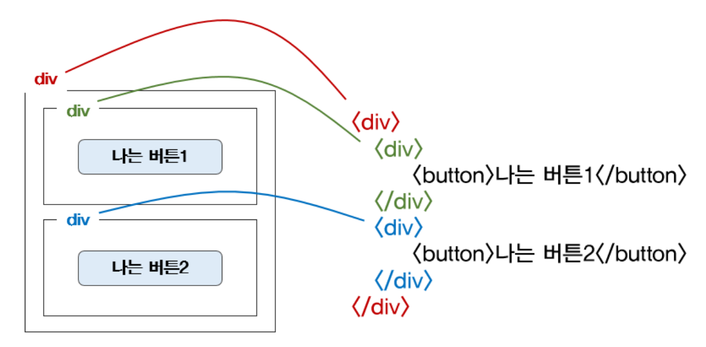
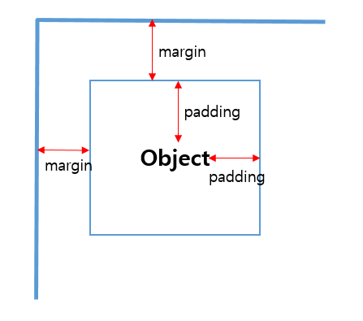

# **HTML, CSS, Javascript**
### **HTML, CSS, Javascript 에 대해 정리합니다.**

[HTML](#HTML-Hypertext-Markup-Language)  
[CSS](#CSS-Cascading-Style-Sheets)   
[Javascript](#Javascript)  


### **HTML - Hypertext Markup Language**
**HTML은 뼈대, CSS는 꾸미기**
- HTML 은 구역과 텍스트를 나타내는 코드, CSS는 잡은 구역을 꾸며주는 코드이다.
- 기존에는 HTML 내 style 속성으로 꾸미기를 할 수 있었지만, 긴 세월 방대한 양을 모아 CSS 파일이 탄생하게 되었다.
- HTML 코드 내에 CSS 파일을 불러와 적용한다.

**HTML의 기초문법**
- HTML은 크게 head '<head></head>' 와 body '<body></body>'로 구성된다.
- head 는 페이지의 속성 및 스크립트 정보를 담고, body는 페이지에 표현할 내용을 담는다.
- HTML에서 사용하는 명령어는 태그(Tag)라고 부르고 '<>' 안에 넣어 표현한다.
```
<!DOCTYPE html>
<html lang="en">

<head>
    <meta charset="UTF-8">
    <meta name="viewport" content="width=device-width, initial-scale=1.0">
    <title> 페이지의 title </title>
</head>

<body>
    <!-- 주석을 나타냄(cmd + /) --!>
    <!-- 구역을 나누는 태그들 -->
    <div>나는 구역을 나누죠</div>
    <p>나는 문단이에요</p>
    <ul>
        <li> bullet point!1 </li>
        <li> bullet point!2 </li>
    </ul>

    <!-- 구역 내 콘텐츠 태그들 -->
    <h1>h1은 제목을 나타내는 태그입니다. 페이지마다 하나씩 꼭 써주는 게 좋아요. 그래야 구글 검색이 잘 되거든요.</h1>
    <h2>h2는 소제목입니다.</h2>
    <h3>h3~h6도 각자의 역할이 있죠. 비중은 작지만..</h3>
    <hr>
    span 태그입니다: 특정 <span style="color:red">글자</span>를 꾸밀 때 써요
    <hr>
    a 태그입니다: <a href="http://naver.com/"> 하이퍼링크 </a>
    <hr>
    img 태그입니다: 
    <hr>
    input 태그입니다: <input type="text" />
    <hr>
    button 태그입니다: <button> 버튼입니다</button>
    <hr>
    textarea 태그입니다: <textarea>나는 무엇일까요?</textarea>
</body>

</html>
```


### **CSS 'Cascading Style Sheets'**
**HTML의 부모자식 구조**
- HTML tag 들은 부모자식 구조를 가지며, 부모 tag에 적용된 CSS는 자식 tag에도 적용된다.
  

**CSS 사용법**
- '<head> ~ </head>' 안에 '<style> ~ </style>' 로 공간을 만들어 작성한다.
- 아래와 같이 파일 형태로 불러와 사용할 수도 있다.
	- 여러 웹페이지 적용 시 중복 코드 제거할 수 있어 효율적이다.
	- 작업의 분담(문서 규격, 스타일)을 위해 분리 사용하는 것이 좋다.
```
<head>
	<link rel="stylesheet" href="경로.css" type="text/css">
</head>
``` 

**자주 쓰는 CSS**
- 배경 관련
	- background-color : 배경색을 지정한다.
	- background-image : 배경에 들어갈 이미지를 지정한다.
	- background-position : 배경의 이미지의 위치를 지정한다.
	- background-size : 배경의 사이즈를 지정한다.
```
// 배경 image 사용 예(보통 아래 3개가 set로 사용된다.)
.mytitle {
	background-image: url('https://www.~~~~); // image 불러옴
	background-positioin : center; // image 위치 중앙
	background-size : cover; // image 사이즈를 해당 tag에 맞춘다.
}
```
- 구역 size 관련
	- width : 해당 tag의 가로 크기를 지정한다.
	- height : 해당 tag의 세로 크기를 지정한다.

- 폰트 관련
	- color : 글자색을 바꿀 때 사용한다.
	- font-size : 폰트의 사이즈를 지정한다.(단위:px)
	- font-weight : 폰트의 두께를 지정한다.
	- font-family : 글꼴을 지정하는데 사용한다.

- 테두리 관련
	- border-radius : 테두리의 둥글기를 조절할 수 있다.

- 간격(여백) 관련
	- margin : 내용물과 바깥 공간 사이의 여백을 지정한다.(외부여백)
		- 'margin : auto'를 사용해 화면을 가운데로 가져올 수 있다.
	- padding : 내용물 내부의 여백을 지정한다.(내부여백)  
  

**CSS Tips**
- 웹폰트 입히기
	- 구글웹폰트 [https://fonts.google.com/?subset=korean](https://fonts.google.com/?subset=korean)
```
/* 사용 예 */
<!-- HTML <head></head> 에 아래 부분 추가-->
<link href="https://fonts.googleapis.com/css2?family=Nanum+Gothic&display=swap" rel="stylesheet">

/* CSS에 아래 부분을 추가하면 완료 */
*{
font-family: 'Nanum Gothic', sans-serif; 
}
```	
- 부트스트랩(bootstrap), 예쁜 CSS 모음집
	- 부트스트랩 컴포넌트 : [https://getbootstrap.com/docs/4.0/components/alerts/](https://getbootstrap.com/docs/4.0/components/alerts/)
```
// 부트스트랩 시작 템플릿
<!doctype html> 
<html lang="en">
<head>
	<!-- Required meta tags -->
	<meta charset="utf-8">
	<meta name="viewport" content="width=device-width, initial-scale=1, shrink-to-fit=no">

	<!-- Bootstrap CSS -->
	<link rel="stylesheet" href="https://maxcdn.bootstrapcdn.com/bootstrap/4.0.0/css/bootstrap.min.css"
		integrity="sha384-Gn5384xqQ1aoWXA+058RXPxPg6fy4IWvTNh0E263XmFcJlSAwiGgFAW/dAiS6JXm" crossorigin="anonymous

	<!-- Optional JavaScript -->
	<!-- jQuery first, then Popper.js, then Bootstrap JS -->
	<script src="https://ajax.googleapis.com/ajax/libs/jquery/3.5.1/jquery.min.js"></script> <script src="https://cdnjs.cloudflare.com/ajax/libs/popper.js/1.12.9/umd/popper.min.js"
		integrity="sha384-ApNbgh9B+Y1QKtv3Rn7W3mgPxhU9K/ScQsAP7hUibX39j7fakFPskvXusvfa0b4Q"crossorigin="anonymous"></script>
	<script src="https://maxcdn.bootstrapcdn.com/bootstrap/4.0.0/js/bootstrap.min.js"
		integrity="sha384-JZR6Spejh4U02d8jOt6vLEHfe/JQGiRRSQQxSfFWpi1MquVdAyjUar5+76PVCmYl" crossorigin="anonymous"></script>
	
	<title> 타이틀 넣는 자리 </title>
</head>
<body>
</body> 
</html>	
```

### **Javascript**
**자바스크립트란?**
- 프로그래밍 언어 중 하나로, 브라우저가 알아들을 수 있는 언어
- 브라우저가 Javascript만 알아듣는 이유
	- '역사적인 이유'와 '이미 만들어진 표준'이기 때문에, 모든 브라우저는 기본적으로 Javascript를 알아듣게 설계됨
	- 이에 따라 모든 웹서버는 HTML+CSS+Javascript 를 주게 되어있다.

**자바스크립트 만드는 법**
- '<head> ~ </head>' 안에 '<script> ~ </script>'로 공간을 만들어 작성한다.
- 별도 파일을 만들어 html 파일에 연결할 수도 있다.
	- 컴파일 처리 순서를 이유로 <body> 태그 안 맨 아래에 적어준다.
	- 코드 관리도 편하고, 코드의 길이도 짧아져 효율적이다.
```
<body>
	...
        <script type="text/javascript" src="practice.js"></script> 
</body>
```

**button 사용법**
- javascript에 함수를 지정해 준 후 button tag에 'onclick="함수명()"' 을 넣어준다.
```
<script>
	function hey() {
		alert('안녕!');
	}
</script>

<body>
	<button onclick="hey()">인사!<button>
</body>
```


