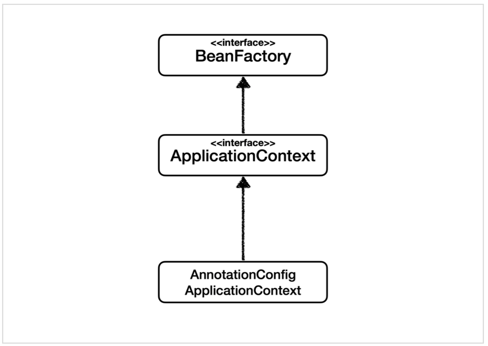
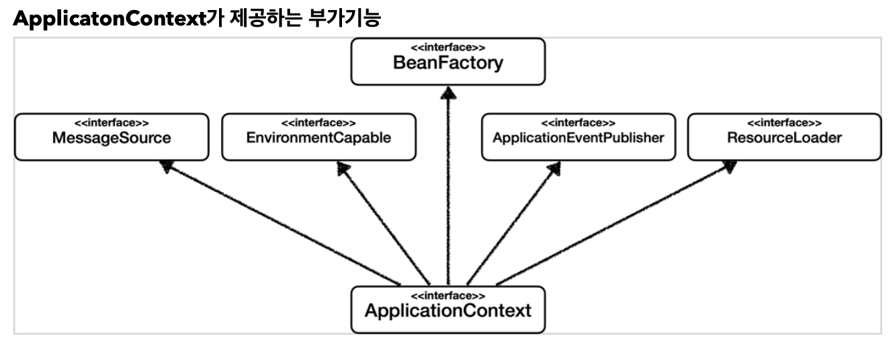

## BeanFactory와 ApplicationContext
**해당 내용은 김영한 님의 Inflearn '스프링 핵심 원리 - 기본편' 강의 내용에서 가져왔습니다.**   
**BeanFactory와 ApplicationContext에 대해 알아봅니다.**

### BeanFactory
- 스프링 컨테이너의 최상위 인터페이스이다.
- 스프링 빈을 관리하고 조회하는 역할을 담당한다.
- `getBean()`을 제공한다.
- Bean을 조회하는 대부분의 기능은 BeanFactory가 제공하는 기능이다.
  

### ApplicationContext
- BeanFactory 기능을 모두 상속 받아서 제공한다.
- Bean을 관리하고 조회하는 기능 외에도 애플리케이션 개발에 필요한 수많은 부가기능을 가지고 있다.
  
- 메시지소스를 활용한 국제화 기능
    - 예를 들어, 한국에서 입력되면 한국어로, 영어권에서 들어오면 영어로 출력
- 환경 변수
    - 로컬, 개발, 운영 등을 구분해서 처리
    - 실무에서는 개인이 개발하는 **로컬 환경**, 테스트 서버에 띄워두고 테스트하는 **개발 환경**, 실제 프로덕션에 나가는 **운영 환경**으로 개발 단계가 나누어진다.
- 애플리케이션 이벤트
    - 이벤트를 발행하고 구독하는 모델을 편리하게 지원
- 편리한 리소스 조회
    - 파일, 클래스패스, 외부 등에서 리소스를 편리하게 조회

### 정리
- ApplicationContext는 BeanFactory의 기능을 상속 받는다.
- ApplicationContext는 Bean 관리 기능 + 편리한 부가 기능을 제공한다.
- BeanFactory를 직접 사용할 일은 거의 없다. 부가 기능이 포함된 ApplicationContext를 사용한다.
- BeanFactory나 ApplicationContext를 **스프링 컨테이너**라 한다.

