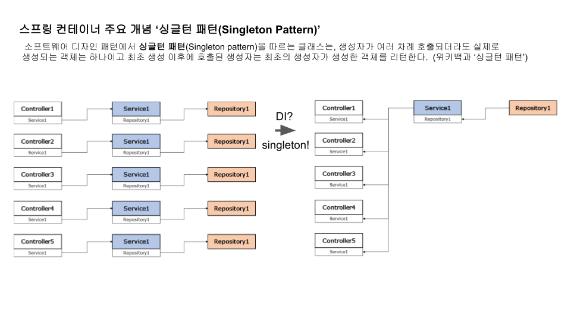
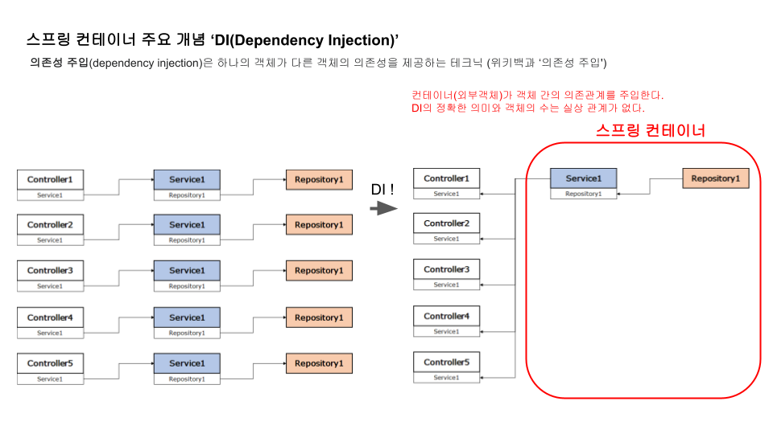

## DI(Dependency Injection) vs Singleton
듣고 있는 수업 자료에 DI에 대한 설명으로 아래와 같은 그림이 나왔다. 헷갈릴 수 있는 여지가 있어서 남겨 본다.  

### 결론
#### 싱글톤 패턴(Singleton Pattern)
- **싱글톤 패턴(Singleton Pattern)**의 경우 '동적 계획법(Dynamic Programming)'이 적용된 것이라고 본다.
- 핵심 키워드는 '**하나의 객체만 생성하는 것**'이다. 해서, 단순히 숫자가 줄어드는 그림은 singleton에 더 알맞다고 생각한다.
  

#### 의존관계 주입(Dependency Injection)
- **의존관계 주입(Dependency Injection)**의 경우 객체의 생성 주체가 '**이를 사용하는 객체인지 아니면 외부객체인지**'가 중요하다고 본다.
- 즉, 하나의 객체가 직접 다른 객체와(특정 객체를 찍어서) 관계를 맺느냐 아니면 비즈니스 로직 외부의 다른객체가 객체 간의 관계를 맺어주느냐의 차이이다.
- 해서, 좀 더 정확히 표현하기 위해서는 아래와 같이 컨테이너를 특정하고 그 안에 저장된 객체를 컨터이너가 요청 받은 객체에 제공하는 방식이 되어야한다.
  

