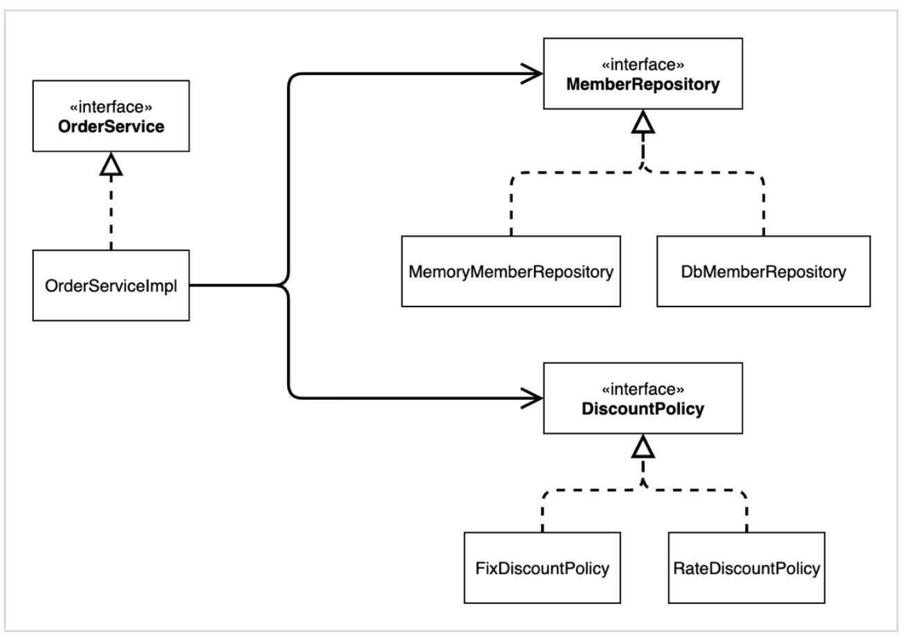
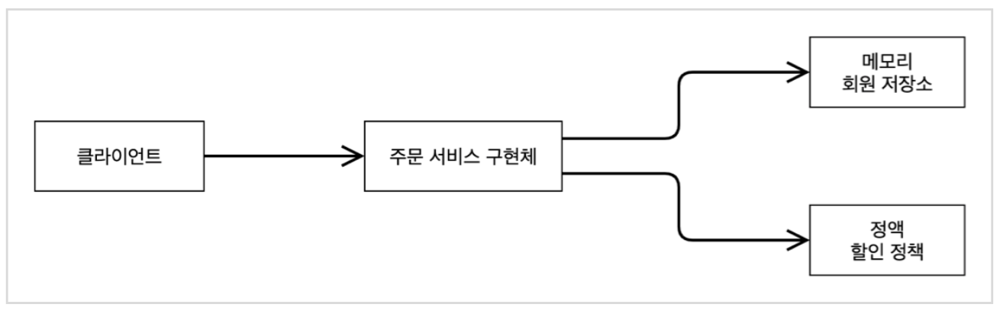

## IoC와 DI, 컨테이너
**해당 내용은 김영한 님의 Inflearn '스프링 핵심 원리 - 기본편' 강의 내용에서 가져왔습니다.**  
**'백문의 불여일타'라고 했던가.. 강의로 듣고 손으로 치면서 보니 이해가 된다..**  
※ 아래 정리에 등장하는 AppConfig 는 Application Configuration을 줄여 사용하는 것으로, 프로그램 작성 시 프로그램 설정정보를 AppConfig.class로 작성하는 것을 줄여 부르는 것이다.  

### 제어의 역전 IoC(Inversion of Control)
- 기존 프로그램은 클라이언트 구현 객체가 스스로 필요한 서버 구현 객체를 생성하고, 연결하고, 실행했다. 한 마디로 구현 객체가 프로그램의 제어 흐름을 스스로 조종했다. 개발자 입장에서는 자연스러운 흐름이다.
- 반면에 AppConfig가 등장한 이후 구현 객체는 자신의 로직을 실행하는 역할만 담당한다.(본인이 연결할 구현 객체를 직접 생성하지 않는다는 이야기) 프로그램의 제어 흐름은 이제 AppConfig가 가져간다. 클라이언트 객체는 인터페이스들을 호출하지만 어떤 구현 객체들이 실행될지는 알 수 없다.
- 프로그램 제어 흐름에 대한 권한은 모두 AppConfig가 가지고 있다. 이렇듯 프로그램의 제어 흐름을 클라이언트 구현 객체가 직접 제어하는 것이 아니라 외부에서 관리하는 것을 제어의 역전(IoC)라고 한다.

#### 프레임워크 vs 라이브러리
- 내가 작성한 코드를 프레임워크가 제어하고 대신 실행하면 그것은 프레임워크가 맞다.
- 반면에 내가 작성한 코드가 직접 제어의 흐름을 담당한다면 그것은 프레임워크가 아니라 라이브러리이다.

### 의존관계 주입 DI(Dependency Injection)
- 의존관계는 **정적인 클래스 의존 관계**와 **실행 시점에 결정되는 동적인 객체(인스턴스) 의존관계** 둘을 분리해서 생각해야 한다.

#### 정적인 클래스 의존관계
클래스가 사용하는 import 코드만 보고 의존관계를 쉽게 판단할 수 있다. 정적인 의존관계는 애플리케이션을 실행하지 않아도 분석할 수 있다.  
클래스 다이어그램을 보자.
#### 클래스 다이어그램
  

#### 동적인 객체(인스턴스) 의존관계
애플리케이션 실행 시점에 실제 생성된 객체 인스턴스의 참조가 연결된 의존관계이다.
#### 객체 다이어그램
  
- **애플리케이션 실행시점(런타임)에 외부에서 실제 구현 객체를 생성하고 클라이언트에 전달해서 클라이언트와 서버의 실제 의존관계가 연결되는 것**을 **의존관계 주입**이라 한다.
- **객체(인스턴스)를 생성하고, 그 참조값을 전달해서 연결된다.**
- 의존관계 주입을 사용하면 **클라이언트 코드를 변경하지 않고**, 클라이언트가 호출하는 대상의 타입 인스턴스를 변경할 수 있다.
- 의존관계 주입을 사용하면 **정적인 클래스 의존관계를 변경하지 않고**, 동적인 객체 인스턴스 의존관계를 쉽게 변경할 수 있다.

### IoC 컨테이터, DI 컨테이너
- AppConfig 처럼 객체를 생성하고 관리하면서 의존관계를 연결해 주는 것을 IoC 컨테이너 또는 DI 컨테이너라 한다.
- 의존관계 주입에 초점을 맞추어 최근에는 주로 DI 컨테이너라고 한다.
- 이 외에도 어셈블러, 오브젝트 팩토리 등으로 불리기도 한다.
