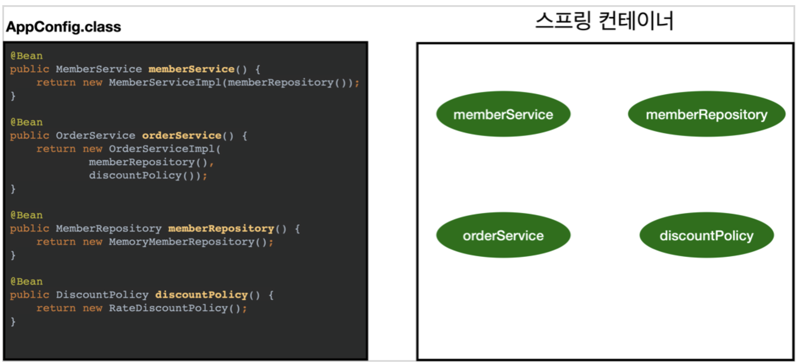

## 스프링 컨테이너와 스프링 빈
**해당 내용은 김영한 님의 Inflearn '스프링 핵심 원리 - 기본편' 강의 내용에서 가져왔습니다.(아주 조금 덧댔습니다.^^)**   
**컨테이너는 빈으로 지정된 클래스를 객체로 생성하여 가지고 있으며, 이 객체들의 의존관계를 설정한다.**

### 스프링 컨테이너 생성
```
// 스프링 컨테이너 생성 -> Annotation을 통해 정보를 받는 스프링 컨테이너를 생성
// AnnotationConfigApplicationContext(AppConfig.class) 는 인터페이스인 ApplicationContext의 구현체이다.
ApplicationContext applicationContext = new AnnotationConfigApplicationContext(AppConfig.class);
```
- `ApplicationContext`를 스프링 컨테이너라 한다.
- `ApplicationContext`는 인터페이스이다.(아래는 ApplicationContext를 구현한 객체들이다.)  
  
- 스프링 컨테이너는 XML을 기반으로 만들 수 있고, 애노테이션 기반의 자바 설정 클래스로 만들 수 있다.
> 참고 : 더 정확히는 스프링 컨테이너를 부를 때, `BeanFactory`,`ApplicationContext`로 구분해서 이야기 한다. `BeanFactory`를 직접 사용하는 경우는 거의 없으므로 일반적으로 `ApplicationContext`를 스프링 컨테이너라 한다.

### 스프링 컨테이너의 생성과정
1. 스프링 컨테이너 생성  
  
- `new AnnotationConfigApplicationContext(AppConfig.class)`을 통한 컨테이너 생성
- 스프링 컨테이너를 생성할 때는 구성 정보`AppConfig.class`를 지정해주어야 한다. 
  
2. 스프링 빈 등록  
  
- 스프링 컨테이너는 파라미터로 넘어온 설정 클래스 정보를 사용해서 스프링 빈을 등록한다.
- **빈 이름**
    - 빈 이름은 메서드 이름을 사용한다.
    - 빈 이름은 직접 부여할 수도 있다. `@Bean(name="memberService2")`
> 주의 : **빈 이름은 항상 다른 이름을 부여해야 한다.** 같은 이름을 부여하면 여러 오류가 발생할 수 있다.
  
3. 스프링 빈 의존관계 설정 - 준비  
  
  
4. 스프링 빈 의존관계 설정 - 완료
  
- 스프링 컨테이너는 설정 정보를 참고해서 의존관계를 주입(DI)한다.
- 단순히 자바 코드를 호출하는 것 같지만 차이가 있다고.. 이 부분은 추후에 강의를 더 들으면 적어 보겠다.
  
#### 참고
- 스프링은 빈을 생성하고, 의존관계를 주입하는 단계가 나누어져 있다. 그런데 이렇게 자바 코드로 스프링 빈을 등록하면 생성자를 호출하면서 의존관계 주입도 한 번에 처리된다. 이렇듯 설명과 과정이 부딪히는 면이 있는데, 이 부분은 추후에 추가설명을 하신다고 하니까 기다려 보자.


