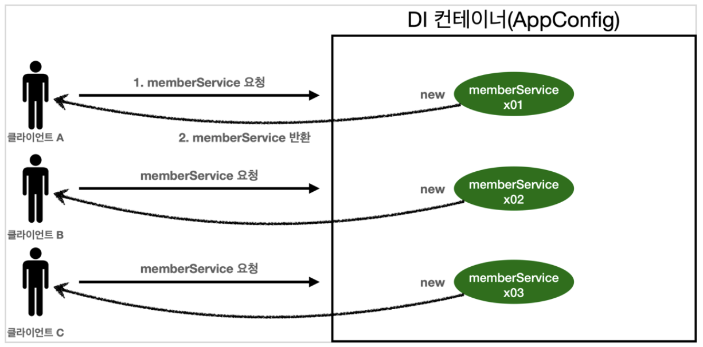
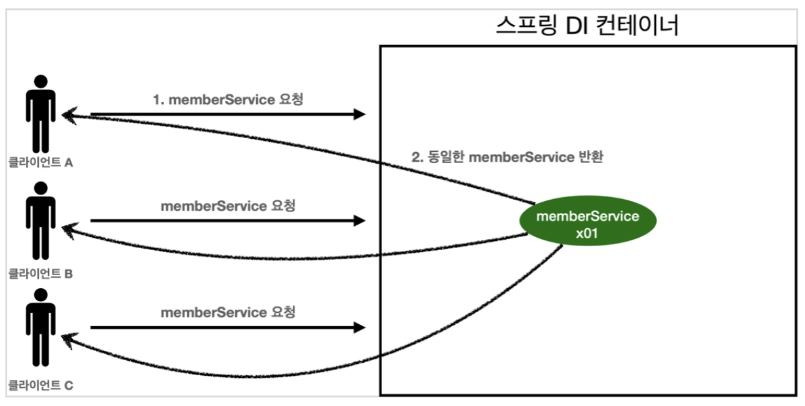
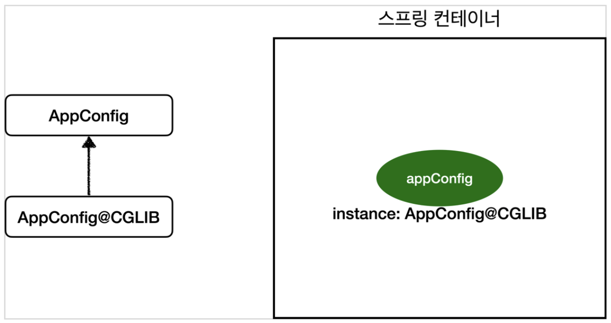

## 싱글톤 컨테이너
**해당 내용은 김영한 님의 Inflearn '스프링 핵심 원리 - 기본편' 강의 내용에서 가져왔습니다.**  
**이해되지 않던 개념들이 하나하나 이해되는 것을 보면 너무나 신기합니다.**  

### 웹 애플리케이션과 싱글톤
- 스프링은 태생이 기업용(enterprise) 온라인 서비스 기술을 지원하기 위해 탄생했다. 
- 웹 애플리케이션은 보통 여러 고객이 동시에 요청을 한다.
  
- 수업 과정에서 직접 제작했던 AppConfig의 경우 요청을 할 때 마다 객체를 새로 생성한다.
- 이는 메모리 낭비가 싶하다. 하여, 해당 객체를 딱 1개만 생성하고 공유하도록 설계하는데 이를 **싱글톤 패턴**이라 한다.

### 싱글톤 패턴
- 클래스의 인스턴스가 딱 1개만 생성되는 것을 보장하는 패턴이다.
- 하여, 객체 인스턴스를 2개 이상 생성하지 못핟도록 막아야 한다.
    - private 생성자를 사용해서 외부에서 임의로 new 키워드를 사용하지 못하도록 막아야 한다.
- 아래와 같은 싱글톤 패턴을 구축하면 매 호출 시 같은 객체 인스턴스를 반환한다.
```
package hello.core.singleton;

public class SingletonService {
    //1. static 영역에 객체를 딱 1개만 생성해둔다.
    private static final SingletonService instance = new SingletonService();

    //2. 객체 인스턴스가 필요할 시 이 static 메서드를 통해서만 조회하도록 허용한다.
    public static SingletonService getInstance() {
        return instance;
    }

    //3. 생성자를 private으로 선언해서 외부에서 new 키워드를 사용한 객체 생성을 못하게 막는다.
    private SingletonService(){}
}
```
> 참고 : 싱글톤 패턴을 구현하는 방법은 이외에도 여러가지가 있다고 한다. 위 예는 가장 단순하고 안전한 방법이다.

#### 싱글톤 패턴의 문제점
- 싱글톤 패턴을 구현하는 코드 자체가 많이 들어간다.
- 의존 관계 상 클라이언트가 구체 클래스에 의존한다. -> DIP를 위반
- 클라이언트가 구체 클래스에 의존해서 OCP 원칙을 위반할 가능성이 높다.
- 테스트하기 어렵다.
- 내부 속성을 변경하거나 초기화 하기 어렵다.
- private 생성자로 자식 클래스를 만들기 어렵다.
- 결론적으로 유연성이 떨어진다.
- 안티패턴으로 불리기도 한다.  
  
※ [좋은 객체 지향 설계의 5가지 원칙(SOLID)_DIP,OCP 참고](https://github.com/beadoer1/TIL/blob/main/Java/Spring/SOLID.md)  

> 안티패턴(anti-pattern) : 실제 많이 사용되는 패턴이지만 비효율적이거나 비생산적인 패턴을 의미한다.
> 위키백과 '안티패턴'

### 싱글톤 컨테이너
스프링의 싱글톤 컨테이너는 싱글톤 패턴의 문제점을 해결하면서 인스턴스를 싱글톤(1개만 생성)으로 관리한다. 

#### 싱글톤 컨테이너
- 스프링 컨테이너는 싱글톤 패턴을 적용하지 않아도 객체 인스턴스를 싱글톤으로 관리한다.
- 스프링 컨테이너는 알아서 싱글톤 컨테이너 역할을 한다. 이렇게 싱글톤 객체를 생성하고 관리하는 기능을 **싱글톤 레지스트리**라 한다.
- 스프링 컨테이너의 이런 기능 덕분에 싱글톤 패턴의 모든 단점을 해결하면서 객체를 싱글톤으로 유지할 수 있다.
    - 싱글톤 패턴을 위한 지저분한 코드가 들어가지 않아도 된다.
    - DIP, OCP, 테스트, private 생성자로부터 자유롭게 싱글톤을 사용할 수 있다.
```
// MemberService 생성자를 직접 호출하지 않음을 볼 수 있다.
void springContainer() {
    ApplicationContext ac = new AnnotationConfigApplicationContext(AppConfig.class);

    //1. 조회: 호출할 때 마다 같은 객체를 반환
    MemberService memberService1 = ac.getBean("memberService", MemberService.class);

    //2. 조회: 호출할 때 마다 같은 객체를 반환
    MemberService memberService2 = ac.getBean("memberService", MemberService.class);

    //참조값이 같은 것을 확인
    System.out.println("memberService1 = " + memberService1); // memberService1 = hello.core.member.MemberServiceImpl@61f05988
    System.out.println("memberService2 = " + memberService2); // memberService2 = hello.core.member.MemberServiceImpl@61f05988

    //memberService1 == memberService2 테스트. 무사히 통과됨
    assertThat(memberService1).isSameAs(memberService2); 
}
```

#### 싱글톤 컨테이너 적용 후
  
- 스프링 컨테이너 덕분에 고객의 요청이 올 때 마다 객체를 생성하는 것이 아니라, 이미 만들어진 객체를 공유해서 효율적으로 재사용할 수 있다.

> 참고 : 스프링의 기본 빈 등록 방식은 싱글톤이지만, 싱글톤 방식만 지원하는 것은 아니다. 요청할 때마다 새로운 객체를 생성해서 반환하는 기능도 제공한다.

### 싱글톤 방식의 주의점
- 싱글톤 패턴이든, 스프링 같은 싱글톤 컨테이너를 사용하든, 객체 인스턴스를 하나만 생성해서 공유하는 싱글톤 방식은 여러 클라이언트가 하나의 같은 객체 인스턴스를 공유하기 때문에 싱글톤 객체는 상태를 유지(stateful)하게 설계하면 안된다.
- 무상태(stateless)로 설계해야 한다!
    - 특정 클라이언트에 의존적인 필드가 있으면 안된다.
    - 특정 클라이언트가 값을 변경할 수 있는 필드가 있으면 안된다.
    - 가급적 읽기만 가능해야 한다.
    - 필드 대신 자바에서 공유되지 않는 지역변수, 파라미터, ThreadLocal 등을 사용해야 한다.
- **★스플링 빈 필드에 공유 값을 설정하면 정말 큰 장애가 발생할 수 있다.★**
```
// stateful 객체 예시
package hello.core.singleton;

public class StatefulService {
    
    private int price; // 상태를 유지하는 필드
    
    public void order(String name, int price){
        System.out.println("name = " + name + "price = " + price );
        this.price = price; // 여기가 문제!
    }
    
    public int getPrice() {
        return price;
    }
}
```
```
// stateful 객체 Test
package hello.core.singleton;

import org.assertj.core.api.Assertions;
import org.junit.jupiter.api.Test;
import org.springframework.context.ApplicationContext;
import org.springframework.context.annotation.AnnotationConfigApplicationContext;
import org.springframework.context.annotation.Bean;

import static org.junit.jupiter.api.Assertions.*;

class StatefulServiceTest {
// 단순한 설명을 위해 실제 쓰레드는 사용하지 않음
    @Test
    void statefulServiceSingleton() {
        // 스프링 컨테이너 생성 및 statefulService 객체 호출
        ApplicationContext ac = new AnnotationConfigApplicationContext(TestConfig.class);
        StatefulService statefulService1 = ac.getBean("statefulService", StatefulService.class);
        StatefulService statefulService2 = ac.getBean("statefulService", StatefulService.class);

        // ThreadA : A사용자 10000원 주문
        statefulService1.order("userA", 10000);
        // ThreadB : B사용자 20000원 주문
        statefulService2.order("userB", 20000);

        // ThreadA : A사용자 주문 금액 조회
        int price = statefulService1.getPrice();
        System.out.println("priceA = " + price);
        // 뒤집어씌워지는 현상 발생. 공유 필드를 변경할 수 있게 프로그래밍 했기 때문
        Assertions.assertThat(statefulService1.getPrice()).isEqualTo(20000);

    }

    // Test를 위해 생성한 configuration class
    static class TestConfig{
        @Bean
        public StatefulService statefulService() {
            return new StatefulService();
        }
    }
}
```

### @Configuration과 싱글톤
- AppConfig 내에 있는 객체가 서로 관계를 맺고 호출되는 경우 동일한 객체를 여러 번 호출하는 경우가 발생한다.
- 결과적으로 같은 클래스로부터 각각의 다른 객체가 구현되면서 싱글톤이 깨지는 것 처럼 보이게 된다. 아래 코드를 보자.
```
// Configuration의 역할을 나타내는 AppConfig Test(Test 실행 코드는 아래 있다.)
package hello.core;

import hello.core.discount.DiscountPolicy;
import hello.core.discount.FixDiscountPolicy;
import hello.core.discount.RateDiscountPolicy;
import hello.core.member.MemberRepository;
import hello.core.member.MemberService;
import hello.core.member.MemberServiceImpl;
import hello.core.member.MemoryMemberRepository;
import hello.core.order.OrderService;
import hello.core.order.OrderServiceImpl;
import org.springframework.context.annotation.Bean;
import org.springframework.context.annotation.Configuration;

// 의존관계 주입의 주체. 해당 인터페이스에 접근하는 클라이언트에게 객체를 지정하여 전달해 준다.
@Configuration // spring에 설정정보 클래스임을 알리는 어노테이션
public class AppConfig { // 애플리케이션의 실제 동작에 필요한 구현 객체를 생성한다.

    // @Bean memberService -> new MemoryMemberRepository()
    // @Bean orderService -> new MemoryMemberRepository()  // 두 번 소환되는데 그럼 객체가 두 번 만들어져서 싱글톤이 깨지나??
    //                    -> new RateDiscountPolicy()

    // 보통의 자바 코드 예상(싱글톤 깨질 경우) -> @Configuration 을 빼주면 아래와 같이 출력된다.
    // call AppConfig.memberService
    // call AppConfig.memberRepository // 스프링 빈에 등록된 객체가 아니게 된다. 실제로 @Configuration 지우면 빨간줄 생김
    // call AppConfig.memberRepository
    // call AppConfig.orderService
    // call AppConfig.memberRepository // 스프링 빈에 등록된 객체가 아니게 된다. 실제로 @Configuration 지우면 빨간줄 생김

    // 실제 출력 -> 스프링이 싱글톤을 유지시켜주는 것을 확인할 수 있다.(@Configuration이 붙은 class를 통해 만들어진 객체(AppConfig)의 역할)
    // call AppConfig.memberService
    // call AppConfig.memberRepository
    // call AppConfig.orderService

    @Bean
    public MemberService memberService() {
        System.out.println("call AppConfig.memberService");
        return new MemberServiceImpl(memberRepository());
    }
    @Bean
    public MemberRepository memberRepository() {
        System.out.println("call AppConfig.memberRepository");
        return new MemoryMemberRepository();
    }
    @Bean
    public OrderService orderService() {
        System.out.println("call AppConfig.orderService");
        return new OrderServiceImpl(memberRepository(), discountPolicy());
    }
    @Bean
    public DiscountPolicy discountPolicy() {
        return new RateDiscountPolicy();
    }
}
```
```
// 위 AppConfig를 호출하는 Test 코드
package hello.core.singleton;

import hello.core.AppConfig;
import hello.core.member.MemberService;
import org.assertj.core.api.Assertions;
import org.junit.jupiter.api.DisplayName;
import org.junit.jupiter.api.Test;
import org.springframework.context.ApplicationContext;
import org.springframework.context.annotation.AnnotationConfigApplicationContext;

import static org.assertj.core.api.Assertions.*;

public class singletonTest {
    @Test
    @DisplayName("스프링 컨테이너와 싱글톤")
    void springContainer() {
        // 스프링 컨테이너 생성(AppConfig.class 내의 @Bean 등록된 class들을 객체화 하여 컨테이너에 저장한다.)
        ApplicationContext ac = new AnnotationConfigApplicationContext(AppConfig.class);
}
```

#### @Configuration과 바이트코드 조작
- 스프링 컨테이너는 싱글톤 레지스트리이다. 따라서 스프링 빈이 싱글톤이 되도록 보장해주어야 한다.
- 위에서 볼 수 있듯이, 싱글톤 컨테이너는 `@Configuration`을 `AppConfig`에 의해 싱글톤이 보장되도록 해준다.
```
@Test
void configurationDeep() {
    ApplicationContext ac = new AnnotationConfigApplicationContext(AppConfig.class);
    AppConfig bean = ac.getBean(AppConfig.class);

    System.out.println("bean = " + bean.getClass());
    // 출력 : bean = class hello.core.AppConfig$$EnhancerBySpringCGLIB$$59c4e2c6 '뒤에 이상한게 붙는다'
}
```
- 위 코드를 보면 알 수 있듯이 `AnnotationConfigApplicationContext`에 파라미터로 넘긴 `AppConfig` 또한 스프링 빈으로 등록된다.
- 그런데, 해당 클래스를 출력해보면 이름이 매우 길어져있는 것을 볼 수 있다.
- 이는 내가 만든 AppConfig 클래스가 아니라 스프링이 CGLIB라는 바이트코드 조작 라이브러리를 사용해서 AppConfig 클래스를 상속 받은 임의의 클래스를 만들고, 해당 클래스를 스프링 빈으로 등록한 것이다.
  
```
// AppConfig@CGLIB 예상 코드

@Bean
public MemberRepository memberRepository() {
    if (memoryMemberRepository가 이미 스프링 컨테이너에 등록되어 있으면?) { 
        return 스프링 컨테이너에서 찾아서 반환;
    } else { //스프링 컨테이너에 없으면
        기존 로직을 호출해서 MemoryMemberRepository를 생성하고 스프링 컨테이너에 등록 
        return 반환
    } 
}
```
- @Bean이 붙은 메서드마다 이미 스프링 빈이 존재하면 존재하는 빈을 반환하고, 스프링 빈이 없으면 생성해서 스프링 빈으로 등록하고 반환하는 코드가 동적으로 만들어진다.
- 이와 같은 과정으로 싱글톤이 보장되는 것이다.

> 참고 : AppConfig@CGLIB는 AppConfig의 자식 타입이므로, AppConfig 타입으로 조회 할 수 있다.

### 정리
- @Bean만 사용해도 스프링 빈으로 등록되지만, 싱글톤이 보장되지는 않는다.
- 원리를 이해하기 위한 내용일 뿐, 큰 고민하지말고 `@Configuration`을 사용하자.


