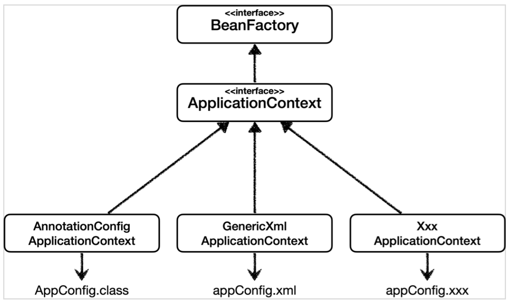
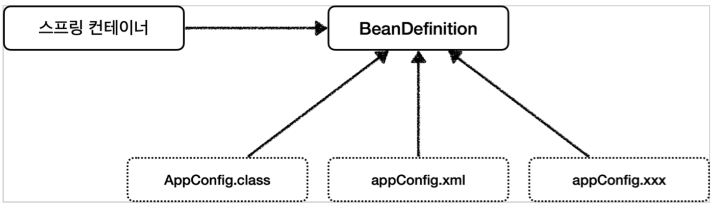
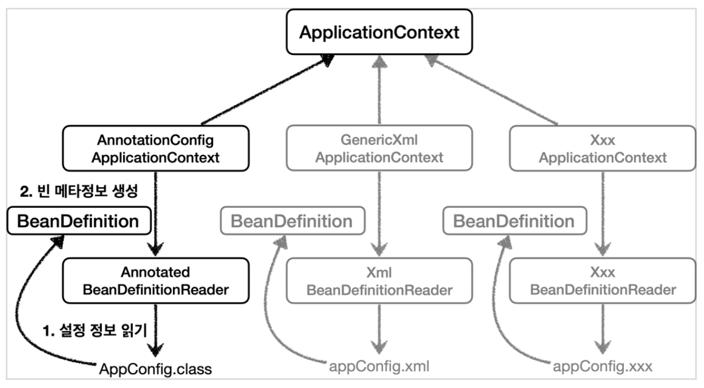

## 다양한 설정 형식을 지원하는 Spring - 자바 코드, XML 등
**해당 내용은 김영한 님의 Inflearn '스프링 핵심 원리 - 기본편' 강의 내용에서 가져왔습니다.**   

### 다양한 설정 형식 지원 - 자바 코드, XML
- 여기서 말하는 다양한 설정 형식이란 Spring에 정보를 넘기는 형식을 결정하는 것이라고 보면 될 것 같다.
- 스프링 컨테이너는 다양한 형식의 설정 정보를 받아드릴 수 있게 유연하게 설계되어 있다.
    - ex. 자바 코드(Annotation), XML, Groovy 등
  

#### Annotation 기반 자바 코드 설정 사용
- `new AnnotationConfigApplicationContext(AppConfig.class)`
- `AnnotationConfigApplicationContext` 클래스를 사용하면서 자바 코드로 된 설정 정보를 넘기면 된다.

#### XML 설정 사용
- 최근에는 스프링 부트를 많이 사용하면서 XML 기반의 설정은 잘 사용하지 않는다. 
- 아직 많은 레거시 프로젝트들이 XML로 되어있고, XML을 사용하면 컴파일 없이 빈 설정 정보를 변경할 수 있는 장점도 가지고 있어 한 번 쯤 배워두는 것도 좋다고 한다.
- 필요 시 참고 ['https://spring.io/projects/spring-framework'](https://spring.io/projects/spring-framework)

> 레거시(legacy) :컴퓨터 분야에서 과거로부터 물려 내려온 기술, 방법, 컴퓨터 시스템 및 응용 프로그램을 의미하며, 새로이 대체 가능한 기존의 기술을 말한다.
> 두산백과 '레거시(legacy)'

```
// XmlAppContext 사용 자바 Test 코드

package hello.core.xml;

import hello.core.member.MemberService;
import org.assertj.core.api.Assertions;
import org.junit.jupiter.api.Test;
import org.springframework.context.ApplicationContext;
import org.springframework.context.support.GenericXmlApplicationContext;


public class XmlAppContext {

    @Test
    void xmlAppContext() {
        ApplicationContext ac = new GenericXmlApplicationContext("appConfig.xml");
        MemberService memberService = ac.getBean("memberService", MemberService.class);
        Assertions.assertThat(memberService).isInstanceOf(MemberService.class);

    }
```
```
<!-- xml 기반의 스프링 빈 설정 정보 -->
<!-- 위치 : src/main/resources/appConfig.xml 'resources'에 만들어 준다. -->

<?xml version="1.0" encoding="UTF-8"?>
<beans xmlns="http://www.springframework.org/schema/beans"
       xmlns:xsi="http://www.w3.org/2001/XMLSchema-instance"
       xsi:schemaLocation="http://www.springframework.org/schema/beans http://www.springframework.org/schema/beans/spring-beans.xsd">


    <!-- 아래 부분(AppConfig.java)과 거의 비슷함을 알 수 있다.
    @Bean 
    public MemberService memberService() {
        return new MemberServiceImpl(memberRepository());
    }
    @Bean
    public MemberRepository memberRepository() {
        return new MemoryMemberRepository();
    }
    @Bean
    public OrderService orderService() {
        return new OrderServiceImpl(memberRepository(), discountPolicy());
    }
    @Bean
    public DiscountPolicy discountPolicy() {
        return new RateDiscountPolicy();
    }
    -->

    <bean id="memberService" class="hello.core.member.MemberServiceImpl">
        <constructor-arg name="memberRepository" ref="memberRepository" />
    </bean>

    <bean id="memberRepository" class="hello.core.member.MemoryMemberRepository"/>

    <bean id="orderService" class="hello.core.order.OrderServiceImpl">
        <constructor-arg name="memberRepository" ref="memberRepository" />
        <constructor-arg name="discountPolicy" ref="discountPolicy" />
    </bean>

    <bean id="discountPolicy" class="hello.core.discount.RateDiscountPolicy" />
</beans>
```

### 스프링 빈 설정 메타 정보 - BeanDefinition
- 스프링이 다양한 형식 지원을 할 수 있는데에는 `BeanDefinition` 이라는 추상화가 있다.
- 쉽게 이야기하여 **역할과 구현을 개념적으로 나눈 것!!** 이라고 말씀하신다.
    - XML을 읽어서 BeanDefinition을 만들면 된다.
    - 자바 코드를 읽어서 BeanDefinition을 만들면 된다.
    - 스프링 컨테이너는 자바 코드인지, XML인지 몰라도 된다. 오직 BeanDefinition만 알면 된다.
- 여기서 `BeanDefinition`을 **빈 설정 메타정보**라고 한다.
    - `@Bean`, `<bean>` 각각 하나씩 메타 정보가 생성된다.
- **스프링 컨테이너는 이 메타정보를 기반으로 스프링 빈을 생성한다.**  
##### BeanDefinition 계통도
  
##### BeanDefinition 계통도(코드 레벨)
  
- `AnnotationConfigApplicationContext`는 `AnnotatedBeanDifinitionReader`를 사용하여 `AppConfig.class`를 읽고 `BeanDefinition`을 생성한다.
- `GenericXmlApplicationContext`는 `XmlBeanDefinitionReader`를 사용해서 `appConfig.xml` 설정 정보를 읽고 `BeanDefinition`을 생성한다.
- 새로운 형식의 설정 정보가 추가되면, `XxxBeanDefinitionReader`를 만들어 `BeanDefinition`을 생성하면 된다.
- 그리고 스프링 컨테이너는 그 `BeanDefinition`을 가지고 스프링 빈을 생성하는 것이다.

#### BeanDefinition 정보
- BeanClassName: 생성할 빈의 클래스 명(자바 설정 처럼 팩토리 역할의 빈을 사용하면 없음) 
- factoryBeanName: 팩토리 역할의 빈을 사용할 경우 이름, 예) appConfig 
- factoryMethodName: 빈을 생성할 팩토리 메서드 지정, 예) memberService
- Scope: 싱글톤(기본값)
- lazyInit: 스프링 컨테이너를 생성할 때 빈을 생성하는 것이 아니라, 실제 빈을 사용할 때 까지 최대한 생성을 지연처리 하는지 여부
- InitMethodName: 빈을 생성하고, 의존관계를 적용한 뒤에 호출되는 초기화 메서드 명 
- DestroyMethodName: 빈의 생명주기가 끝나서 제거하기 직전에 호출되는 메서드 명 
- Constructor arguments, Properties: 의존관계 주입에서 사용한다. (자바 설정 처럼 팩토리 역할 의 빈을 사용하면 없음)
```
// BeanDefinition 정보 확인 Test class

package hello.core.definition;

import hello.core.AppConfig;
import org.junit.jupiter.api.DisplayName;
import org.junit.jupiter.api.Test;
import org.springframework.beans.factory.config.BeanDefinition;
import org.springframework.context.annotation.AnnotationConfigApplicationContext;
import org.springframework.context.support.GenericXmlApplicationContext;

public class BeanDefinitionTest {

    // Annotation 사용 시 factoryBean과 factoryMethod 형태로 정보를 나타냄
    AnnotationConfigApplicationContext ac = new AnnotationConfigApplicationContext(AppConfig.class);
    // xml 로 Bean을 등록 시 해당 class 정보도 나타냄을 알 수 있다.
    // GenericXmlApplicationContext ac = new GenericXmlApplicationContext("appConfig.xml");

    @Test
    @DisplayName("빈 설정 메타정보 확인")
    void findApplicationBean() {
        String[] beanDefinitionNames = ac.getBeanDefinitionNames();
        for(String beanDefinitionName : beanDefinitionNames) {
            BeanDefinition beanDefinition = ac.getBeanDefinition(beanDefinitionName);

            if(beanDefinition.getRole() == BeanDefinition.ROLE_APPLICATION) {
                System.out.println("beanDefinitionName = " + beanDefinitionName +
                        " beanDefinition = " + beanDefinition);
            }
        }
    }
}
```

### 정리
- BeanDefinition을 직접 생성해서 스프링 컨테이너에 등록할 수도 있다. 그러나 실무에서 거의 사용하지 않음. 그래도 개념은 알고가자.
- 중요한 개념은 **스프링이 다양한 형태의 설정 정보를** `BeanDefinition`**으로 추상화하여 사용한다는 것** 이다.
- 한 번 씩 스프링 코드나 스프링 관련 오픈소스 코드를 볼 때, BeanDefinition이라는 것이 보일 때가 있다고 한다. 이 때 떠올릴 것.


