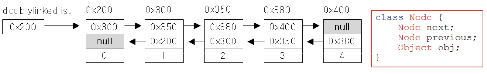
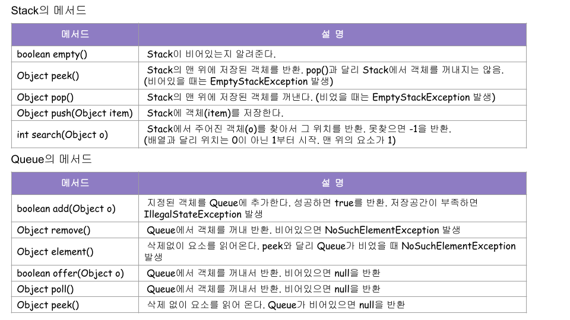
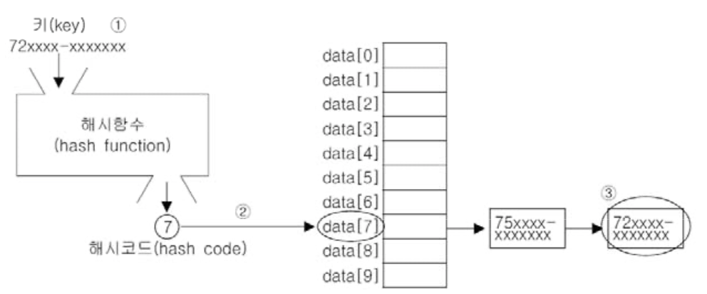
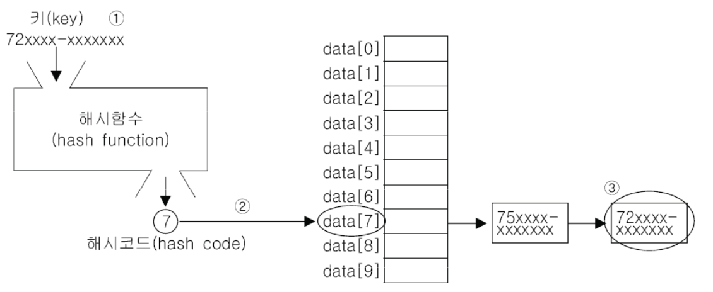

# **자바의 정석 기초편 정리(10장~16장)**

**책과 강의를 참고하여 Keyword 중심으로 정리 해보려 합니다.**  
※ 정리 내용은 [자바의 정석 - 기초편 2권] 강의, 책 등을 참고하였습니다.

[Ch10. 날짜와 시간 & 형식화](#Ch10-날짜와-시간-형식화)  
[Ch11. 컬렉션 프레임웍](#Ch11-컬렉션-프레임웍)  
[Ch12. 지네릭스, 열거형, 애너테이션](#Ch12-지네릭스-열거형-애너테이션)   
[Ch13. 쓰레드](#Ch13-쓰레드)  

---------

### **Ch10. 날짜와 시간 & 형식화**

**날짜와 시간**
- java.util.Date
	- 날짜와 시간을 다룰 목적으로 만들어진 클래스(JDK1.0~)
	- Date의 메서드는 거의 deprecated 되었지만, 여전히 쓰이고 있다.
- java.util.Calendar
	- Date클래스를 개선한 새로운 클래스(JDK1.1). 여전히 단점 존재
- java.time 패키지
	- Date와 Calendar의 단점을 개선한 새로운 클래스들을 제공(JDK1.8)
	- 기초편에서는 다루지 않는다.(자바의 정석 3판 참고할 것)

**Calendar 클래스**
- 추상 클래스이므로 getInstance()를 통해 구현된 객체를 얻어야 한다.
```
Calendar cal = new Calendar(); // 에러!! 추상 클래스는 인스턴스를 생성할 수 없다.

//OK, getInstance() 메서드는 Calendar 클래스를 구현한 클래스의 인스턴스를 반환한다.
Calendar cal = Calendar.getInstance();
```
- get()으로 날짜와 시간 필드 가져오기 -> int get(int field)
```
Calendar cal = Calendar.getInstance();  // 현재 날짜와 시간으로 셋팅됨
int thisYear = cal.get(Calendar.YEAR);  // 올해가 몇년인지 알아낸다.
int lastDayOfMonth = cal.getActualMaximum(Calendar.DATE); // 이 달의 마지막 달
```
- Calendar 에 정의된 필드
  
```
import java.util.Calendar;

class Ex10_1 {
	public static void main(String[] args) {
		// 기본적으로 현재 날짜와 시간으로 설정된다.
		Calendar today = Calendar.getInstance();
		System.out.println("이 해의 년도 : " + today.get(Calendar.YEAR));
		System.out.println("월(0~11, 0:1월): " + today.get(Calendar.MONTH));
		System.out.println("이 해의 몇 째 주 : " + today.get(Calendar.WEEK_OF_YEAR));
		System.out.println("이 달의 몇 째 주 : " + today.get(Calendar.WEEK_OF_MONTH));
		
		// DATE와 DAY_OF_MONTH 는 같다.
		System.out.println("이 달의 몇 일 : " + today.get(Calendar.DATE));
		System.out.println("이 달의 몇 일 : " + today.get(Calendar.DAY_OF_MONTH));
		System.out.println("이 해의 몇 일 : " + today.get(Calendar.DAY_OF_YEAR));
		System.out.println("요일(1~7, 1: 일요일): " + today.get(Calendar.DAY_OF_WEEK));
		System.out.println("이 달의 몇 째 요일 : " + today.get(Calendar.DAY_OF_WEEK_IN_MONTH));
		System.out.println("오전_오후(0:오전, 1:오후) : " + today.get(Calendar.AM_PM));
		System.out.println("시간(0~11) : " + today.get(Calendar.HOUR));
		System.out.println("시간(0~23) : " + today.get(Calendar.HOUR_OF_DAY));
		System.out.println("분(0~59) : " + today.get(Calendar.MINUTE));
		System.out.println("초(0~59) : " + today.get(Calendar.SECOND));
		System.out.println("1000분의 1초(0~999) : " + today.get(Calendar.MILLISECOND));
		
		// 천분의 1초를 시간으로 표시하기 위해 3600000으로 나누었다.(1시간 = 60*60초)
		System.out.println("TimeZone(-12~+12): " + today.get(Calendar.ZONE_OFFSET/3600000));
		System.out.println("이 달의 마지막 날 : " + today.getActualMaximum(Calendar.DATE));
	}
}

출력 : 
이 해의 년도 : 2021
월(0~11, 0:1월): 1
이 해의 몇 째 주 : 6
이 달의 몇 째 주 : 1
이 달의 몇 일 : 5
이 달의 몇 일 : 5
이 해의 몇 일 : 36
요일(1~7, 1: 일요일): 6
이 달의 몇 째 요일 : 1
오전_오후(0:오전, 1:오후) : 1
시간(0~11) : 5
시간(0~23) : 17
분(0~59) : 16
초(0~59) : 51
1000분의 1초(0~999) : 997
TimeZone(-12~+12): 1
이 달의 마지막 날 : 28
```
- set()으로 날짜와 시간 지정하기
```
void set(int field, int value)
void set(int year, int month, int date)
void set(int year, int month, int date, int hourIfDay, int minute)
void set(int year, int month, int date, int hourOfDay, int minute, int second)
```
- 날짜 지정하는 방법. 월(MONTH)이 0부터 시작한다는 점 주의!!
```
Calendar date1 = Calendar.getInstance();
date1.set(2017,7,15); // 2017년 8월 15일(7월 아님)
// date1.set(Calendar.YEAR, 2017);
// date1.set(Calendar.MONTH, 7);
// date1.set(Calendar.DATE, 15);
```
```
import java.util.*;

class Ex10_2 {
	public static void main(String[] args) {
		//요일은 1부터 시작하기 때문에, DAY_OF_WEEK[0]은 비워둠
		final String[] DAY_OF_WEEK = {"","일","월","화","수","목","금","토"};
		
		Calendar date1 = Calendar.getInstance();
		Calendar date2 = Calendar.getInstance();
		
		// month의 경우 0부터 시작하기 때문에 4월인 경우, 3으로 지정해야한다.
		// date1.set(2019, Calendar.APRIL, 29); 와 같이 할 수도 있다. 
		date1.set(2019, 3, 29); // 2019년 4월 29일로 날짜를 설정한다.
		System.out.println("date1은 " + toString(date1)+ 
				DAY_OF_WEEK[date1.get(Calendar.DAY_OF_WEEK)] + "요일이고,");
		System.out.println("오늘(date2)은 " + toString(date2) + 
				DAY_OF_WEEK[date2.get(Calendar.DAY_OF_WEEK)] + "요일입니다."  );
		
		// 두 날짜 간의 차이를 얻으려면, getTimeInMillis() 천분의 일초 단위로 변환해야한다.
		long difference = (date2.getTimeInMillis() - date1.getTimeInMillis())/1000;
		System.out.println("그 날(date1)부터 지금(date2)까지 " + difference + "초가 지났습니다.");
		System.out.println("일로 환산하면 " + difference/(24*60*60) + "일이 됩니다.");
		
	}
	
	static String toString(Calendar date) {
		return date.get(Calendar.YEAR) + "년 " + (date.get(Calendar.MONTH)+1) + 
				"월 " + date.get(Calendar.DATE) + "일 ";
	}
}

출력:
date1은 2019년 4월 29일 월요일이고,
오늘(date2)은 2021년 2월 5일 금요일이다.
그 날(date1)부터 지금(date2)까지 55987200초가 지났습니다.
일로 환산하면 648일이 됩니다.
```
- 시간 지정하는 방법. 시,분,초 별도 설정 필요.
```
Calendar time1 = Calendar.getInstance();
time1.set(Calendar.HOUR_OF_DAY, 10);
time1.set(Calendar.MINUTE, 20);
time1.set(Calendar.SECOND, 30);
```
```
import java.util.Calendar;

public class Ex10_3 {
	public static void main(String[] args) {
		final int[] TIME_UNIT = {3600, 60, 1};
		final String[] TIME_UNIT_NAME = {"시간 ", "분 ", "초 "};
		
		Calendar time1 = Calendar.getInstance();
		Calendar time2 = Calendar.getInstance();
		
		// time1의 시간을 10시 20분 30초로 설정
		timeSet(time1,10,20,30);
		// time2의 시간을 20시 30분 10초로 설정
		timeSet(time2,20,30,10);
		
		System.out.println("time1 : "+timeToString(time1));
		System.out.println("time2 : "+timeToString(time2));
		
		long difference = 
				Math.abs(time2.getTimeInMillis()-time1.getTimeInMillis())/1000;
		System.out.println("time1과 time2의 차이는 "+difference+"초 입니다.");
		
		String tmp = "";
		// 거스름돈 구하는 알고리즘과 유사함(큰 단위부터 나눠준다.)
		for(int i = 0; i < TIME_UNIT.length; i++) {
			tmp += difference/TIME_UNIT[i] + TIME_UNIT_NAME[i];
			difference %= TIME_UNIT[i];
		}
		System.out.println("시분초로 환산하면, "+tmp+"입니다.");
	}
	
	static void timeSet(Calendar date, int hour, int min, int sec) {
		date.set(Calendar.HOUR_OF_DAY, hour);
		date.set(Calendar.MINUTE, min);
		date.set(Calendar.SECOND, sec);
	}
	
	static String timeToString(Calendar date) {
		return date.get(Calendar.HOUR_OF_DAY)+"시 "+date.
				get(Calendar.MINUTE)+"분 "+date.get(Calendar.SECOND)+"초 ";
	}
}

출력:
time1 : 10시 20분 30초 
time2 : 20시 30분 10초 
time1과 time2의 차이는 36580초 입니다.
시분초로 환산하면, 10시간 9분 40초 입니다.
```
- clear()는 Calendar 객체의 모든 필드를 초기화
- 날짜 및 시간을 설정하기 전에 clear()를 통해 초기화를 해주는 것이 좋다.
```
Calendar dt = Calendar.getInstance();

// Fri Feb 05 19:05:59 KST 2021
System.out.println(new Date(dt.getTimeInMillis()));

dt.clear();
// Thu Jan 01 00:00:00 KST 2017 <- EPOCH Time
System.out.println(new Date(dt.getTimeInMillis()));
```
- clear(int field)는 Calendar 객체의 특정 필드를 초기화
```
Calendar dt = Calendar.getInstance();

// Fri Feb 05 19:05:59 KST 2021
System.out.println(new Date(dt.getTimeInMillis()));

dt.clear(Calendar.SECOND);
dt.clear(Calendar.MINUTE);
dt.clear(Calendar.HOUR_OF_DAY);
dt.clear(Calendar.HOUR);

// Fri Feb 05 00:00:00 KST 2021
System.out.println(new Date(dt.getTimeInMillis()));
```
- add() 는 특정 필드의 값을 증가 또는 감소(다른 필드에 영향O)
```
Calendar date = Calendar.getInstance();
date.clear(); // 모든 필드를 초기화
date.set(2020,7,31); // 2020년 8월 31일로 설정

date.add(Calendar.DATE, 1); // 날짜(DATE)에 1을 더한다. -> 9월 1일로 변경
date.add(Calendar.MONTH, -8); // 월(MONTH)에서 8을 뺀다.
```
- roll()은 특정필드의 값을 증가 또는 감소(다른 필드에 영향X)
```
date.set(2020,7,31); // 2020년 8월 31일로 설정

// add()와 달리 roll()은 다른 필드에 영향을 미치지 않는다.
date.roll(Calendar.DATE, 1); // 날짜(DATE)에 1을 더한다. -> 8월 1일로 변경
date.roll(Calendar.MONTH, -8); // 월(MONTH)에서 8을 뺀다.
```
```
import java.util.Calendar;

class Ex10_4 {
	public static void main(String[] args) {
		Calendar date = Calendar.getInstance();
		date.set(2019, 7, 31); // 2019년 8월 31일
		
		System.out.println(toString(date));
		System.out.println("= 1일 후 =");
		date.add(Calendar.DATE, 1);
		System.out.println(toString(date));
		
		System.out.println("= 6달 전 =");
		date.add(Calendar.MONTH, -6);
		System.out.println(toString(date));
		
		// add()와 달리 roll()은 다른 필드에 영향을 주지 않는다.
		System.out.println("= 31일 후(roll) =");
		date.roll(Calendar.DATE, 31);
		System.out.println(toString(date));
		
		System.out.println("= 31일 후(add) =");
		date.add(Calendar.DATE, 31);
		System.out.println(toString(date));
		
	}
	
	static String toString(Calendar date) {
		return date.get(Calendar.YEAR)+"년 "+(date.get(Calendar.MONTH)+1)+"월 "+
			date.get(Calendar.DATE)+"일 ";
	}
}

출력 :
2019년 8월 31일 
= 1일 후 =
2019년 9월 1일 
= 6달 전 =
2019년 3월 1일 
= 31일 후(roll) =
2019년 3월 1일 
= 31일 후(add) =
2019년 4월 1일 
```

**Date와 Calendar 간의 변환**
- Date의 메서드는 대부분 deprecated 되었지만 여전히 사용
- Calendar를 Date로 변환
```
Calendar cal = Calendar.getInstance();
...
Date d = new Date(cal.getTimeInMillis()); // Date(long date)
```
- Date를 Calendar로 변환
```
Date d = new Date();
...
Calendar cal = Calendar.getInstance();
cal.setTime(d)
```

**형식화 클래스**
- java.text패키지의 DecimalFormat, SimpleDateFormat
- 숫자와 날짜를 원하는 형식으로 쉽게 출력 가능(숫자, 날짜 -> 형식 문자열)
```
double number = 1234567.89;
DecimalFormat df = new DecimalFormat("#.#E0");
String result = df.format(number); // result = "1.2E6"
```
- 형식 문자열에서 숫자와 날짜를 뽑아내는 기능(형식 문자열 -> 숫자, 날짜)
```
DecimalFormat df = new DecimalFormat("#,###.##");
Number num = df.parse("1,234,567.89");
double d = num.doubleValue(); // 1234567.89
```

**DecimalFormat**
- 숫자를 형식화할 때 사용(숫자 -> 형식 문자열)
- 특정 형식의 문자열을 숫자로 변환할 때도 사용(형식 문자열 -> 숫자)
- 참고. Integer.parseInt()와 같은 형태의 메서드는 콤마','가 포함된 문자열을 숫자로 변환 못함
  

**SimpleDateFormat**
- 날짜와 시간을 다양한 형식으로 출력할 수 있게 해준다.
```
Date today = new Date();
SimpleDateFormat df = new SimpleDateFormat("yyyy-MM-dd");

// 오늘 날짜를 yyyy-MM-dd 형태로 변환하여 반환
String result = df.format(today);
```
- 특정 형식으로 되어있는 문자열에서 날짜와 시간을 뽑아낼 수도 있다.
```
DateFormat df = new SimpleDateFormat("yyyy년 MM월 dd일");
DateFormat d2 = new StimplDateFormat(yyyy/MM/dd);

Date d = df.parse("2015년 11월 23일");
String result = df2.format(d);
```
  

### **Ch11. 컬렉션 프레임웍**

**컬렉션 프레임웍**
- 컬렉션(collection) : 여러 객체(데이터)를 모아 놓은 것을 의미
- 프레임웍(framework) : 표준화, 정형화된 체계적인 프로그래밍 방식
	- 생산성이 올라가고, 유지보수가 용이해진다.
- 컬렉션 프레임웍(collections framework)
	- 컬렉션(다수의 객체)을 다루기 위한 표준화된 프로그래밍 방식)
	- 컬렉션을 쉽고 편리하게 다룰 수 있는 다양한 클래스를 제공
	- java.util 패키지에 포함. JDK1.2부터 제공
- 컬렉션 클래스(collection class)
	- 다수의 데이터를 저장할 수 있는 클래스(예, Vector, ArrayList,HashSet)

**컬렉션 프레임웍의 핵심 인터페이스**

 
**Collection 인터페이스의 메서드**


**List 인터페이스 - 순서O, 중복O**
  
  

**Set 인터페이스 - 순서X, 중복X**
  
- Set 인터페이스의 메서드는 Collection 인터페이스와 동일  
  
- 집합과 관련된 메서드(Collection에 변화가 있으면 true, 아니면 false 반환  
  

**Map 인터페이스 - 순서X, 중복(키X,값O)**
  
  

**ArrayList**
- ArrayList는 기존의 Vector를 개선한 것으로 구현 원리와 기능적으로 동일
- ArrayList와 달리 Vector는 자체적으로 동기화처리가 되어 있다.
- List인터페이스를 구현하므로, 저장순서가 유지되고 중복을 허용한다.
- 데이터의 저장공간으로 배열을 사용한다.(배열기반)
```
public class Vector extends AbstractList
	implements List, RandomAccess, Cloneable, java.io.Serializable {
	...
	protected Object[] elementData; // 모든 종류의 객체 저장 가능
	...
```

**ArrayList의 메서드**  
  
```
import java.util.ArrayList;
import java.util.Collections;

class Ex11_1 {
	public static void main(String[] args) {
		// 기본 길이(용량, capacity)가 10인 ArrayList를 생성
		ArrayList list1 = new ArrayList(10);
		// ArrayList에는 객체만 저장 가능
		// autoboxing에 의해 기본형이 참조형으로 자동 변환
		list1.add(5); // list1.add(new Integer(5));
		list1.add(new Integer(4));
		list1.add(new Integer(2));
		list1.add(new Integer(0));
		list1.add(new Integer(1));
		list1.add(new Integer(3));
		
		ArrayList list2 = new ArrayList(list1.subList(1, 4)); // ArrayList(Collection c) 사
		print(list1, list2);
		 
		// Collection은 인터페이스, Collections는 유틸 클래스
		Collections.sort(list1);
		Collections.sort(list2);
		print(list1, list2);
		
		System.out.println("list1.containsAll(list2) : "+list1.containsAll(list2));
		
		list2.add("B");
		list2.add("c");
		list2.add(3,"a");
		print(list1, list2);
		
		list2.set(3, "AA");
		print(list1, list2);
		
		// "1"을 찾으면 index=0, 1을 찾으면 index=2
		list1.add(0, "1");
		System.out.println("index = "+list1.indexOf(1));
		
		// 입력값의 자료형을 명확히 해주어야 한다.
		list1.remove(1); // Object remove(int index) 사용
		list1.remove(new Integer(1)); // boolean remove(Object o) 사용
		list1.remove("1"); // boolean remove(Object o) 사
		print(list1,list2);
		
		// list1에서 list2와 겹치는 부분만 남기고 나머지는 삭제한다.
		System.out.println("list1.retainAll(list2) : "+list1.retainAll(list2));
		print(list1, list2);
		
		// list2에서 list1에 포함된 객체들을 삭제한다.
		for(int i = list2.size()-1;i >=0; i--) {
			if(list1.contains(list2.get(i))) {
				list2.remove(i);
			}
		} 
		print(list1, list2);
	} // main의 끝
	
	static void print(ArrayList list1, ArrayList list2) {
		System.out.println("list1 : "+ list1);
		System.out.println("list2 : "+ list2);
		System.out.println();
	}
}

출력 :
list1 : [5, 4, 2, 0, 1, 3]
list2 : [4, 2, 0]

list1 : [0, 1, 2, 3, 4, 5]
list2 : [0, 2, 4]

list1.containsAll(list2) : true
list1 : [0, 1, 2, 3, 4, 5]
list2 : [0, 2, 4, a, B, c]

list1 : [0, 1, 2, 3, 4, 5]
list2 : [0, 2, 4, AA, B, c]

index = 2
list1 : [2, 3, 4, 5]
list2 : [0, 2, 4, AA, B, c]

list1.retainAll(list2) : true
list1 : [2, 4]
list2 : [0, 2, 4, AA, B, c]

list1 : [2, 4]
list2 : [0, AA, B, c]
```

**ArrayList에 저장된 객체의 삭제 과정 1**
- ArrayList에 저장된 세 번째 데이터(data[2])를 삭제하는 과정. list.remove(2);를 호출
  

**ArrayList에 저장된 객체의 삭제 과정 2**
  

**배열의 장단점**
- 장점 : 배열은 구조가 간단하고 데이터를 읽는데 걸리는 시간(접근시간, access time)이 짧다.
- 단점1 : 크기를 변경할 수 없다.
	- 크기를 변경해야 하는 경우 새로운 배열을 생성 후 데이터를 복사해야 함.
	- 크기 변경을 피하기 위해 충분히 큰 배열을 생성하면, 메모리가 낭비됨.
- 단점2 : 비순차적인 데이터의 추가, 삭제에 시간이 많이 걸린다.
	- 데이터를 추가하거나 삭제하기 위해, 다른 데이터를 옮겨야 함.
	- 그러나 순차적인 데이터 추가(끝에 추가)와 삭제(끝부터 삭제)는 빠르다.

**LinkedList - 배열의 단점을 보완**
- 배열과 달리 LinkedList는 불연속적으로 존재하는 데이터를 연결(link)
- 데이터의 삭제 : 단 한 번의 참조 변경만으로 가능
  
- 데이터의 추가 : 한 번의 Node객체 생성과 두 번의 참조 변경만으로 가능
  

**LinkedList - 이중 연결 리스드**
- 링크드 리스트(linked list) : 연결 리스트. 데이터 접근성이 나쁨
  
- 더블리 링크드 리스트(doubly linked list) : 이중 연결 리스트, 접근성 향상
  
- 더블리 써큘러 링크드 리스트(doubly circular linked list) : 이중 원형 연결 리스트
  

**ArrayList vs. LinkedList - 성능비교**  
  

**스택과 큐(Stack & Queue)**
- 스택(Stack) : LIFO(Last In First Out)구조. 마지막에 저장된 것을 제일 먼저 꺼내게 된다.
	- 스택은 밑이 막힌 상자!
- 큐(Queue) : FIFO(First In First Out)구조. 제일 먼저 저장한 것을 제일 먼저 꺼내게 된다.  
  

**스택과 큐(Stack & Queue)의 메서드**
  

**인터페이스를 구현한 클래스 찾기**  
  
```
import java.util.LinkedList;
import java.util.Queue;
import java.util.Stack;

class Ex11_2 {
	public static void main(String[] args) {
		Stack st = new Stack();
		Queue q = new LinkedList();
		
		st.push("0");
		st.push("1");
		st.push("2");
		
		q.offer("0");
		q.offer("1");
		q.offer("2");
		
		System.out.println("= Stack =");
		while(!st.empty()) {              // 스택이 비어있지 않다면,
			System.out.println(st.pop()); // 스택에서 요소 하나를 꺼내서 나타낸다.
		}
		
		System.out.println("= Queue =");
		while(!q.isEmpty()) {             // 큐가 비어있지 않다면,
			System.out.println(q.poll()); // 큐에서 요소 하나를 꺼내서 나타낸다.
		}
	}
}

출력 : // Stack 과 Queue 의 출력 순서가 반대로 되어있는 것을 볼 수 있음. 
= Stack =
2
1
0
= Queue =
0
1
2
```

**스택과 큐(Stack & Queue)의 활용**
- 스택의 활용 예 : 수식계산, 수식괄호검사, 워드프로세서의 undo/redo, 웹브라우저의 뒤로/앞으로
- 큐의 활용 예 : 최근사용문서, 인쇄작업 대기목록, 버퍼(buffer)
```
// 수식괄호검사 예제
import java.util.EmptyStackException;
import java.util.Stack;

class Ex11_3 {
	public static void main(String[] args) {
		if(args.length != 1) {
			System.out.println("Usage:java Ex11_3 \"EXPRESSION\"");
			System.out.println("Example:java Ex11_3 \"((2+3)*1)+3\"");
			System.exit(0);
		}
		
		Stack st = new Stack();
		String expression = args[0];
		
		System.out.println("expression : " + expression);
		
		try {
			for(int i = 0; i < expression.length(); i++) {
				char ch = expression.charAt(i);
				
				if(ch=='(') {
					st.push("(");
				}else if(ch==')') {
					st.pop();
				}
			}
			
			if(st.isEmpty()) {
				System.out.println("괄호가 일치합니다.");
			}else {
				System.out.println("괄호가 일치하지 않습니다.");				
			}			
		} catch(EmptyStackException e){ // ')'가 많을 때 Stack이 비어있는 경우 발생
			System.out.println("괄호가 일치하지 않습니다.");
		} // try
	} // main
}
```
```
// 최근 명령어(5개) 저장 예제
import java.util.LinkedList;
import java.util.ListIterator;
import java.util.Queue;
import java.util.Scanner;

class Ex11_4 {
	static Queue q = new LinkedList(); // Queue 사용할 때 Queue를 구현한 class를 사용한다.
	static final int MAX_SIZE = 5; // Queue에 최대 5개까지만 저장되도록 한다.(save())
	
	public static void main(String[] args) {
		System.out.println("help를 입력하면 도움말을 볼 수 있습니다.");
		
		while(true) {
			System.out.print(">>");
			try {
				// 화면으로부터 라인단위로 입력받는다.
				Scanner s = new Scanner(System.in);
				String input = s.nextLine().trim(); // trim() : 좌우 공백 없애줌
				
				if("".equals(input)) {
					continue; // 나머지 반복문 건너띄고 조건문(while)으로 이동
				}
				
				// boolean equalsIgnoreCase(String s) : 대소문자 구분없이 같을 경우 true 
				if(input.equalsIgnoreCase("q")) { 
					System.exit(0);
				}else if(input.equalsIgnoreCase("help")){
					System.out.println(" help - 도움말을 보여줍니다.");
					System.out.println(" q 또는 Q - 프로그램을 종료합니다.");
					System.out.println(" history - 최근 입력한 명령어"+MAX_SIZE+"개 보여줍니다.");
				}else if(input.equalsIgnoreCase("history")) {
					
					int i = 0;
					
					save(input);
					
					// LinkedList 의 내용을 보여준다.
					LinkedList tmp = (LinkedList)q;
					ListIterator it = tmp.listIterator(); // List를 가로지르는 객체 it
					
					// boolean hasNext() : Returns true if this list iterator has more elements 
					//                    when traversing the list in the forward direction.
					while(it.hasNext()) {
						// E next() : Returns the next element in the list and advances 
						//           the cursor position.
						System.out.println(++i+"."+it.next());
					}
				} else { 
					save(input);
					System.out.println(input);
				}
			}catch(Exception e) {
				System.out.println("입력오류입니다.");
			}
		}
	}
	
	static void save(String input) {
		// Queue에 저장한다.
		if(!"".equals(input)) { // 빈문자열은 저장하지 않는다.
			q.offer(input); // 큐에 명령어를 저장
		}
		// queue의 최대크기를 넘으면 제일 처음에 입력된 것을 삭제한다.
		if(q.size() > MAX_SIZE) { // size()는 Collection 인터페이스에 정의
			q.remove();
		}
	}
	
} // end of class
```

**Iterator, ListIterator, Enumeration**
- 컬렉션에 저장된 데이터를 접근하는데 사용되는 인터페이스
- Enumeration은 Iterator의 구버전
- ListIterator는 Iterator는 Iterator의 접근성을 향상시킨 것(단방향 -> 양방향)
  
- **컬렉션(list, set, map)**에 저장된 요소들을 읽어오는 방법을 표준화한 것
```
public interface Collection {
	...
	public Iterator iterator();
	...
}
```
```
List list = new ArrayList(); // 다른 컬렉션으로 변경할 때는 이 부분만 고치면 된다.
Iterator it = list.iterator();

while(it.hasNext()) { // boolean hasNext() 읽어올 요소가 있는지 확인
	System.out.println(it.next()); // Object next() 다음 요소를 읽어옴
}
```
```
import java.util.ArrayList;
import java.util.Iterator;

class Ex11_5 {
	public static void main(String[] args) {
		ArrayList list = new ArrayList();
		list.add("1");
		list.add("2");
		list.add("3");
		list.add("4");
		list.add("5");
		
		// iterator를 통한 출력. 
		// Collection 메서드이므로 인터페이스가 바뀌어도 계속 사용 가능
		Iterator it = list.iterator();
		while(it.hasNext()) {
			Object obj = it.next();
			System.out.println(obj);
		}

		// iterator는 1회용으로 다쓰고나면 다시 얻어와야한다.
		it = list.iterator();
		while(it.hasNext()) {
			Object obj = it.next();
			System.out.println(obj);
		}
		
		// for문을 통한 출력. 
		// get()과 같은 메서드가 정의되어있지 않은 인터페이스로 바뀌면 사용 불가할 수 있다.
		for(int i = 0; i < list.size(); i++) {
			Object obj = list.get(i);
			System.out.println(obj);
		}
	}
}
```

**Map과 Iterator**
- Map에는 ierator()가 없다. keySet(), entrySet(), values()를 호출해야 한다.
```
Map map = new HashMap();
...
Iterator it = map.entrySet().iterator();
```
1. map.entrySet()을 통해 Set을 얻고,
	- Iterator it = map.entrySet().iterator();
	- Iterator it = Set인스턴스.iterator();
2. map.entrySet()를 통해 얻은 Set인스턴스의 iterator()를 호출해서 Iterator인스턴스를 얻는다.
	- Iterator it = Set인스턴스.iterator();
	- Iterator it = Iterator인스턴스;
3. 마지막으로 Iterator인스턴스의 참조가 it에 저장된다.

**Arrays**
- 배열을 다루기 편리한 메서드(static) 제공
1. 배열의 출력 : toString()
```
static String toString(boolean[] a)
static String toString(byte[] a)
static String toString(char[] a)
static String toString(short[] a)
static String toString(int[] a)
static String toString(long[] a)
static String toString(float[] a)
static String toString(double[] a)
static String toString(Object[] a)
```
2. 배열의 복사 : copyOf(), copyOfRange()
```
int[] arr = {0,1,2,3,4};
int[] arr2 = Arrays.copyOf(arr, arr.length); // arr2 = [0,1,2,3,4]
int[] arr3 = Arrays.copyOf(arr, 3);          // arr3 = [0,1,2] 
int[] arr4 = Arrays.copyOf(arr, 7);          // arr4 = [0,1,2,3,4,0,0]
int[] arr5 = Arrays.copyOfRange(arr, 2, 4);  // arr5 = [2,3]
int[] arr6 = Arrays.copyOfRange(arr, 0, 7);  // arr6 = [0,1,2,3,4,0,0]
```
3. 배열 채우기 : fill(), setAll()
```
int[] arr = new int[5];
Arrays.fill(arr, 9); // arr = [9,9,9,9,9]
Arrays.setAll(arr, (i) -> (int)(Math.random()*5)+1); // arr = [1,5,2,3,2]
```

4. 배열의 정렬과 검색 : sort(), binarySearch()
```
static void sort(Object[] a) // 객체 배열에 저장된 객체가 구현한 Comparable에 의한 정렬
static void sort(Object[] a, Comparator c) // 지정한 Comparator에 의한 정렬
```
```
int[] arr = {3,2,0,1,4};
int idx = Arrays.binarySearch(arr,2);      // idx = -5 <- 잘못된 결과

Arrays.sort(arr);
System.out.println(Arrays.toString(arr));  // [0,1,2,3,4]
int idx = Arrays.binarySearch(arr,2));     // idx = 2 <- 올바른 결과. 정렬을 먼저 해줘야함
```

5. 다차원 배열의 출력 : deepToString()
```
int[] arr = {0,1,2,3,4};
int[][] arr2D = {{11,12},{21,22}};

System.out.println(Arrays.toString(arr)); // [0,1,2,3,4]
System.out.println(Arrays.deepToString(arr2D)); // [[11,12],[21,22]]
``` 

6. 다차원 배열의 비교 : deepEquals()
```
String[][] str2D = new String[][]{{"aaa","bbb"},{"AAA","BBB"}};
String[][] str2D2 = new String[][]{{"aaa","bbb"},{"AAA"."BBB"}};

System.out.println(Arrays.equals(str2D, str2D2));
System.out.println(Arrays.deepEquals(str2D, str2D2));
```

7. 배열을 List로 변환 : asList(Object...) <- 괄호 안은 '배열'
```
List list = Arrays.asList(new Integer[]{1,2,3,4,5});
List list = Arrays.asList(1,2,3,4,5);
list.add(6); // UnsupportedOperationException 예외 발생. 읽기 전용이므로.

List list = new ArrayList(Arrays.asList(1,2,3,4,5));
```

8. 람다와 스트림 관련 : parallelXXX(), spliterator(), stream()


**Comparator와 Comparable**
- 객체 정렬에 필요한 메서드(정렬기준 제공)를 정의한 인터페이스
	- Comparable : 기본 정렬기준을 구현하는데 사용
	- Comparator : 기본 정렬기준 외에 다른 기준으로 정렬하고자할 때 사용
```
public interface Comparator {
	int compare(Object o1, Object o2); // o1, o2 두 객체를 비교
	boolean equals(Object obj); // equals를 오버라이딩하라는 뜻
}

public interface comparable {
	int compareTo(Object o); // 주어진 객체(o)를 자신과 비교
}
```
- compare()와 compareTo()는 두 객체의 비교결과를 반환하도록 작성
	- 같으면 0, 오른쪽이 크면 음수(-), 작으면 양수(+)
```
public final class Integer extends Number implements Comparable {
	...
	public int t compareTo(Integer anotherInteger) {
		int v1 = this.value;
		int v2 = anotherInteger.value;
		// 같으면 0, 오른쪽 값이 크면 -1, 작으면 1 반환
		return v1 < v2 ? -1 : (v1 == v2 ? 0 : 1);
	}
	...
}
```
```
import java.util.Arrays;
import java.util.Comparator;

class Ex11_7 {
	public static void main(String[] args) {
		String[] strArr = {"cat", "Dog", "lion","tiger"};

		Arrays.sort(strArr); // String의 Comparable 구현에 의한 정렬
		System.out.println("strArr = "+Arrays.toString(strArr)); // strArr = [Dog, cat, lion, tiger]
		
		Arrays.sort(strArr, String.CASE_INSENSITIVE_ORDER); // 대소문자 구분안함
		System.out.println("strArr = "+Arrays.toString(strArr)); // strArr = [cat, Dog, lion, tiger]
		
		Arrays.sort(strArr, new Descending()); // 역순 정렬
		System.out.println("strArr = "+Arrays.toString(strArr)); // strArr = [tiger, lion, cat, Dog]
	}

}

class Descending implements Comparator {
	public int compare(Object o1, Object o2) {
		if(o1 instanceof Comparable && o2 instanceof Comparable) {
			Comparable c1 = (Comparable)o1;
			Comparable c2 = (Comparable)o2;
			return c1.compareTo(c2) * -1 ; // -1을 곱해서 기본 정렬방식의 역으로 변경
			// 또는 c2.compareTo(c1)와 같이 순서를 바꿔도 된다.
		}
		return -1;
	}
}
```
 
**Integer와 Comparable**
- 크기 비교를 명확히 할 수 있는 요소는 정렬 기준을 가지고 있다.
```
public final class Integer Extends Nuymber implements Comarable {
	...
	public int compareTo(Object o) {
		return compareTo((Integer)o);
	}
	public int compareTo(Integer anotherInteger) {
		int thisVal = this.value;
		int anotherVal = anotherInteger.value;

		// 비교하는 값이 크면 -1, 같으면 0 , 작으면 1을 반환한다.
		return(thisVal<anotherVal ? -1 : (thisVal==anotherVal ? 0 : -1))
	}
	...
}
```

**HashSet - 순서 X, 중복 X**
- Set 인터페이스를 구현한 대표적인 컬렉션 클래스(순서 X, 중복 X)
- 순서를 유지하려면, LinkedHashSet 클래스를 사용하면 된다.
  
```
import java.util.HashSet;
import java.util.Iterator;
import java.util.Set;

class Ex11_9 {
	public static void main(String[] args) {
		// "1" 과 new Integer(1) 은 문자열과 integer 객체로 형태가 달라 다른 객체이다.(둘 다 저장)
		Object[] objArr = {"1", new Integer(1), "2","2","3","3","4","4"};
		Set set = new HashSet();
		
		for(int i = 0; i < objArr.length; i++) {
			set.add(objArr[i]); // HashSet에 objArr의 요소들을 저장한다.
		}
		// HashSet에 저장된 요소들을 출력한다.
		System.out.println(set);
		
		// HashSet에 저장된 요소들을 출력한다.(Iterator 이용)
		Iterator it = set.iterator();
		
		while(it.hasNext()) { // 읽어올 요소가 남아있는지 확인
			System.out.println(it.next()); // 요소 하나 꺼내오기
		}
	}
}
```
```
import java.util.Collections;
import java.util.HashSet;
import java.util.LinkedList;
import java.util.List;
import java.util.Set;

class Ex11_10 {
	public static void main(String[] args) {
		Set set = new HashSet();
		
		for(int i = 0; set.size() < 6; i++) {
			int num = (int)(Math.random()*45)+1;
			set.add(new Integer(num)); // new Integer() 생략 가능
		}
		
		System.out.println(set); // [3, 26, 43, 29, 15, 31]
		
		// Set은 정렬불가하므로, List로 변경해준 후에 정렬
		List list = new LinkedList(set); // LinkedList(Collection c)
		Collections.sort(list); // Collections.sort(List list)
		System.out.println(list); //[3, 15, 26, 29, 31, 43]
	}
}
```
- HashSet은 객체를 저장하기 전에 기존에 같은 객체가 있는지 확인  
- 같은 객체가 없으면 저장하고, 있으면 저장하지 않는다.
- boolean add(Object o)는 저장할 객체의 equals()와 hashCode()를 호출
- equals()와 hashCode()가 오버라이딩되어 있어야 함
```
import java.util.HashSet;
import java.util.Objects;

class Ex11_11 {
	public static void main(String[] args) {
		HashSet set = new HashSet();
		
		set.add("abc");
		set.add("abc");
		set.add(new Person("David",10));
		set.add(new Person("David",10));
		
		System.out.println(set);
	}
}

class Person {
	String name;
	int age;
	
	Person(String name, int age) {
		this.name = name;
		this.age = age;
	}
	
	public String toString() {
		return name + ":" + age
	}
	
	// 동일한 내용의 객체 중복을 막기 위해 equals()와 hashCode()의 오버라이딩이 필요하다.
	public boolean equals(Object obj) {
		if(!(obj instanceof Person)) {
			return false;
		}
		Person p = (Person)obj;
		// 나 자신(this)의 이름과 나이를 p와 비교
		return name.equals(p.name) && age == p.age;
	}
	
	public int hashCode() {
		// int hash(Object... values); -> '...' 가변인자(객체를 구분하는 기준을 넣어주면 된다.)
		return Objects.hash(name, age);
	}
}

출력:
오버라이딩 전 -> [David:10, abc, David:10]
오버라이딩 후 -> [David:10, abc]
```
```
import java.util.HashSet;
import java.util.Iterator;

class Ex11_12 {
	public static void main(String[] args) {
		HashSet setA = new HashSet();
		HashSet setB = new HashSet();
		HashSet setHab = new HashSet();
		HashSet setKyo = new HashSet();
		HashSet setCha = new HashSet();
		
		setA.add("1"); setA.add("2"); setA.add("3");
		setA.add("4"); setA.add("5");
		System.out.println("A = "+setA);
		
		setB.add("4"); setB.add("5"); setB.add("6");
		setB.add("7"); setB.add("8");
		System.out.println("B = "+setB);
	
		Iterator it = setB.iterator();
		while(it.hasNext()) {
			Object tmp = it.next();
			if(setA.contains(tmp)) {
				setKyo.add(tmp);
			}
		}
		
		it = setA.iterator();
		while(it.hasNext()) {
			Object tmp = it.next();
			if(!setB.contains(tmp)) {
				setCha.add(tmp);
			}
		}
		
		it = setA.iterator();
		while(it.hasNext()) {
			setHab.add(it.next());
		}
		
		it = setB.iterator();
		while(it.hasNext()) {
			setHab.add(it.next());
		}
		
		System.out.println("A와 B의 교집합 : "+setKyo);
		System.out.println("A와 B의 합집합 : "+setHab);
		System.out.println("A와 B의 차집합 : "+setCha);
	}
}
```

**TreeSet**
- 이진 탐색 트리(binary search tree)로 구현. 범위 탐색과 정렬에 유리
- 이진 트리는 모든 노드가 최대 2개의 하위 노드를 갖는다.
- 각 요소(node)가 나무(tree) 형태로 연결(LinkedList의 변형)
- HashSet보다 데이터 추가, 삭제에 시간이 더 걸림
  

**이진 탑색 트리(binary search tree)**
- 부모보다 작은 값은 왼쪽, 큰 값은 오른쪽에 저장
- 데이터가 많아질 수록 추가, 삭제에 시간이 더 걸림(비교 횟수 증가)

**TreeSet 데이터 저장과정**
- boolean add(Object o) 사용
	1. equals(), hashcode() 호출 : 중복을 허용하지 않으므로 같은게 있는지 비교
- 루트부터 트리를 따라 내려가며 값을 비교. 작으면 왼쪽, 크면 오른쪽에 저장
  

**TreeSet 주요 생성자와 메서드**
  
```
import java.util.Set;
import java.util.TreeSet;

class Ex11_13 {
	public static void main(String[] args) {
		Set set = new TreeSet();
		
		for(int i = 0; set.size() < 6; i++) {
			int num = (int)(Math.random()*45)+1;
			set.add(num);
		}
		System.out.println(set); // [1, 12, 19, 37, 39, 40] 정렬이 된 채로 출력

	}
}
```
```
import java.util.TreeSet;

class Ex11_15 {
	public static void main(String[] args) {
		TreeSet set = new TreeSet();
		int[] score = {80,95,50,35,45,65,10,100};
		
		for(int i = 0; i < score.length;i++) {
			set.add(new Integer(score[i]));
		}
		
		System.out.println("50보다 작은 값 : "+set.headSet(50)); // 
		System.out.println("50보다 큰 값 : "+set.tailSet(new Integer(50)));
	}
}

출력 : 
50보다 작은 값 : [10, 35, 45]
50보다 큰 값 : [50, 65, 80, 95, 100]
```
  

**HashMap과 Hashtable**
- 순서 X, 중복(키 X, 값 O)
- Map 인터페이스를 구현. 데이터를 키와 값의 쌍으로 저장
- HashMap(동기화X)은 Hashtable(동기화O)의 신버전
- HashMap
	- Map 인터페이스를 구현한 대표적인 컬렉션 클래스
	- 순서를 유지하려면, LinkedHashMap클래스를 사용하면 된다.
- TreeMap
	- 범위 검색과 정렬에 유리한 컬렉션 클래스
	- HashMap보다 데이터 추가, 삭제에 시간이 더 걸린다.

**HashMap의 키(key)와 값(value)**
- 해싱(hashing)기법으로 데이터를 저장. 데이터가 많아도 검색이 빠르다.
- Map인터페이스를 구현. 데이터를 키와 값의 쌍으로 저장
	- 키(key) : 컬렉션 내의 키(key) 중에서 유일해야 한다. (중복 X)
	- 값(value) : 키(key)와 달리 데이터 중복을 허용한다. (중복 O)

**해싱(hashing)**
- 해시함수(hash function)로 해시테이블(hash table)에 데이터를 저장, 검색
  
- 해시테이블은 배열과 링크드 리스트가 조합된 형태
  
- 해시테이블에 저장된 데이터를 가져오는 과정
  
	1. 키로 해시함수를 호출해서 해시코드를 얻는다.
	2. 해시코드(해시함수의 반환값)에 ㅎ대응하는 링크드리스트를 배열에서 찾는다.
	3. 링크드리스트에서 키와 일치하는 데이터를 찾는다.
- 해시함수는 같은 키에 대해 항상 같은 해시코드를 반환해야 한다.
- 서로 다른 키일지라도 같은 값의 해시코드를 반환할 수 있다.

**HashMap 주요 메서드**
  

```
import java.util.HashMap;
import java.util.Scanner;

class Ex11_16 {
	public static void main(String[] args) {
		HashMap map = new HashMap();
		map.put("myId",  "1234");
		map.put("asdf", "1111");
		map.put("asdf", "1234");
		
		Scanner s = new Scanner(System.in);
		
		while(true) {
			System.out.println("id와 password를 입력해주세요.");
			System.out.print("id : ");
			String id = s.nextLine().trim();
			
			System.out.print("password : ");
			String pw = s.nextLine().trim();
			System.out.println();
			
			if(!map.containsKey(id)) {
				System.out.println("입력하신 id는 존재하지 않습니다. 다시 입력해주세요.");
				continue;
			}
			
			if(!(map.get(id)).equals(pw)){
				System.out.println("비밀번호가 일치하지 않습니다. 다시 입력해주세요.");
			} else {
				System.out.println("id와 password가 일치합니다.");
				break;
			}
		}
	}
}
```
```
import java.util.Collection;
import java.util.Collections;
import java.util.HashMap;
import java.util.Iterator;
import java.util.Map;
import java.util.Set;

class Ex11_17 {
	public static void main(String[] args) {
		HashMap map = new HashMap();
		map.put("김자바", 90);
		map.put("김자바", 100); // key값이 일치하므로 value값이 덮어써짐
		map.put("이자바", 100);
		map.put("최자바", 80);
		map.put("안자바", 90);
		
		Set set = map.entrySet();
		Iterator it = set.iterator();
		
		while(it.hasNext()) {
			// Map 인터페이스 내부의 Entry 인터페이스를 통해 entry 지정
			Map.Entry e = (Map.Entry)it.next();
			System.out.println("이름 : "+e.getKey()+", 점수 : "+e.getValue());
		}
		
		set = map.keySet(); // 
		System.out.println("참가자 명단 : "+set);
		
		Collection values = map.values(); // Collection values() 로 반환값이 Collection.
		it = values.iterator();
		
		int total = 0;
		
		while(it.hasNext()) {
			int i = (int)it.next();
			total += i;
		}
		
		System.out.println("총점 : "+total);
		System.out.println("평균 : "+(float)total/set.size());
		// Comparable 구현 객체만 max,min 변수로 넣을 수 있다.
		System.out.println("최고점수 : "+Collections.max(values));
		System.out.println("최저점수 : "+Collections.min(values));
	}
}
```
```
import java.util.HashMap;
import java.util.Iterator;
import java.util.Map;

class Ex11_18 {
	public static void main(String[] args) {
		String[] data = {"A","K","Z","K","D","K","Z","A","K","Z","A","K"};
		
		HashMap map = new HashMap();
		
		for(int i = 0; i < data.length; i++) {
			if(map.containsKey(data[i])) {
				int value = (int)map.get(data[i]);
				map.put(data[i], value +1);
			} else {
				map.put(data[i],1);
			}
		}
		
		Iterator it = map.entrySet().iterator();
		
		while(it.hasNext()){
			Map.Entry entry = (Map.Entry)it.next();
			int value = (int)entry.getValue();
			System.out.println(entry.getKey()+" : "+printBar('#',value)+" "+value);
		}
	}
	
	static String printBar(char ch, int value) {
		char[] bar = new char[value];
		
		for(int i = 0; i < bar.length; i++) {
			bar[i] = ch;
		}
		
		return new String(bar); // String(char[] chArr)
	}
}

출력 : 
A : ### 3
D : # 1
Z : ### 3
K : ##### 5
```

**Collections**
- 컬렉션을 위한 메서드(static)를 제공
1. 컬렉션 채우기, 복사, 정렬, 검색 -> fill(), copy(), sort(), binarySearch() 등
2. 컬렉션의 동기화 -> synchronizedXXX()
```
static Collection synchronizedCollection(Collection c)
static List synchronizedList(List list)
static Set synchronizedSet(Set s)
static Map synchronizedMap(Map m)
static SortedSet synchronizedSortedSet(SortedSet s)
static SortedMap synchronizedSortedMap(SortedMap m)
```
3. 변경불가(readOnly) 컬렉션 만들기 -> unmodifiableXXX()
```
static Collection unmodifiableCollection(Collection c)
static List unmodifiabledList(List list)
static Set unmodifiableSet(Set s)
static Map unmodifiableMap(Map m)
static NavigableSet unmodifiableNavigabledSet(NavigableSet s)
static SortedSet unmodifiableSrotedSet(SortedSet s)
static NavigableMap unmodifiableNavigableMap(NavigableMap m)
static SortedMap unmodifiableSortedMap(SortedMap m)
```
4. 싱글톤 컬렉션 만들기 -> singletonXXX()
```
static List singletonList(Object o)
static Set singleton(Object o) // singletonSet 이 아님에 주의
static Map singletonMap(Object key, Object value)
```
5. 한 종류의 객체만 저장하는 컬렉션 만들기 -> checkedXXX()
```
static Collection checkedCollection(Collection c, Class type)
static List checkedList(List list, Class type)
static Set checkedSet(Set s, Class type)
static Map checkedMap(Map m, Class keyType, Class valueType)
static Queue checkedQueue(Queue queue, Class type)
static NavigableSet checkedNavigableSet(NavigableSet s, Class type)
static SortedSet checkedSortedSet(SortedSet s, Class type)
static NavigableMap checkedNavigableMap(NavigableMap m, Class keyType, Class valueType)
static SortedMap checkedSortedMap(SortedMap m, Class keyType, Class valueType)
```

```
import java.util.*;
import static java.util.Collections.*;

class Ex11_19 {
	public static void main(String[] args) {
		List list = new ArrayList(); // list 생성
		System.out.println(list); // []
		
		addAll(list, 1,2,3,4,5); // list에 객체 추가
		System.out.println(list); // [1, 2, 3, 4, 5]
		
		rotate(list, 2); // 오른쪽으로 두 칸씩 이동
		System.out.println(list); // [4, 5, 1, 2, 3]
		
		swap(list,0,2); // 첫 번째와 세 번째를 교환(swap)
		System.out.println(list); // [1, 5, 4, 2, 3]
		
		shuffle(list); // 저장된 요소의 위치를 임의로 변경
		System.out.println(list); // [3, 1, 5, 2, 4]
	
		sort(list, reverseOrder()); // 역순 정렬 reverse(list);와 동일
		System.out.println(list); //[5, 4, 3, 2, 1]
				
		sort(list); // 정렬
		System.out.println(list); // [1, 2, 3, 4, 5]
		
		int idx = binarySearch(list, 3); // 3이 저장된 index 반환(정렬 후에 찾을 것!)
		System.out.println("index of 3 = "+idx); // index of 3 = 2
		
		System.out.println("max = "+max(list)); // max = 5
		System.out.println("min = "+min(list)); // min = 1
		System.out.println("min = "+max(list,reverseOrder())); // min = 1
		
		fill(list,9); // list를 9로 채운다
		System.out.println("list = "+list); // list = [9, 9, 9, 9, 9]
		
		// list와 같은 크기의 새로운 list를 생성하고 2로 채운다. 단, 결과는 변경 불가
		List newList = nCopies(list.size(), 2); 
		System.out.println("newList = "+newList); // nuwList = [2, 2, 2, 2, 2]
		
		System.out.println(disjoint(list,newList)); // 공통 요소가 없으면 true
		
		copy(list,newList);
		System.out.println("newList = "+newList); // newList = [2, 2, 2, 2, 2]
		System.out.println("list = "+list); // list = [2, 2, 2, 2, 2]
		
		replaceAll(list,2,1);
		System.out.println("list = "+list); // list = [1, 1, 1, 1, 1]
		
		Enumeration e = enumeration(list);
		ArrayList list2 = list(e);
		
		System.out.println("list2 = "+list2); // list2 = [1, 1, 1, 1, 1]
		
	}
}
```

### **Ch12. 지네릭스, 열거형, 애너테이션**

**지네릭스(Generics)**
- 컴파일 시 타입을 체크해 주는 기능(compile-time type check)(JDK1.5)
- 객체의 타입 안정성을 높이고 형변환의 번거로움을 줄여줌
```
// Tv객체만 저장할 수 있는 ArrayList를 생성
ArrayList<Tv> tvList = new ArrayList<Tv>();

tvList.add(new Tv()); // OK
tvList.add(new Audio()); // 컴파일 에러. Tv 외 다른 타입 저장 불가
```

**타입 변수**
- 클래스를 작성할 때, Object 타입 대신 타입 변수(T)를 선언해서 사용.
  
- 객체를 생성 시, 타입 변수(T) 대신 실제 타입을 지정(대입)
- 타입 변수 대신 실제 타입이 지정되면, 형변환 생략 가능
```
// No 지네릭스
ArrayList tvList = new ArrayList();
tvList.add(new Tv());
Tv t = (Tv)tvList.get(0);
```
```
// 지네릭스(타입변수)
ArrayList<Tv> tvList = new ArrayList<Tv>();
tvList.add(new Tv());
Tv t = tvList.get(0); // 형변환 불필요
```

**지네릭스 용어**
  
- Box<T> : 지네릭 클래스. T의 Box 또는 T Box라고 읽는다.
- T : 타입 변수 또는 타입 매개변수.(T는 타입 문자)
- Box : 원시 타입(raw type)

**지네릭 타입과 다형성**
- 참조 변수와 생성자의 대입된 타입은 일치해야 한다.
```
ArrayList<Tv> list = new ArrayList<Tv>();      // OK. 일치
ArrayList<Product> list = new ArrayList<Tv>(); // 에러. 불일치
```
- 지네릭 클래스 간의 다형성은 성릭.(여전히 대입된 타입은 일치해야)
```
List<Tv> list = new ArrayList<Tv>();
List<Tv> list = new LinkedList<Tv>();
```
- 매개변수의 다형성도 성립.
```
ArrayList<Product> list = newArrayList<Product>();
list.add(new Product());
list.add(new Tv());
list.add(new Audio());
```
- 대신, ArrayList에 저장된 객체를 꺼낼 때, 형변환 필요
```
Product p = list.get(0); // Product 객체는 형변환이 필요없다.
Tv t = (Tv)list.get(1); // Product의 자손객체들은 형변환을 필요로 한다.
```
```
import java.util.ArrayList;
import java.util.List;

public class Ex12_1 {
	public static void main(String[] args) {
		ArrayList<Product> productList = new ArrayList<Product>();
		ArrayList<Tv> tvList = new ArrayList<Tv>();
		ArrayList<Product> tvList2 = new ArrayList<Tv>(); // 에러.
		List<Tv> tvList3 = new ArrayList<Tv>(); // OK. 다형성
		
		productList.add(new Tv());
		productList.add(new Audio());
		
		tvList.add(new Tv());
		
		printAll(productList);
		printAll(tvList); // 컴파일 에러 발생
	}
	
	public static void printAll(ArrayList<Product> list){
		for(Product p : list) {
			System.out.println(p);
		}
	}
}

class Product {}
class Tv extends Product {}
class Audio extends Product {}
```

**Iterator<E>**
- 클래스를 작성할 때, Object타입 대신 E와 같은 타입 변수를 사용
```
public interface Iterator<E> {
	boolean hasNext();
	E next();
	void remove();
}
```
```
import java.util.ArrayList;
import java.util.Iterator;

public class Ex12_2 {
	public static void main(String[] args) {
		ArrayList<Student> list = new ArrayList<Student>();
		
		list.add(new Student("자바왕",1,1));
		list.add(new Student("자바짱",1,2));
		list.add(new Student("자바킹",2,1));
		
		Iterator<Student> it = list.iterator();
		
		while(it.hasNext()) {
			// Student s = (Student)it.next(); // 지네릭스를 사용하지 않으면 형변환 필요
			Student s = it.next();
			System.out.println(s.name);
		}
	}
}

class Student {
	String name = "";
	int ban;
	int no;
	
	Student(String name, int ban, int no){
		this.name = name;
		this.ban = ban;
		this.no = no;
	}
}
```

**HashMap<K,V>**
- 여러 개의 타입 변수가 필요한 경우, 콤마','를 구분자로 선언
```
public class HashMap<K,V> extends AbstractMap<K,V> { // 일부 생략
	...
	public V get(Object key) {/* 내용 생략 */}
	public V put(K key, V value) {/* 내용 생략 */}
	public V remove(Object key) {/* 내용 생략 */}
	...
}
```
```
import java.util.HashMap;

public class Ex12_2_2 {
	public static void main(String[] args) {
		HashMap<String, Student> map = new HashMap<>(); // JDK1.7부터 생성자에 타입 지정 생략 가능
		map.put("자바왕", new Student("자바왕",1,1));
				
		System.out.println(map);
	} // main
}

class Student {
	String name = "";
	int ban;
	int no;
	
	public String toString() {
		return name+" "+ban+"반 no."+no;
	}
	
	Student(String name, int ban, int no){
		this.name = name;
		this.ban = ban;
		this.no = no;
	}
}
```

**제한된 지네릭 클래스**
- extends로 대입할 수 있는 타입을 제한
```
class FruitBox<T extends Fruit> { // Fruit의 자손만 타입으로 지정가능
	ArrayList<T> list = new ArrayList<T>();
	...
}

FruitBox<Apple> appleBox = new FruitBox<Apple>();
FruitBox<Toy> toyBox = new FruitBox<Toy>();
```
- 인터페이스인 경우에도 extends를 사용
```
interface Eatable {}
class FruitBox<T extends Eatable> {...}
```
```
import java.util.ArrayList;

class Ex12_3 {
	public static void main(String[] args) {
		FruitBox<Fruit> fruitBox = new FruitBox<>();
		FruitBox<Apple> appleBox = new FruitBox<>();
		FruitBox<Grape> grapeBox = new FruitBox<>();
//		FruitBox<Grape> grapeBox = new FruitBox<Apple>(); // 에러. 타입 불일치
		Box<Toy> toyBox = new Box<>();
//		FruitBox<Toy> toyBox = new FruitBox<>(); // 에러. 상속 X(제한 사항 적용 받음)
		
		fruitBox.add(new Fruit());
		fruitBox.add(new Apple());
		fruitBox.add(new Grape());
		appleBox.add(new Apple());
		grapeBox.add(new Grape());
//		appleBox.add(new Grape()); // 에러. Grape는 Apple의 자손 X
		
		System.out.println("fruitBox - "+fruitBox);
		System.out.println("appleBox - "+appleBox);
		System.out.println("grapeBox - "+grapeBox);
		
	}
}

class Fruit implements Eatable {public String toString() {return "Fruits";}}
class Apple extends Fruit {public String toString() {return "Apple";}}
class Grape extends Fruit {public String toString() {return "Grape";}}
class Toy {public String toString() {return "Toy";}}

interface Eatable {}

// 인터페이스 함께 사용 시 ','가 아닌 '&' 사용
class FruitBox<T extends Fruit & Eatable> extends Box<T> {}

class Box<T> {
	ArrayList<T> list = new ArrayList<>();
	void add(T item) {list.add(item);}
	T get(int i) {return list.get(i);}
	int size() {return list.size();}
	public String toString() {return list.toString();}
}

출력 : 
fruitBox - [Fruits, Apple, Grape]
appleBox - [Apple]
grapeBox - [Grape]
```

**지네릭스의 제약**
- 타입 변수에 대입은 인스턴스 별로 다르게 가능
```
Box<Apple> appleBox = new Box<Apple>();
Box<Grape> grapeBox = new Box<Grape>();
```
- static멤버에 타입 변수 사용 불가
```
class Box<T> {
	static T item; // 에러. 모든 인스턴스 공통이므로 특정 인스턴스 지정 불가
	static int compare(T t1, T t2) {...} // 에러.
	...
}
```
- 배열 생성할 때 타입 변수 사용 불가.(new 다음에 사용 불가)
- 타입 변수로 배열 선언은 가능.
```
class Box<T> {
	T[] itemArr; // OK. T 타입의 배열을 위한 참조변수
	...
	T[] toArray() {
		T[] tmpArr = new T[itemArr.length]; // 에러. 지네릭 배열 생성불가
		// new 연산자는 그 타입이 확정되어 있어야 한다.(new 다음 T 사용불가)
}
```
 
**와일드 카드 <?>**
- 하나의 참조 변수로 대입된 타입이 다른 객체를 참조 가능
	- <? extends T> : 와일드 카드의 상한 제한. T와 그 자손들만 가능
	- <? super T> : 와일드 카드의 하한 제한. T와 그 조상들만 가능
	- <?> : 제한 없음. 모든 타입이 가능. <? extends Object>와 동일
```
ArrayList<? extends Product> list = new ArrayList<Tv>(); // OK
ArrayList<? extends Product> list = new ArrayList<Audio>(); // OK
ArrayList<Product> list = new ArrayList<Tv>(); // 에러. 대입된 타입 불일치
```
- 메서드의 매개변수에 와일드 카드를 사용
```
import java.util.ArrayList;

class Fruit2 {public String toString() {return "Fruit";}}
class Apple2 extends Fruit2 {public String toString() {return "Apple";}}
class Grape2 extends Fruit2 {public String toString() {return "Grape";}}

class Juice {
	String name;
	
	Juice(String name) {this.name = name + "Juice";}
	public String toString() {return name;}
}

class Juicer {
	// 와일드 카드 사용하여 Fruit2와 그 자손 모두 메서드 사용 가능
	static Juice makeJuice(FruitBox2<? extends Fruit2> box) {
		String tmp = "";
		
		for(Fruit2 f : box.getList()) { // 향상된 for문
			tmp += f + " ";
		}
		return new Juice(tmp);
	}
}

public class Ex12_4 {
	public static void main(String[] args) {
		FruitBox2<Fruit2> fruitBox = new FruitBox2<Fruit2>();
		FruitBox2<Apple2> appleBox = new FruitBox2<Apple2>();
		
		fruitBox.add(new Apple2());
		fruitBox.add(new Grape2());
		appleBox.add(new Apple2());
		appleBox.add(new Apple2());
		
		System.out.println(Juicer.makeJuice(fruitBox)); // Apple Grape Juice
		System.out.println(Juicer.makeJuice(appleBox)); // Apple Apple Juice

	
	}
}

class FruitBox2<T extends Fruit2> extends Box2<T> {}

class Box2<T> {
	ArrayList<T> list = new ArrayList<T>();
	void add(T item) {list.add(item);}
	T get(int i) {return list.get(i);}
	ArrayList<T> getList() {return list;}
	int size() {return list.size();}
	public String toString() {return list.toString();}
}
```

**지네릭 메서드**
- 지네릭 타입이 선언된 메서드(타입 변수는 메서드 내에서만 유효)
```
static <T> void sort(List<T> list, Comparator<? super T> c)
```
- 클래스의 타입 매개변수 <T>와 메서드의 타입 매개변수 <T>는 별개
```
class FruitBox<T> { // 해당 타입 매개변수와 아래 타입 매개변수는 별개이다.
	...
	static <T> void sort(List<T> list, Comparator<? super T> c) {
		...
	}
}
```
- 메서드를 호출할 때마다 타입을 대입해야(대부분 생략 가능)
```
FruitBox<Fruit> fruitBox = new FruitBox<Fruit>();
FruitBox<Apple> appleBox = new FruitBox<Apple>();
...
System.out.println(Juicer.<Fruit>makeJuice(fruitBox));
System.out.println(Juicer.<Apple>makeJuice(appleBox));
```
- 메서드를 호출할 때 타입을 생략하지 않을 때는 클래스 이름 생략 불가
```
System.out.println(<Fruit>makeJuice(fruitBox)); // 에러. 클래스 이름 생략 불가
System.out.println(this.<Fruit>makeJuice(fruitBox)); // OK
System.out.println(Juicer.<Fruit>makeJuice(fruitBox)); // OK
```

**지네릭 타입의 형변환**
- 지네릭 타입과 원시 타입 간의 형변환은 바람직 하지 않다.(경고 발생)
```
Box<Object> objBox = null;
Box box = (Box)objBox; // OK. 지네릭 타입 -> 원시 타입 (경고 발생)
objBox = (Box<Object>)box; // OK. 원시 타입 -> 지네릭 타입 (경고 발생)

objBox = (Box<Object>)strBox; // 에러. Box<String> -> Box<Object> 불가
strBox = (Box<String>)objBox; // 에러. Box<Object> -> Box<String> 불가
```
- 와일드 카드가 사용된 지네릭 타입으로는 형변환 가능
```
Box<Object> objBox = (Box<Object>)new Box<String>(); // 에러. 형변환 불가
Box<? extends Object> wBox = (Box<? extends Object>)new Box<String>(); // OK
Box<? extends Object> wBox = new Box<String>(); // 위 문장과 동일

static Juice makeJuice(FruitBox<? extends Fruit> box){...}

FruitBox<? extends Fruit> box = new FruitBox<Fruit>(); // OK
FruitBox<? extends Fruit> box = new FruitBox<Apple>(); // OK
// 아래와 같은 형변환이 생략되어 있는 것이다.
FruitBox<? extends Fruit> box = (FruitBox<? extends Fruit>)new FruitBox<Apple>();
```
- 컴파일러는 지네릭 타입을 제거하고, 필요한 곳에 형변환을 넣는다.
	1. 지네릭 타입의 경계(bound)를 제거
	2. 지네릭 타입 제거 후에 타입이 불일치하면, 형변환을 추가
	3. 와일드 카드가 포함된 경우, 적절한 타입으로 형변환 추가

**열거형(enum)**
- 관련된 상수들을 같이 묶어놓은 것. Java는 타입에 안전한 열거형을 제공
  

**열거형의 정의와 사용**
- 열거형을 정의하는 방법
```
enum 열거형이름 { 상수명1, 상수명2, ...};

enum Direction { EAST, SOUTH, WEST, NORTH};
```
- 열거형 타입의 변수를 선언하고 사용하는 방법
```
class Unit {]
	int x, y; // 유닛의 위치
	Direction dir; // 열거형 인스턴스 변수를 선언

	void init() {
		dir = Drection.EAST; // 유닛의 방향을 EASTFH 초기화
	}
}
```
- 열거형 상수의 비교에 '=='와 compareTo() 사용가능
```
if(dir==Direction.EAST) {
	x++;
} else if (dir > Direction.WEST) { // 에러. 열거형 상수에 비교연산자 사용불가
	...
} else if (dir.compareTo(Direction.WEST) > 0) { // compareTo()는 가능
	...
}
```

**열거형의 조상 - java.lang.Enum**
- Enum 클래스 메서드  
  
- 컴파일러 자동 추가 메서드
```
static E values()
static E valueOf(String name)

Direction d = Direction.valueOf("WEST");
```
```
enum Direction {EAST,SOUTH,WEST,NORTH}

class Ex12_5 {
	public static void main(String[] args) {
		Direction d1 = Direction.EAST; // 열거형 타입. 상수 이름
		Direction d2 = Direction.valueOf("WEST");
		Direction d3 = Direction.valueOf(Direction.class,"EAST");
		
		System.out.println("d1 = "+d1);
		System.out.println("d2 = "+d2);
		System.out.println("d3 = "+d3);
		
		System.out.println("d1 == d2 ? "+(d1==d2)); // true
		System.out.println("d1 == d3 ? "+(d1==d3)); // false
		System.out.println("d1.equals(d3) ? "+d1.equals(d3));
//		System.out.println("d1 > d3 ? "+(d1 > d3)); //에러.
		System.out.println("d1.compareTo(d3) ? "+(d1.compareTo(d3)));
		System.out.println("d1.compareTo(d2) ? "+(d1.compareTo(d2)));
		
		switch(d1) {
			case EAST : // Direction.EAST라고 사용 불가
				System.out.println("The direction is EAST."); 
				break;
			case SOUTH :
				System.out.println("The direction is SOUTH.");
				break;
			case WEST :
				System.out.println("The direction is WEST.");
				break;
			case NORTH :
				System.out.println("The direction is NORTH.");
				break;
			default :
				System.out.println("Invalid direction.");
				break;
		}
		
		Direction[] dArr = Direction.values(); // 열거형의 모든 상수를 배열로 변환
		
		for(Direction d : dArr) { // for(Direction d : Direction.values())
			System.out.printf("%s = %d%n", d.name(), d.ordinal()); // ordinal() 순
		}
	}
}

출력 : 
d1 = EAST
d2 = WEST
d3 = EAST
d1 == d2 ? false
d1 == d3 ? true
d1.equals(d3) ? true
d1.compareTo(d3) ? 0
d1.compareTo(d2) ? -2
The direction is EAST.
EAST = 0
SOUTH = 1
WEST = 2
NORTH = 3
```

**열거형에 멤버 추가하기**
- 불연속적인 열거형 상수의 경우, 원하는 값을 괄호() 안에 적는다.
```
enum Direction {EAST(1), SOUTH(5), WEST(-1), NORTH(10)}
```
- 괄호()를 사용하려면, 인스턴스 변수와 생성자를 새로 추가해 줘야 한다.
```
enum Direction {
	EAST(1), SOUTH(5), WEST(-1), NORTH(10); // 끝에 ';'를 추가해야 한다.

	private final int value; // 정수를 저장할 필드(인스턴스 변수)를 추가
	Direction(int value) {this.value = value;} // 생성자를 추가

	public int getValue() { return value; }
}
```
- 열거형의 생성자는 묵시적으로 private이므로, 외부에서 객체생성 불가
```
Direction d = new Direction(1); // 에러. 열거형의 생성자는 외부에서 호출불가
```
```

enum Direction2{
	EAST(1, ">"), SOUTH(2,"V"), WEST(3,"<"), NORTH(4,"^");
	
	private static final Direction2[] DIR_ARR = Direction2.values();
	private final int value;
	private final String symbol;
	
	Direction2(int value, String symbol){ // 접근 제어자 private이 생략됨
		this.value = value;
		this.symbol = symbol;
	}
	
	public int getValue() {return value;}
	public String getSymbol() {return symbol;}
	
	public static Direction2 of(int dir) {
		if(dir < 1 || dir > 4) {
			throw new IllegalArgumentException("Invalid value : "+dir);
		}
		return DIR_ARR[dir-1];
	}
	
	// 방향을 회전시키는 메서드. num의 값만큼 90도씩 시계방향으로 회전
	public Direction2 rotate(int num) {
		num = num % 4;
		if(num < 0) {
			num+=4;
		}
		return DIR_ARR[(value-1+num)%4];
	}
	
	public String toString() {
		return name()+getSymbol();
	}
}

class Ex12_6 {
	public static void main(String[] args) {
		for(Direction2 d : Direction2.values()) {
			System.out.printf("%s=%d%n", d.name(), d.getValue());
		}
		
		Direction2 d1 = Direction2.EAST;
		Direction2 d2 = Direction2.of(1);
		
		System.out.printf("d1=%s, %d%n", d1.name(), d1.getValue());
		System.out.printf("d2=%s, %d%n", d2.name(), d2.getValue());
		System.out.println(Direction2.EAST.rotate(1));
		System.out.println(Direction2.EAST.rotate(2));
		System.out.println(Direction2.EAST.rotate(-1));
		System.out.println(Direction2.EAST.rotate(-2));
	}
}

출력 :
EAST=1
SOUTH=2
WEST=3
NORTH=4
d1=EAST, 1
d2=EAST, 1
SOUTHV
WEST<
NORTH^
WEST<
```

**애너테이션**
- 주석처럼 프로그래밍 언어에 영향을 미치지 않으며, 유용한 정보를 제공
- 프로그램의 '설정 정보'
- 애너테이션 사용예
```
@Test // 이 메서드가 테스트 대상임을 테스트 프로그램에게 알린다.
public void method() {
	...
}
```

**표준 애너테이션**
- Java에서 제공하는 애너테이션(메타 애너테이션 : 애너테이션을 만들 때 사용)  
  

**@Orerride**
- 오버라이딩을 올바르게 했는지 컴파일러가 체크하게 한다.
- 오버라이딩할 때 메서드이름을 잘못 적는 실수를 하는 경우가 많다.
- 오버라이딩할 때 메서드 선언부 앞에 '@Override'를 붙인다.  
  
```
class Parent {
	void parentMethod() {}
}

class child extends Parent{
	@Override
	// @Override 애너테이션 붙일 경우 애러 뜬다.
	void parentmethod() {} // 조상 메서드의 이름 잘못 적음
}
```

**@Deprecated**
- 앞으로 사용하지 않을 것을 권장하는 필드나 메서드에 붙인다.
- @Deprecated의 사용 예, Date클래스의 getDate()
```
@Deprecated
public int getDate() {
	return normalize().getDayOfMonth();
}
```
- @Deprecated가 붙은 대상이 사용된 코드를 컴파일하면 나타나는 메시지
```
 ~/Desktop/Java/workspace/_ch12/src  javac Ex12_7.java
Note: Ex12_7.java uses or overrides a deprecated API.
Note: Recompile with -Xlint:deprecation for details.
 ~/Desktop/Java/workspace/_ch12/src  javac -Xlint:deprecation Ex12_7.java
Ex12_7.java:17: warning: [deprecation] parentMethod() in Child has been deprecated
		c.parentMethod();
		 ^
1 warning
```

**@FunctionalInterface**
- 함수형 인터페이스에 붙이면, 컴파일러가 올바르게 작성했는지 체크  
	함수형 인터페이스에는 하나의 추상메서드만 가져야 한다는 제약이 있다.
```
@FunctionalInterface
public interface Runnable {
	public abstract void run(); // 추상 메서드(1개만 가능)
}	
```
```
@FunctionalInterface 
interface Testable { // 에러. 함수형 인터페이스는 하나의 추상 메서드만 가능
	void test(); // 추상 메서드
	void check(); // 추상 메서드
}
```

**@SuppressWarnings**
- 컴파일러의 경고메시지가 나타나지 않게 억제한다.
- 괄호() 안에 억제하고자하는 경고의 종류를 문자열로 지정
```
@SuppressWarnings("unchecked") // 지네릭스와 관련된 경고를 억제
ArrayList list = new ArrayList(); // 지네릭 타입을 지정하지 않았음
list.add(obj); // 여기서 경고가 발생하지만, 억제되어 컴파일 시 표시되지 않음
```
- 둘 이상의 경고를 동시에 억제할 때 아래와 같이 한다.( '{}' 넣어줘야 함)
```
@SuppressWarnings({"deprecation", "unchecked", "varargs"}) // {} 중괄호 필요
```
```
class Parent {
	void parentMethod() {}
}

class Child extends Parent{
	@Override
	@Deprecated
	void parentMethod() {} // 조상 메서드의 이름 잘못 적음
}

class Ex12_7 {
	@SuppressWarnings("deprecation") // 컴파일 시 deprecation 경고가 뜨지 않게 함
	public static void main(String[] args) {
		Child c = new Child();
		c.parentMethod();
	}
}
```

**메타 애너테이션**
- 메타 애너테이션은 '애너테이션을 위한 애너테이션'
- 메타 애너테이션은 java.lang.annotation 패키지에 포함  
  

**@Target**
- 애너테이션을 정의할 때, 정용대상 지정에 사용 
  
```
// 예 : @SuppressWarnings 의 소스코드
@Target({TYPE, FIELD, METHOD, PARAMETER, CONSTRUCTOR, LOCAL_VARIABLE})
@Retention(RetentionPolicy.SOURCE)
public @interface SuppressWarnings {
	String[] value();
}
```
```
import static java.lang.annotation.ElementType.*;

@Target({FIELD, TYPE, TYPE_USE}) // 적용대상 지정
public @interface MyAnnotation { } // 애너테이션 MyAnnotation을 정의

@MyAnnotation // 적용대상이 TYPE인 경우
class MyClass {
	@MyAnnotation // 적용대상이 FIELD인 경우
	int i;

	@MyAnnotation // 적용대상이 TYPE_USE인 경우
	MyClass mc;
}
```

**@Retention**
- 애너테이션이 유지(retention)되는 기간을 지정하는데 사용
  
- 컴파일러에 의해 사용되는 애너테이션의 유지 정책은 SOURCE이다.
```
@Target(ElementType.METHOD)
@Retention(RetentionPolicy.SOURCE)
public @interface override {}
```
- 실행 시에 사용 가능한 애너테이션의 정책은 RUNTIME이다.
```
@Documented
@Retention(RetentionPolicy.RUNTIME)
@Target(ElementType.TYPE)
public @interface FunctionalInterFace {}
```

**@Documented, @Ingerited**
- javadoc으로 작성한 문서에 포함시키려면 @Documented를 붙인다.(사용할 일 거의 없음)
```
@Documented
@Retention(RetentionPolicy.RUNTIME)
@Target(ElementType.TYPE)
public @interface FunctionalInterface {}
```
- 애너테이션을 자손 클래스에 상속하고자 할 때, @Ingerited를 붙인다.(자주 사용 X)
```
@Inherited // @SuperAnno가 자손까지 영향 미치게
@interface SuperAnno {}

@SuperAnno
class Parent {}

class Child extends Parent {} // Child에 애너테이션이 붙은 것으로 인식
```

**Repeatable**
- 반복해서 붙일 수 있는 애너테이션을 정의할 때 사용(자주 사용 X)
```
@Repeatable(ToDos.class) // ToDo애너테이션을 여러 번 반복해서 쓸 수 있게 한다.
@interface ToDo {
	String value();
}
```
- @Repeatable이 붙은 애너테이션은 반복해서 붙일 수 있다.
```
@ToDo("delete test codes.")
@ToDo("override inherited methods")
class MyClass {
	...
}
```
- @Repeatable인 @ToDo를 하나로 묶을 컨테이너 애너테이션도 정의해야 함
```
@interface ToDos { // 여러 개의 ToDo애너테이션을 담을 컨테이너 애너테이션 ToDos
	ToDo[] value(); // ToDo애너테이션 배열타입의 요소를 선언. 이름이 반드시 value여야 함
}
```

**애너테이션 타입 정의하기**
- 애너테이션을 직접 만들어 쓸 수 있다.
```
@interface 애너테이션이름 {
	타입 요소이름(); // 애너테이션의 요소를 선언한다.
	...
}
```

**애너테이션 타입 정의하기**
- 애너테이션을 직접 만들어 쓸 수 있다.
```
@interface 애너테이션이름 {
	타입 요소이름(); // 애너테이션의 요소를 선언한다.
	...
}
```
- 애너테이션의 메서드는 추상 메서드이며, 애너테이션을 적용할 때 지정(순서 X)
```
// 애너테이션 정의
@interface TestInfo {
	int count();
	String testedBy();
	String[] testTools();
	TestType testType();
	DateTime testDate();
}
@interface DateTime {
	String yymmdd();
	String hhmmss();
}
// 애너테이션 적용
@TestInfo(
	count=3, testedBy="Kim".
	testToolds={"JUnit","AutoTester"}.
	testType=TestType.FIRST,
	testDate=@DateTime(yymmdd="160101", hhmmss="235959")
)
```

**애너테이션의 요소**
- 적용 시 값을 지정하지 않으면, 사용될 수 있는 기본값 지정 가능(null 제외)
```
@interface TestInfo { // 애너테이션 정의
	int count() default 1;
}

@TestInfo // @TestInfo(count=1)과 동일
```
- 요소가 하나이고 이름이 value일 때는 요소의 이름 생략가능
```
@interface TestInfo {
	String value();
}

@TestInfo("passed") // @TestInfo(value="passed")와 동일
```
- 요소의 타입이 배열인 경우, 관호{}를 사용해야 한다.
```
@interface TestInfo {
	String[] testTools{};
}

@TestInfo(testTools={"JUnit", "AutoTester"}) // 값이 여러 개인 경우
@TestInfo(testTools="JUnit") // 값이 하나일 때는 괄호{} 생략 가능
@TestInfo(testTools={}) // 값이 없을 때는 괄호{}가 반드시 필요
```

**모든 애너테이션의 조상**
- Annotation은 모든 애너테이션의 조상이지만 상속은 불가
```
@interface TestInfo extends Annotation { // 에러. 허용되지 않은 표현(조상이지만 쓰지 않는다.) 
	int count();
	String testedBy();
	...
}
- Annotation은 인터페이스이다.
```
package java.lang.annotation;

public interface Annotation { // Annotation 자신은 인터페이스이다. 
	// 아래 메서드는 구현하지 않고도 다른 애너테이션에서 호출 가능하다.
	boolean equals(Object obj);
	int hashCode();
	String toString();

	Class<? extends Annotation> annotationType(); // 애너테이션의 타입을 반환
}
```

**마커 애너테이션**
- 요소가 하나도 정의되지 않은 애너테이션
```
@Target(ElementType.METHOD)
@Retention(RetentionPolicy.SOURCE)
public @interface Override {}

@Target(ElementType.METHOD)
@Retention(RetentionPolicy.SOURCE)
public @interface Test{}

// 적용
@Test // 이 메서드가 테스트 대상임을 테스트 프로그램에게 알린다.
public void method() {
	...
}
```

**애너테이션 요소의 규칙**
- 애너테이션의 요소를 선언할 때 아래의 규칙을 반드시 지켜야 한다.
	- 요소의 타입은 기본형, String, enum, 애너테이션, Class만 허용됨
	- 괄호() 안에 매개변수를 선언할 수 없다.
	- 예외를 선언할 수 없다.
	- 요소를 타입 매개변수로 정의할 수 없다.
- 예시
```
@interface AnnoTest {
	int id = 100; // static final 생략된 상수 -> 상수 OK
	String major(int i, int j); // 에러. 매개변수 X
	String minor() throws Exception; // 에러. 예외선언 X
	ArrayList<T> list(); // 에러. 타입 매개변수 X
}
```
```
import java.lang.annotation.Annotation;
import java.lang.annotation.Retention;
import java.lang.annotation.RetentionPolicy;

@Deprecated // 더 이상 사용하지 않을 것을 권하는 애너테이션
@SuppressWarnings("1111") // 유효하지 않은 애너테이션은 무시된다.
@TestInfo(testedBy="aaa", testDate=@DateTime(yymmdd="160101",hhmmss="235959"))
class Ex12_8 {
	public static void main(String[] args) {
		// Ex12_8의 Class 객체를 얻는다.
		// Class 객체는 Class 파일을 읽어 사용하기 편한 형태로 저장해놓은 것
		Class<Ex12_8> cls = Ex12_8.class;
		
		TestInfo anno = (TestInfo)cls.getAnnotation(TestInfo.class);
		System.out.println("anno.testedBy()="+anno.testedBy());
		System.out.println("anno.testDate().yymmdd()="+anno.testDate().yymmdd());
		System.out.println("anno.testDate().hhmmss()="+anno.testDate().hhmmss());
		
		for(String str : anno.testTools()) {
			System.out.println("testTools="+str);
		}
		
		System.out.println();

		// Ex12_8에 적용된 모든 애너테이션을 가져온다.
		Annotation[] annoArr = cls.getAnnotations();
		
		for(Annotation a : annoArr) {
			System.out.println(a);
		}
		
		
	}
}

@Retention(RetentionPolicy.RUNTIME) // 실행 시에 사용 가능하도록 지정
@interface TestInfo {
	int count() default 1;
	String testedBy();
	String[] testTools() default "JUnit";
	TestType testType() default TestType.FIRST;
	DateTime testDate();
}
@Retention(RetentionPolicy.RUNTIME) // 실행 시에 사용 가능하도록 지정
@interface DateTime {
	String yymmdd();
	String hhmmss();
}

enum TestType { FIRST, FINAL }

출력 :
anno.testedBy()=aaa
anno.testDate().yymmdd()=160101
anno.testDate().hhmmss()=235959
testTools=JUnit

@java.lang.Deprecated(forRemoval=false, since="")
@TestInfo(count=1, testType=FIRST, testTools={"JUnit"}, testedBy="aaa", testDate=@DateTime(yymmdd="160101", hhmmss="235959"))
```

### **Ch13. 쓰레드**
**프로세스(Process)와 쓰레드(Thread)**
- 프로세스 : 실행 중인 프로그램, 자원(resources)과 쓰레드로 구성
- 쓰레드 : 프로세스 내에서 실제 작업을 수행  
	모든 프로세스는 최소한 하나의 쓰레드를 가지고 있다.
- 하나의 새로운 프로세스를 생성하는 것보다  
	하나의 새로운 쓰레드를 생성하는 것이 더 적은 비용이 든다.

**멀티쓰레드의 장단점**
- 대부분의 프로그램이 멀티쓰레드로 작성되어 있으나, 꼭 장점만 있는 것은 아니다.
- 장점
	- 시스템 자원을 보다 효율적으로 사용할 수 있다.
	- 사용자에 대한 응답성(responseness)이 향상된다.
	- 작업이 분리되어 코드가 간결해 진다.
- 단점
	- 동기화(synchronization)에 주의해야 한다.
	- 교착상태(dead-lock)가 발생하지 않도록 주의해야 한다.
	- 각 쓰레드가 효율적으로 고르게 실행될 수 있게 해야 한다.


**쓰레드의 구현과 실행**
1. Thread 클래스를 상속
```
// 구현
class MyThread extends Thread {
	public void run() { // Thread 클래스의 run()을 오버라이딩
		/* 작업 내용 */
	}
}

// 실행
MyThread t1 = new MyThread(); // 쓰레드 생성
t1.start(); // 쓰레드 실행
```
2. Runnable 인터페이스를 구현(다른 클래스를 상속할 수도 있어 더 유연)
```
// 구현
class MyThread2 implements Runnable {
	public void run() { // Runnable 인터페이스의 추상메서드 run()을 구현
		/* 작업 내용 */
	}
}

// 실행
Runnable r = new MyThread2();
Thread t2 = new Thread(r); // Thread(Runnable r)
// Thread t2 = new Thread(new MyThread2());
t2.start();
```
```

class Ex13_1 {
	public static void main(String args[]) {
		ThreadEx1_1 t1 = new ThreadEx1_1();
		
		Runnable r = new ThreadEx1_2();
		Thread t2 = new Thread(r); // 생성자 Thread(Runnable target)
		
		t1.start(); 
		t2.start();
	}
}

class ThreadEx1_1 extends Thread { // 1. Thread 클래스를 상속해서 쓰레드를 구현
	public void run() { // 쓰레드가 수행할 작업을 작성
		for(int i = 0; i < 5; i++) {
			System.out.println(getName()); // 조상인 Thread의 getName()을 호출
		}
	}
}

class ThreadEx1_2 implements Runnable { // 2. Runnable 인터페이스를 구현해서 쓰레드를 구현
	public void run() { // 쓰레드가 수행할 작업을 작성
		for(int i = 0; i < 5; i++) {
			// Thread.currentThread() - 현재 실행 중인 Thread를 반환한다.
			System.out.println(Thread.currentThread().getName());
		}
	}
}

출력(매 출력마다 순서 다름) :
Thread-0
Thread-0
Thread-1
Thread-1
Thread-1
Thread-1
Thread-1
Thread-0
Thread-0
Thread-0
```

**쓰레드의 실행 - start()**
- 쓰레드를 생성한 후에 start()를 호출해야 쓰레드가 작업을 시작한다.
- OS의 스케쥴러가 실행 순서를 결정한다.(정해진 순서 없음)
```
ThreadEx1_1 t1 = new ThreadEx1_1();
ThreadEx1_1 t2 = new ThreadEx1_1();

t1.start(); // 쓰레드 t1을 실행시킨다.
t2.start(); // 쓰레드 t2를 실행시킨다.
```

**start()와 run()**  
  
1. main메서드에서 쓰레드의 start()를 호출한다.
2. start()는 새로운 쓰레드를 생성하고, 쓰레드가 작업하는데 사용될 호출스택을 생성한다.
3. 새로 생성된 호출스택에 run()이 호출되어, 쓰레드가 독립된 공간에서 작업을 수행한다.
4. 이제는 호출스택이 2개이므로 스케줄러가 정한 순서에 의해서 번갈아 가면서 실행된다.

**main 쓰레드**
- main메서드의 코드를 수행하는 쓰레드
- 쓰레드는 '사용자 쓰레드'와 '데몬 쓰레드' 두 종류가 있다.
- **"실행 중인 사용자 쓰레드가 하나도 없을 때 프로그램은 종료된다."**

**싱글쓰레드와 멀티쓰레드**
- 싱글쓰레드  
  
```
class Ex13_2 {
	public static void main(String args[]) {
		long startTime = System.currentTimeMillis();
		
		for(int i = 0; i < 300; i++) {
			System.out.printf("%s", new String("-"));
		}
		
		System.out.print("소요시간1: "+(System.currentTimeMillis()-startTime)+" ");
		
		for(int i = 0; i < 300; i++) {
			System.out.printf("%s", new String("|"));
		}
		
		System.out.print("소요시간2: "+(System.currentTimeMillis()-startTime)+" ");
	}
}
```
- 멀티쓰레드  
  
```
class Ex13_3 {
	static long startTime = 0;
	
	public static void main(String args[]) {
		ThreadEx3_1 th1 = new ThreadEx3_1();
		th1.start();
		startTime = System.currentTimeMillis();
		
		for(int i = 0; i < 300; i++) {
			System.out.printf("%s", new String("-"));
		}
		
		System.out.print("소요시간1: "+(System.currentTimeMillis()-startTime)+" ");
	}
}

class ThreadEx3_1 extends Thread {
	public void run() {
		for(int i = 0; i < 300; i++) {
			System.out.printf("%s", new String("|"));
		}
		
		System.out.print("소요시간2: "+(System.currentTimeMillis()-Ex13_3.startTime));
	}
}
```

**쓰레드의 I/O 블락킹(blocking)**
- 쓰레드가 입출력(I/O)처리를 위해 기다리는 것을 I/O블락킹이라고 한다.
- 멀티쓰레드를 이용하면 이 때 더 효율적으로 자원을 사용할 수 있다.```
```
import javax.swing.JOptionPane;

class Ex13_4 { // 싱글쓰레드
	public static void main(String[] args) throws Exception{
		String input = JOptionPane.showInputDialog("아무 값이나 입력하세요.");
		System.out.println("입력하신 값은 "+input+"입니다.");
		
		for(int i = 10; i > 0; i--) {
			System.out.println(i);
			try {
				Thread.sleep(1000);
			} catch(Exception e) {}
		}
	}
}

출력:// 입력을 받은 후에 숫자 출력 시작
입력하신 값은 asdf입니다.
10
9
8
7
6
5
4
3
2
1
```
```
import javax.swing.JOptionPane;

class Ex13_5 {
	public static void main(String[] args) throws Exception{
		ThreadEx5_1 th1 = new ThreadEx5_1();
		th1.start();
		
		String input = JOptionPane.showInputDialog("아무 값이나 입력하세요.");
		System.out.println("입력하신 값은 "+input+"입니다.");
	}
}

class ThreadEx5_1 extends Thread{
	public void run() {
		for(int i = 10; i > 0; i--) {
			System.out.println(i);
			try {
				sleep(1000);
			}catch(Exception e) {}
		}
	}
}

출력: // 숫자 출력과 값 입력이 동시에 이루어짐
10
9
8
7
6
입력하신 값은 ㅁㄴㅇㄹ입니다.
5
4
3
2
1
```

**쓰레드의 우선순위(priority of thread)**
- 작업의 중요도에 따라 쓰레드의 우선순위를 다르게 하여 특정 쓰레드가 더 많은 작업시간을 갖게 할 수 있다.
- 우선순위는 희망사항일 뿐 항상 우선순위대로 실행되지는 않는다.(빈도가 높아짐)
```
void setPriority(int newPriority) // 쓰레드의 우선순위를 지정한 값으로 변경한다.
int getPriority() // 쓰레드의 우선순위를 반환한다.

public static final int MAX_PRIORITY = 10 // 최대우선순위
public static final int MIN_PRIORITY = 1 // 최소우선순위
public static final int NORM_PRIORITY = 5 // 보통우선순위
```

**쓰레드 그룹**
- 서로 관련된 쓰레드를 그룹으로 묶어서 다루기 위한 것
- 모든 쓰레드는 반드시 하나의 쓰레드 그룹에 포함되어 있어야 한다.
- 쓰레드 그룹을 지정하지 않고 생성한 쓰레드는 'main 쓰레드 그룹'에 속한다.
- 자신을 생성한 쓰레드(부모 쓰레드)의 그룹과 우선순위를 상속 받는다.
```
Thread(ThreadGroup group, String name)
Thread(ThreadGroup group, Runnable target)
Thread(ThreadGroup group, Runnable target, String name)
Thread(ThreadGroup group, Runnable target, String name, long stackSize)
```
```
ThreadGroup getThreadGroup() // 쓰레드 자신이 속한 쓰레드 그룹을 반환한다.
// 처리되지 않은 예외에 의해 쓰레드 그룹의 쓰레드가 실행이 종료되었을 때,
// JVM에 의해 이 메서드(↓)가 자동적으로 호출된다.
void uncaughtException(Thread t, Throwable e)
```
  

**데몬 쓰레드(Daemon Thread)**
- 일반 쓰레드(non-daemon thread)의 작업을 돕는 보조적인 역할을 수행.
- 일반 쓰레드가 모두 종료되면 자동적으로 종료된다.
- **가비지 컬렉터, 자동저장, 화면 자동갱신 등**에 사용된다.
- 무한루프와 조건문을 이용해서 실행 후 대기하다가 특정조건이 만족되면 작업을 수행하고 다시 대기하도록 작성한다.
```
public void run() {
	while(true) { // 무한루프를 이용해 프로세스 진행 중 대기하게 함
		try {
			Thread.sleep(3*1000); // 3초마다 확인(3초 간 쉰다)
		} catch(InterruptedException e) {}

		// autoSave의 값이 true이면 autoSave()를 호출한다.
		if(autoSave) {
			autoSave();
		}
	}
}
```
```
boolean isDaemon() // 쓰레드가 데몬 쓰레드인지 확인한다. 데몬 쓰레드이면 true를 반환
void setDaemon(boolean on)
// 쓰레드를 데몬 쓰레드로 또는 사용자 쓰레드로 변경. 매개변수 on을 true로 지정하면 데몬 쓰레드가 된다.
// *setDaemon(boolean on)은 반드시 start()를 호출하기 전에 실행되어야 한다. 
// 그렇지 않으면 illgalThreadStateException이 발생한다.
```
```
class Ex13_7 implements Runnable{
	static boolean autoSave = false;
	
	public static void main(String[] args) { // main 쓰레드(일반 쓰레드)
		Thread t = new Thread(new Ex13_7()); // Thread(Runnable r)
		t.setDaemon(true); // 데몬 쓰레드 지정. 이 부분이 없으면 종료되지 않는다.
		t.start();
		
		for(int i = 1; i <= 15; i++) {
			try {
				Thread.sleep(1000);
			} catch(InterruptedException e) {}
			System.out.println(i);
			
			if(i==5) { autoSave = true; }
		}
		System.out.println("프로그램을 종료합니다.");
	}
	public void run() { // 데몬 쓰레드. Runnable 인터페이스에 작성된 run()을 구현
		while(true) {
			try {
				Thread.sleep(3*1000); // 3초마다
			} catch(InterruptedException e) {}
			
			// autoSave의 값이 true이면 autoSave()를 호출한다.
			if(autoSave) {autoSave();}
		}
	}
	public void autoSave() {
		System.out.println("작업 파일이 자동저장되었습니다.");
	}

}

출력:
1
2
3
4
5
작업 파일이 자동저장되었습니다.
6
7
8
작업 파일이 자동저장되었습니다.
9
10
11
작업 파일이 자동저장되었습니다.
12
13
14
작업 파일이 자동저장되었습니다.
15
프로그램을 종료합니다.
```

**쓰레드의 상태**
- NEW : 쓰레드가 생성되고 아직 start()가 호출되지 않은 상태
- RUNNABLE : 실행 중 또는 실행 가능한 상태
- BLOCKED : 동기화블럭에 의해서 일시정지된 상태(lock이 풀릴 때까지 기다리는 상태)
- WAITING,TIMED_WAITING : 쓰레드의 작업이 종료되지는 않았지만 실행가능하지 않은(unrunnable) 일시정지상태.  
	TIMED_WAITING은 일시정지시간이 지정된 경우를 의미
- TERMINATED : 쓰레드의 작업이 종료된 상태  
  
1. 쓰레드를 생성하고 start()를 호출하면 바로 실행되는 것이 아니라 실행대기열에 저장되어 자신의 차례가 될 때까지 기다려야 한다. 실행대기역은 큐(queue)와 같은 구조로 먼저 실행대기열에 들어온 쓰레드가 먼저 실행된다.
2. 실행대기 상태에 있다가 자신의 차례가 되면 실행상태가 된다.
3. 주어진 실행시간이 다되거나 yield()를 만나면 다시 실행대기상태가 되고 다음 차례의 쓰레드가 실행상태가 된다.
4. 실행 중에 suspend(), sleep(), wait(), join(), I/O block에 의해 일시정지상태가 될 수 있다. I/O block은 입출력작업에서 발생하는 지연상태를 말한다. 사용자의 입력을 기다리는 경우를 예로 들 수 있는데, 이런 경우 일시정지 상태에 있다가 사용자가 입력을 마치면 다시 실행대기상태가 된다.
5. 지정된 일시정지시간이 다되거나(time-out), notify(), resume(), interrupt()가 호출되면 일시정지상태를 벗어나 다시 실행대기열에 저장되어 자신의 차례를 기다리게 된다.
6. 실행을 모두 마치거나 stop()이 호출되면 쓰레드는 소멸된다.

**쓰레드의 실행제어**
- 쓰레드의 실행을 제어할 수 있는 메서드가 제공된다.
- 이들을 활용해서 보다 효율적인 프로그램을 작성할 수 있다.  
  

**sleep()**
- 현재 쓰레드를 지정된 시간동안 멈추게 한다.
```
static void sleep(long millis) // 천분의 일초 단위
static void sleep(long millis, int nanos) // 천분의 일초 + 나노초(10^-9)
```
- 예외처리를 해야 한다.(InterruptedException이 발생하면 깨어남)
```
try {
	Thread.sleep(1, 500000); // 쓰레드를 0.0015초 동안 멈추게 한다.
} catch(InterruptedException e) {} // Exception 의 자손. 예외처리 필수!
```
- **특정 쓰레드를 지정해서 멈추게 하는 것은 불가능하다.**
```

class Ex13_8 {
	public static void main(String[] args) {
		ThreadEx8_1 th1 = new ThreadEx8_1();
		ThreadEx8_2 th2 = new ThreadEx8_2();
		th1.start(); th2.start();
		
		try {
			// th1.sleep(2000) 이라고 입력해도 main 쓰레드가 sleep 됨
			// sleep()은 포함된 메서드만 일시정지 시키므로 Thread.sleep() 형태로 사용할 것!
			Thread.sleep(2000);  
		}catch(InterruptedException e) {}
		
		System.out.println("<<main 종료>>");
	}
}
class ThreadEx8_1 extends Thread {
	public void run() {
		for(int i = 0; i < 300; i++){
			System.out.print("-");
		}
		System.out.println("<<th1 종료>>");
	}
}
class ThreadEx8_2 extends Thread {
	public void run() {
		for(int i = 0; i < 300; i++) {
			System.out.print("|");
		}
		System.out.println("<<th2 종료>>");
	}
}
```

**interrupt()**
- 대기상태(WAITING)인 쓰레드를 실행대기상태(RUNNABLE)로 만든다.
```
void interrupt() // 쓰레드의 interrupted 상태를 false에서 true로 변경.
boolean isInterrupted() // 쓰레드의 interrupted 상태를 반환
static boolean interrupted // 현재 쓰레드의 interrupted 상태를 알려주고, false로 초기화
```
```
public static void main(String[] args) {
	ThreadEx13_2 th1 = new ThreadEx13_2();
	th1.start();
	...
	th1.interrupt(); // interrupt()를 호출하면, interrupted 상태가 true가 된다.
	...
	System.out.println("isInterrupted():"+th1.isInterrupted()); // true
}
```
```
import javax.swing.JOptionPane;

class Ex13_9 {
	public static void main(String[] args) {
		ThreadEx9_1 th1 = new ThreadEx9_1();
		th1.start();
		
		System.out.println("isInterrupted() : "+th1.isInterrupted());
		
		String input = JOptionPane.showInputDialog("아무 값이나 입력하세요.");
		System.out.println("입력하신 값은 "+input+"입니다.");
		th1.interrupt();
		System.out.println("isInterrupted() : "+th1.isInterrupted());
	}
}
class ThreadEx9_1 extends Thread {
	public void run() {
		int i = 10;
		
		while(i!=0 && !isInterrupted()) {
			System.out.println(i--);
			for(long x = 0; x < 2500000000L;x++); // 시간 지연
		}
		System.out.println("카운트가 종료되었습니다.");
	}
}

출력:
isInterrupted() : false
10
9
8
7
6
입력하신 값은 asdf입니다.
isInterrupted() : true
카운트가 종료되었습니다.
```

**suspend(), resume(), stop()**
- 쓰레드의 실행을 일시정지, 재개, 완전정지 시킨다.
- 교착상태(dead-lock)를 일으키기 쉽게 작성되어 있어 'deprecated'되어있다.
```
void suspend() // 쓰레드를 일시정지 시킨다.
void resume() // suspend()에 의해 일시정지된 쓰레드를 실행대기상태로 만든다.
void stop() // 쓰레드를 즉시 종료시킨다.
```
- 교착상태 방지를 위해 직접 구현(오버라이딩)하여 사용하기도 한다.
```
class ThreadEx17_1 implements Runnable {
	boolean suspended = false;
	boolean stopped = false;

	public void run() {
		while(!stopped) {
			if(!suspended) {
				/* 쓰레드가 수행할 코드 */
			}
		}
	}
	public void suspend() { suspended = true; }
	public void resume() { suspended = false; }
	public void stop() { stopped = true; }
}
```

**join()**
- 지정된 시간동안 특정 쓰레드가 작업하는 것을 기다린다.
```
void join()                        // 작업이 모두 끝날 때까지
void join(long millis)             // 천분의 일초 동안
void join(long millis, int nanos)  // 천분의 일초 + 나노초 동안
```
- 예외처리를 해야 한다.(InterruptedException이 발생하면 작업 재개)
```

class Ex13_11 {
	static long startTime = 0;
	
	public static void main(String[] args) {
		ThreadEx11_1 th1 = new ThreadEx11_1();
		ThreadEx11_2 th2 = new ThreadEx11_2();
		th1.start();
		th2.start();
		startTime = System.currentTimeMillis();
		
		try {
			th1.join(); // main쓰레드가 th1의 작업이 끝날 때까지 기다리게 한다.
			th2.join(); // main쓰레드가 th2의 작업이 끝날 때까지 기다리게 한다.
		} catch(InterruptedException e) {}
		
		System.out.print("소요시간 : "+(System.currentTimeMillis()-startTime));
	}
}
class ThreadEx11_1 extends Thread {
	public void run() {
		for(int i = 0; i < 300; i++) {
			System.out.print(new String("-"));
		}
	}
}
class ThreadEx11_2 extends Thread {
	public void run() {
		for(int i = 0; i < 300; i++) {
			System.out.print(new String("|"));
		}
	}
}

출력(소요시간을 마지막에 출력한다.) : 
--------|||||||||||||||||||||||||||||||||------||||||||--||||------||||||||||----------------------|||||||||||||------||||||||||||||---------------------------------------------------|||||||||||||||--||||||||||-----|||||---||||||||----|---||||||-------||-----------||||------------|||||----------||||||||||||||||||||||||||||||||||-------------|||||||||||||||||||||||||--------------|||||||||||||||-------------|||||||||||||||||||||||||||||||||||||||||||------|||||||-----|||||||||||||||||||||||||||||||-------------------||||||--------------|----------------------------------------------------------소요시간 : 9
```

**yield()**
- 남은 시간을 다음 쓰레드에게 양보하고, 자신(현재 쓰레드)은 실행대기한다.
- yield()와 interrupt()를 적절히 사용하면, 응답성과 효율을 높일 수 있다.
- OS 스케쥴러에 위와 같은 내용을 통보하는 메서드로 의도대로 작동한다는 보장은 없다.
```
class MyThreadEx18 implements Runnable {
	boolean suspended = false ;
	boolean stopped = false ;

	Thread th;

	MyThreadEx18(String name) {
		th = new Thread(this, name);
	}
	
	public void run() {
		while(!stopped) {
			if(!suspended) { 
				/* 작업 수행 */
				try {
					Thread.sleep(1000);
				} catch(InterruptedException e) {}
			} else {
				Thread.yield() // 일시정지 상태인 동안 다른 쓰레드에 자원을 양보
			}
		}
	}
	public void start() {
		th.start();
	}
	public void resume() {
		suspended = false;
	}
	public void suspend() {
		suspended = true;
		th.interrupt(); // 해당 메서드에 바로 반응할 수 있도록 interrupt()를 넣어준다.
	}
	public void stop() {
		stopped = true;
		th.interrupt(); // 반응성이 빨라진다.
	}
}
```	
