## **자바의 정석 기초편 정리**
**책과 강의를 참고하여 Keyword 중심으로 정리 해보려 합니다.**

[Ch1. 자바를 시작하기 전에](#Ch1. 자바를 시작하기 전에)
[Ch2. 변수'Variable'](#Ch2. 변수'Variable')
[Ch3. 연산자'Operator'](#Ch3. 연산자'Operator')

-------------
### **Ch1. 자바를 시작하기 전에**

**Java**
- 프로그래밍 언어
- 실행환경(JRE) + 개발도구(JDK) + 라이브러리(API)  
※ Web App 개발 시 - Spring Framework 사용한다.

**Why Java??**
- 다양한 분야에 사용된다.
- 20년 간 프로그래밍 언어 1,2위를 다투고 있다.
- 배우기 쉽고 자료가 풍부하다.(역사가 오래되었다(약 20년))
- 모던 프로그래밍 언어(객체지향 + 함수형)  
※ 빅데이터의 영향으로 Java도 함수형 언어로써 지속 발전 중이다.

**Java의 특징**
- 배우기 쉬운 객체지향 언어
- 자동 메모리 관리
- 멀티 쓰레드 작성
- 풍부한 라잉브러리로 쉽게 개발 가능
- 운영체제에 독립적이다.

**자바 가상 머신(JVM_Java Virtual Machine)**
- 자바 프로그램이 실행되는 가상 컴퓨터
- 한 번 작성하면, 어디서든 실행(Write once, Run anywhere)
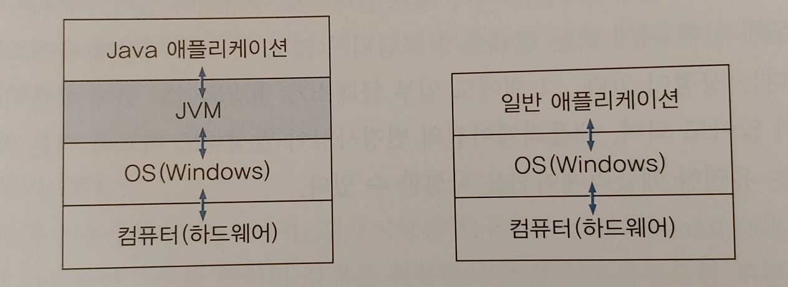  
※ Java 애플리케이션은 JVM에서만 실행되므로 실행에는 반드시 JVM이 필요하며 같은 이유로 운영체제에 자유롭다.

**Build 관련 Eclipse 메뉴 설명**  
Build 란?   
- 소스파일(.java)로 부터 프로그램을 만들어 내는 전과정  
Project > Build Project  
- workspace 안에 있는 모든 프로젝트를 Build 함  
Project > Build Project  
- 현재 프로젝트를 빌드(변경된 소스 파일만 새로 컴파일)  
Project > Clean  
- 이전 빌드의 정보를 모두 삭제(모든 소스 파일은 새로 컴파일한다.)  
-> 빌드 할 때마다 그 정보를 자동 저장하는데, 그 부분을 삭제함  
Project > Build Automatically  
- 소스파일 변경 후, 저장할 때마다 자동 컴파일   

**자주 사용되는 Eclipse 단축키**
- 단축키 전체 목록 보기 : cmd + shift + L
- 폰트 크기 증가/감소 : cmd + '+, -'
- 한 줄 삭제 : cmd + D
- 행단위 복사 : opt + cmd + down(or up) 
- 멀티컬럼 편집 : opt + cmd + A (한 번에 여러줄 동시 작업 시 사용)
- 행단위 이동 : opt + up, down 
- 자동 들여쓰기 : cmd + I
- 주석 처리 : cmd + / (토글)
- 주석 처리(여러줄) : /*  */ (주의사항 : ';' 이전의 주석은 주석이 아니다.)
- 자동 완성 : ctrl + space (ex: 'sysout' 기입 후 누르면 출력 명령어 자동 완성)  
※ 단축키 변경 : Window > Preferences > General > Keys > Binding  
※ 자동완성키 변경 : Window > Preferences > Java > Editor > Templates  
  
  
### **Ch2. 변수'Variable'**

**변수**
- 하나의 값을 저장할 수 있는 메모리 공간
- 원래 메모리 주소는 숫자로 이루어져있으나, 사람이 기억하기 좋게 이름을 붙여놓은 것이 변수

**변수의 선언**
- 값(data)을 저장할 공간을 마련하기 위해 선언
- **변수타입** **변수이름** **;**  형태로 선언
	- int age ; //정수(int) 타입의 변수 age를 선언

**변수에 값 저장**
- '=' 는 등호가 아니라 대입의 개념
```
int age ; // 정수(int) 타입의 변수 age를 선언
age = 25 ; // 변수 age에 25를 저장
int age = 25 ; // 위의 두줄을 한 줄로 표현
```
- 변수 초기화 : 변수에 처음으로 값을 저장하는 것  
[주의사항] 지역 변수는 읽기 전에 꼭! 초기화해야 함
```
int x = 0; // 변수 x를 선언 후, 0으로 초기화
int y = 5; // 변수 y를 선언 후, 5로 초기화
int x = 0, y = 5; // 위 두 줄을 한 줄로 표현
```

**변수의 타입**
- 변수의 타입은 저장할 값의 타입에 의해 결정
- 저장할 값의 타입과 일치하는 타입으로 변수를 선언
- 기본형(Primitive type): Data에 가장 기본이 되는 자료형 -> 실제 값을 저장
	- 논리형 : true와 false 중 하나의 값을 가지며, 조건식과 논리적 계산에 사용
	- 문자형 : 문자를 저장하는데 사용되며, 변수 당 하나의 문자만을 저장 가능
	- 정수형 : 정수 값을 저장하는데 사용. 주로 사용하는 것은 int와 long이며,  
		byte는 이진 데이터를 다루는데 사용되고, short는 c언어와의 호환을 위해 추가되었다.(잘 안쓰임)
	- 실수형 : 실수 값을 저장하는데 사용된다. float와 double이 있다.  
		실수형의 경우 '정밀도'를 갖는데 float의 경우 7, double의 경우 15이다.
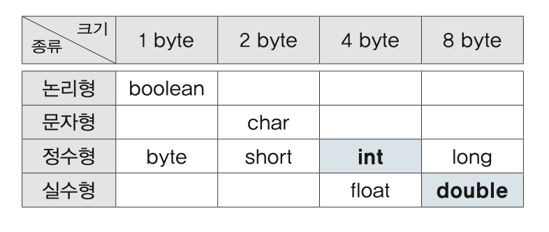  
※ Java에서 Data를 다루는 최소단위가 1byte 이므로 1byte부터 시작  
※ Java에서는 2byte 문자체계인 유니코드(Unicode)를 사용하여 문자는 2byte부터 시작
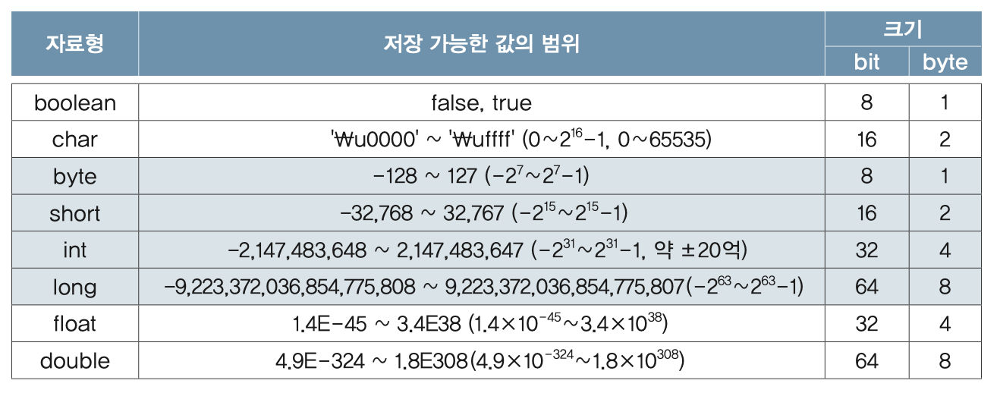  
- 참조형(Reference type) 변수
	- 기본형을 제외한 나머지(String, System 등)
	- 메모리 주소를 저장(4byte or 8byte)
	- 참조 변수는 '객체의 주소를 저장'

**변수, 상수, 리터럴**
- 변수(variable) : 하나의 값을 저장하기 위한 공간
- 상수(constant) : 한 번만 값을 저장 가능한 변수
- 리터럴(litaral) : 그 자체로 값을 의미하는 것(아래 예시에 100, 200 등)
```
int score = 100; // 변수 score에 100이란 값을 저장
    score = 200; // score 에 저장된 값이 200으로 바뀜

**final** int MAX = 100; // 상수 MAX에 100이란 값을 지정
        MAX = 200; // Error 발생
```

**리터럴 타입과접두사, 접미사**
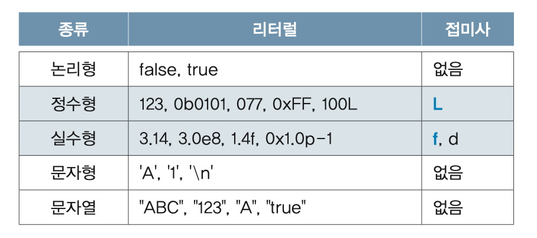  
- 리터럴 값의 구분을 위해 접두사, 접미사를 붙여줌
	- **정수형** 접미사 없는 경우 : int,  L : long (byte, short type 리터럴은 없다.(int 형태로 사용)
	- **실수형** f : float, d(생략가능) : double
- 접두사, 접미사는 대소문자를 구분하지 않음  
(정수형 L의 경우 소문자가 숫자 1과 혼동될 수 있어 대문자 기입하는 것이 좋다.)
```
boolean power = true;
char ch = 'A';
String str = "ABC";
byte b = 127;
byte b = 128; // Error : byte 의 경우 -128 ~ 127 의 값만 저장 가능
int i = 100; // 10진수 
int oct = 0100; // 8진수(접두사 0)
int hex = 0x100; // 16진수(접두사 0x)
int bi = 0b0101; // 2진수(접두사 0b _ 1.7 버전 신규)
long l = 10000000000L; // int 의 경우 최대값이 약 2000000000(20억)이므로 그 이상의 값 정의 시 접미사L을 붙여야 함
long l = 100; // 100의 경우 int 수용범위 내에 들어오므로 L을 붙이지 않아도 됨
float f = 3.14f; // 접미사 f 는 생략 불가
double d = 3.14d; // 접미사 d 의 경우 생략 가능
```
 
**변수와 리터럴의 타입 불일치**
- 범위가 '변수 > 리터럴' 인 경우, OK
```
//예시
int i = 'A'; // int > char
long l = 123; // long > int
double d = 3.14f // double > float
```
- 범위가 '변수 < 리터럴' 인 경우, Error
```
int i = 30_0000_0000; // int의 범위(-20억~20억)를 벗어남
long l = 3.14f; // long < float
float f = 3.14; // float < double
```
- byte, short 변수에 int 리터럴 저장 가능(단, 변수 타입 범위 이내여야 함)
```
byte b = 100; // OK, byte의 범위(-128~127) 이내
byte b = 128; // Error, byte의 범위를 벗어남
```

**문자와 문자열**
- 문자가 여러개로 이루어진 것을 문자열 이라고 함
- 문자열은 'String' 으로 변수를 지정해 주어야 함
- String 은 Java의 기본 class 
- class 는 'new func()' 형태로 객체를 생성하여 쓰이지만 String은 자주 쓰이기 때문에 변수지정 형태로 사용한다.
```
char ch = 'A';
char ch = 'AB'; // Error ''안에는 2개 이상의 문자를 넣을 수 없다.
String s = "ABC";
String s1 = "AB";
String s2 = new String("AB"); // 이와 같은 방식으로도 지정 가능하다.(String은 class이므로)
String s = "A";
String s = ""; // 빈 문자열_ 가능
char ch = ''; // 에러
String s1 = "A" + "B"; // "AB" '+'는 문자열 결합 기
```

**두 변수의 값 교환하기**
```
int x = 10;
int y = 20;
int tmp;

System.out.println("Before change variables..");
System.out.println("x = " + x);
System.out.println("y = " + y);
System.out.println("");		

tmp = x;
x = y;
y = tmp;

System.out.println("After change variables..");
System.out.println("x = " + x);
System.out.println("y = " + y);
System.out.println("tmp = " + tmp);
```

**형식화된 출력 - printf()**
- println()의 단점 : 출력 형식 지정불가
	- 실수의 자리수 조절불가 : 소수점 n자리만 출력 하려면??
	- 10진수로만 출력 됨 : 8, 16진수로 출력하려면??
- printf()로 출력형식 지정가능('%~'형태를 지시자 라고 함)
	- 정수를 10진수, 8진수, 16진수로 출력 가능
	- 8진수와 16진수에 접두사 붙일수 있음
	- 실수 출력을 위한 %f : 지수형식%e, 간략한 형식%g(%f와 %e 비교)
	- 지시자에 숫자를 붙이면 자리수 지정 가능

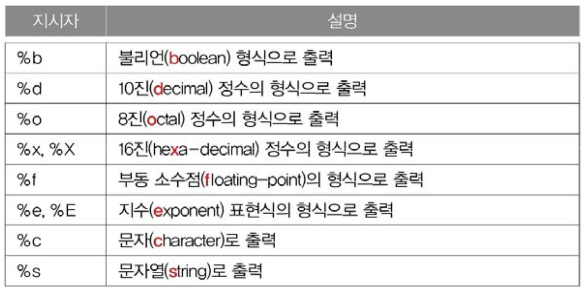

```
// 진수 표현(10, 8, 16, 2)
System.out.printf("%d", 15); // 15 10진수
System.out.printf("%o", 15); // 17 8진수
System.out.printf("%x", 15); // f 16진수
System.out.printf("%s", Integer.toBinaryString(15)); // Integer.toBinaryStrin(??) 2진수로 바꿔줌
// 8, 16진수 표현 시 앞에 0, 0x 기입법 '#'
System.out.printf("%#o", 15); // 017
System.out.printf("%#x", 15); // 0xf
System.out.printf("%#X", 15); // 0xF
// 실수 출력 방식
float f = 123.4567890f;
System.out.printf("%f", f); // 1.23456787 소수점아래 6자리
System.out.printf("%e", f); // 1.234568e+02 지수형식
System.out.printf("%g", f); // 123.457 간략한 형식  
// 자리수 지정
double d = 1.23456789;
System.out.printf("[%5d]%n", 10);     // [   10]
System.out.printf("[%5d]%n", 1234567);// [1234567] 지정한 자리수 상관없이 모두 출력
System.out.printf("[%-5d]%n", 10);    // [10   ]
System.out.printf("[%05d]%n", 10);    // [00010]
System.out.printf("d=%14.10f%n", d);  // [  1.2345678900] 앞 2칸은 공백, 뒤 2칸은 0으로 채움(10자리 표현해야하므로) 
System.out.printf("[%14.6f]%n", d);   // [      1.234568]
// 문자열 표현 방법
String url = "www.codechobo.com";
System.out.printf("[%s]%n", url);    // [www.codechobo.com]
System.out.printf("[%20s]%n", url);  // [   www.codechobo.com] 20칸에 표현하라(기본 우측 정렬)
System.out.printf("[%-20s]%n", url); // [www.codechobo.com   ] '-'를 넣어주어 좌측 정렬
System.out.printf("[%.8s]", url);    // [www.code] '.8' 8글자만 표현
```
※ 더 자세한 지시자는 'JavaAPI > Formatter'

**화면에서 입력받기 - Scanner**
- Scanner : 화면으로부터 데이터를 입력받는 기능을 제공하는 '클래스'
- Scanner 사용 방법
	1. import문 추가
	2. Scanner 객체의 생성
	3. Scanner 객체를 사용
```
import java.util.*; // 1. import문 추가
Scanner scanner = new Scanner(System.in); // 2. Scanner객체의 생성
int num = scanner.nextInt(); // 3. Scanner객체를 사용(화면에서 입력받은 정수를 num에 저장)
// 위의 3번 문장 풀이 ↓↓↓↓↓↓↓↓ 
String input = scanner.nextLine(); // 화면에서 입력받은 내용을 input에 저장
int num = Integer.parseInt(input); // 문자열(input)을 숫자(num)로 저장
```

**타입 간의 변환방법**
- 문자와 숫자 간의 변환
	- 숫자 -> 문자 : + '0'(숫자 0)
	- 문자 -> 숫자 : - '0'(숫자 0)
- 문자열로의 변환
	- 숫자 -> 문자열 : + "" (빈 문자열)
	- 문자 -> 문자열 : + "" (빈 문자열)
- 문자열을 숫자로 변환
	- 문자열 -> 정수 : Integer.parseInt(args) (args에 문자열 기입)
	- 문자열 -> 실수 : Double.parseDouble(args) (args에 문자열 기입)
- 문자열을 문자로 변환
	- 문자열 -> 문자 : 문자열.charAt()  ex) "3".charAt() == '3'


### **Ch3. 연산자'Operator'**

**연산자란?**
- 연산자 : 연산을 수행하는 기호
- 피연산자 : 연산자의 연산 수행 대상
- 모든 연산자는 연산결과를 반환 -> 연산결과를 반환하지 않으면 연산자가 아니다.
```
X + 3 // '+'는 연산자, 'X','3'은 피연산자
```

**연산자의 종류**
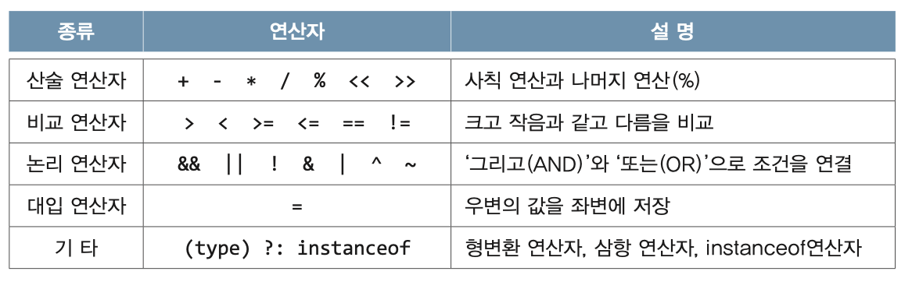

**연산자의 우선순위**
- 하나의 식(expression)에 연산자가 둘 이상 있을 때, 어떤 연산을 먼저 수행할지를 자동 결정
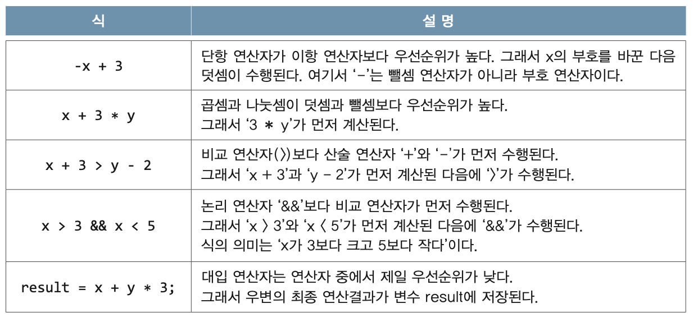

**연산자의 결합규칙**
- 우선순윅 같은 연산자가 있을 때, 어떤 것을 먼저할 것인가

```
x = y = 3 // y = 3 부터 진행 후 x = y  진행
```

**연산자 우선순위, 결합법칙 정리**
1. 산술 > 비교 > 논리 > 대입. 대입은 가장 마지막에 수행
2. 단항(1) > 이항(2) > 삼항(3). 단항 연산자의 우선순위가 이항 연산자보다 높음
3. 단항 연산자와 대입 연산자를 제외한 모든 연산의 진행방향은 왼쪽에서 오른쪽

**증감 연산자**
- 증가 연산자(++) : 피연산자의 값을 1 증가시킨다.
- 감소 연산자(--) : 피연산자의 값을 1 감소시킨다.
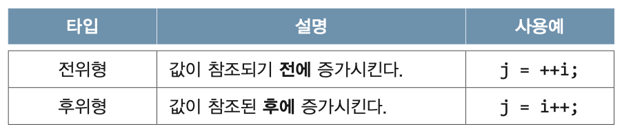  
※ 증감연산자가 독립적으로 사용된 경우, 전위형과 후위형의 차이가 없다.

**형변환 연산자**
- 형변환 : 변수 또는 상수의 타입을 다른 타입으로 변환하는 것
- '(바꿔줄타입)피연산자' 형태로 사
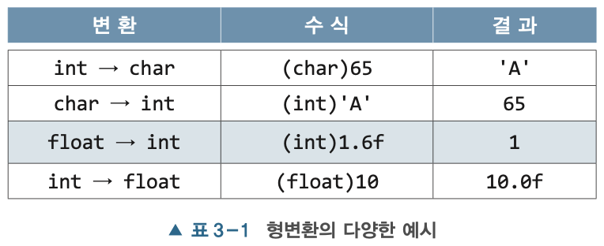

**자동 형변환**
- 컴파일러가 자동으로 형변환을 해주는 것
- 리터럴의 타입보다 변수의 타입이 범위가 넓을 때 이루어짐  
※ 반대로 리터럴의 타입이 더 범위가 넓을 경우 Error 발생.  
-> 직접 형변환 해주어야 함. 
```
float f = 1234; // int 타입의 값을 float타입의 변수에 저장
float f = (float)1234; // 컴파일러가 자동으로 형변환을 해줌

int i = 3.14f; // Error 발생(int < float)
int i = (int)3.14f; // OK 'i = 3' 으로 저장 
```
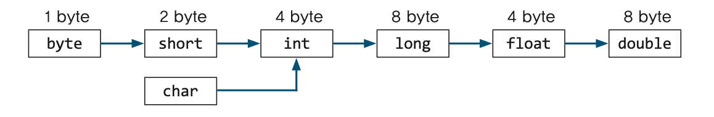

**산술 변환**
- 산술 변환 : 연산 전에 피연산자의 타입을 일치시키는 것 
- 투 피연산자의 타입을 같게 일치시킨다.(보다 큰 타입으로 일치)  
	long + int -> long + long -> long  
	float + int -> float + float -> float  
	double + float -> double + double -> double  
- 피연산자의 타입이 int보다 작은 타입이면 int로 변환된다.  
	byte + short -> int + int -> int  
	char + short -> int + int -> int  
```
int a = 1_000_000; // 1,000,000  1백만 = 10의 6제곱 
int b = 2_000_000; // 2,000,000  2백만 = 10의 6제곱 
		
// 10의 12제곱. int의 범위는 10의 9제곱 
long c = a * b; // int*int 이므로 결과값은 int로 계산된 후 long에 들어감.
long d = (long)a * b; // 둘 중 하나 값에 형변환 해주어야 둘다 바뀐 채로 계산
		
System.out.println(c); // -1454759936
System.out.println(d); // 2,000,000,000,000
```

**반올림 - Math.round()**
- 실수를 소수점 첫 째자리에서 반올림한 정수를 반환
```
double pi = 3.141592;
double shortPi = Math.round(pi*1000)/1000.0; // 소수점 첫째짜리 반올림이므로
System.out.println(shortPi); // 3.142
```

**문자열의 비교**
- 문자열 비교에는 비교연산자 '==' 대신 equals()을 사용해야 한다.
```
// 1번 예시
String str1 = 'abc';
String str2 = 'abc';
System.out.println(str1 == str2); // true
System.out.println(str1.equals(str2)); // true

// 2번 예시
String str1 = new String('abc');
String str2 = new String('abc');
System.out.println(str1 == str2); // false <- 이런 경우 때문에 equals()를 써야한다.
System.out.println(str1.equals(str2)); // true 
```

**논리 연산자 &&, || tip!**
- 문자 ch는 숫자('0'~'9')이다.
	- '0' <= ch && ch <= '9' // 단일 문자의 조건을 물어볼 때는 유니코드를 생각할 것
- 문자 ch는 대문자 또는 소문자이다.
	- ('a' <= ch && ch <= 'z') || ('A' <= ch && ch <= 'Z')

**논리 부정 연산자 !**
- true 를 false로, false 를 true로 바꾼다.  
|x|!x|
|:-:|:-:|
|true|false|
|false|true|  
```
boolean b = true;
!!b -> !!true -> !false -> true
```
- '문자 ch 가 소문자가 아니다.' 를 표시할 때
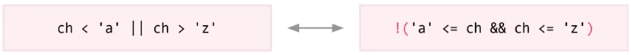

**조건 연산자**
- 조건식의 결과에 따라 연산결과를 달리한다.


