## **자바의 정석 기초편 정리**
**책과 강의를 참고하여 Keyword 중심으로 정리 해보려 합니다.**  
※ 정리 내용은 [자바의 정석 - 기초편] 강의, 책 등을 참고 하였습니다.

[Ch1. 자바를 시작하기 전에](#Ch1-자바를-시작하기-전에)   
[Ch2. 변수 'Variable'](#Ch2-변수-Variable)   
[Ch3. 연산자 'Operator'](#Ch3-연산자-Operator)  
[Ch4. 조건문과 반복문](#Ch4-조건문과-반복문)  
[Ch5. 배열](#Ch5-배열)  
[Ch6. 객체지향 프로그래밍1](#Ch6-객체지향-프로그래밍1)

-------------
### **Ch1. 자바를 시작하기 전에**

**Java**
- 프로그래밍 언어
- 실행환경(JRE) + 개발도구(JDK) + 라이브러리(API)  
※ Web App 개발 시 - Spring Framework 사용한다.

**Why Java??**
- 다양한 분야에 사용된다.
- 20년 간 프로그래밍 언어 1,2위를 다투고 있다.
- 배우기 쉽고 자료가 풍부하다.(역사가 오래되었다(약 20년))
- 모던 프로그래밍 언어(객체지향 + 함수형)  
※ 빅데이터의 영향으로 Java도 함수형 언어로써 지속 발전 중이다.

**Java의 특징**
- 배우기 쉬운 객체지향 언어
- 자동 메모리 관리
- 멀티 쓰레드 작성
- 풍부한 라잉브러리로 쉽게 개발 가능
- 운영체제에 독립적이다.

**자바 가상 머신(JVM_Java Virtual Machine)**
- 자바 프로그램이 실행되는 가상 컴퓨터
- 한 번 작성하면, 어디서든 실행(Write once, Run anywhere)
  
※ Java 애플리케이션은 JVM에서만 실행되므로 실행에는 반드시 JVM이 필요하며 같은 이유로 운영체제에 자유롭다.

**Build 관련 Eclipse 메뉴 설명**  
Build 란?   
- 소스파일(.java)로 부터 프로그램을 만들어 내는 전과정  
Project > Build Project  
- workspace 안에 있는 모든 프로젝트를 Build 함  
Project > Build Project  
- 현재 프로젝트를 빌드(변경된 소스 파일만 새로 컴파일)  
Project > Clean  
- 이전 빌드의 정보를 모두 삭제(모든 소스 파일은 새로 컴파일한다.)  
-> 빌드 할 때마다 그 정보를 자동 저장하는데, 그 부분을 삭제함  
Project > Build Automatically  
- 소스파일 변경 후, 저장할 때마다 자동 컴파일   

**자주 사용되는 Eclipse 단축키**
- 단축키 전체 목록 보기 : cmd + shift + L
- 폰트 크기 증가/감소 : cmd + '+, -'
- 한 줄 삭제 : cmd + D
- 행단위 복사 : opt + cmd + down(or up) 
- 멀티컬럼 편집 : opt + cmd + A (한 번에 여러줄 동시 작업 시 사용)
- 행단위 이동 : opt + up, down 
- 자동 들여쓰기 : cmd + I
- 주석 처리 : cmd + / (토글)
- 주석 처리(여러줄) : /*  */ (주의사항 : ';' 이전의 주석은 주석이 아니다.)
- 자동 완성 : ctrl + space (ex: 'sysout' 기입 후 누르면 출력 명령어 자동 완성)  
- 자동 import문 추가 : cmd + shift + O  
※ 단축키 변경 : Window > Preferences > General > Keys > Binding  
※ 자동완성키 변경 : Window > Preferences > Java > Editor > Templates  
  
  
### **Ch2. 변수 'Variable'**

**변수**
- 하나의 값을 저장할 수 있는 메모리 공간
- 원래 메모리 주소는 숫자로 이루어져있으나, 사람이 기억하기 좋게 이름을 붙여놓은 것이 변수

**변수의 선언**
- 값(data)을 저장할 공간을 마련하기 위해 선언
- **변수타입** **변수이름** **;**  형태로 선언
	- int age ; //정수(int) 타입의 변수 age를 선언

**변수에 값 저장**
- '=' 는 등호가 아니라 대입의 개념
```
int age ; // 정수(int) 타입의 변수 age를 선언
age = 25 ; // 변수 age에 25를 저장
int age = 25 ; // 위의 두줄을 한 줄로 표현
```
- 변수 초기화 : 변수에 처음으로 값을 저장하는 것  
[주의사항] 지역 변수는 읽기 전에 꼭! 초기화해야 함
```
int x = 0; // 변수 x를 선언 후, 0으로 초기화
int y = 5; // 변수 y를 선언 후, 5로 초기화
int y = 5; // 변수 y를 선언 후, 5로 초기화
int x = 0, y = 5; // 위 두 줄을 한 줄로 표현
```

**변수의 타입**
- 변수의 타입은 저장할 값의 타입에 의해 결정
- 저장할 값의 타입과 일치하는 타입으로 변수를 선언
- 기본형(Primitive type): Data에 가장 기본이 되는 자료형 -> 실제 값을 저장
	- 논리형 : true와 false 중 하나의 값을 가지며, 조건식과 논리적 계산에 사용
	- 문자형 : 문자를 저장하는데 사용되며, 변수 당 하나의 문자만을 저장 가능
	- 정수형 : 정수 값을 저장하는데 사용. 주로 사용하는 것은 int와 long이며,  
		byte는 이진 데이터를 다루는데 사용되고, short는 c언어와의 호환을 위해 추가되었다.(잘 안쓰임)
	- 실수형 : 실수 값을 저장하는데 사용된다. float와 double이 있다.  
		실수형의 경우 '정밀도'를 갖는데 float의 경우 7, double의 경우 15이다.
  
※ Java에서 Data를 다루는 최소단위가 1byte 이므로 1byte부터 시작  
※ Java에서는 2byte 문자체계인 유니코드(Unicode)를 사용하여 문자는 2byte부터 시작
  
- 참조형(Reference type) 변수
	- 기본형을 제외한 나머지(String, System 등)
	- 메모리 주소를 저장(4byte or 8byte)
	- 참조 변수는 '객체의 주소를 저장'

**변수, 상수, 리터럴**
- 변수(variable) : 하나의 값을 저장하기 위한 공간
- 상수(constant) : 한 번만 값을 저장 가능한 변수
- 리터럴(litaral) : 그 자체로 값을 의미하는 것(아래 예시에 100, 200 등)
```
int score = 100; // 변수 score에 100이란 값을 저장
    score = 200; // score 에 저장된 값이 200으로 바뀜

final int MAX = 100; // 상수 MAX에 100이란 값을 지정
        MAX = 200; // Error 발생
```

**리터럴 타입과접두사, 접미사**
  
- 리터럴 값의 구분을 위해 접두사, 접미사를 붙여줌
	- **정수형** 접미사 없는 경우 : int,  L : long (byte, short type 리터럴은 없다.(int 형태로 사용)
	- **실수형** f : float, d(생략가능) : double
- 접두사, 접미사는 대소문자를 구분하지 않음  
(정수형 L의 경우 소문자가 숫자 1과 혼동될 수 있어 대문자 기입하는 것이 좋다.)
```
boolean power = true;
char ch = 'A';
String str = "ABC";
byte b = 127;
byte b = 128; // Error : byte 의 경우 -128 ~ 127 의 값만 저장 가능
int i = 100; // 10진수 
int oct = 0100; // 8진수(접두사 0)
int hex = 0x100; // 16진수(접두사 0x)
int bi = 0b0101; // 2진수(접두사 0b _ 1.7 버전 신규)
long l = 10000000000L; // int 의 경우 최대값이 약 2000000000(20억)이므로 그 이상의 값 정의 시 접미사L을 붙여야 함
long l = 100; // 100의 경우 int 수용범위 내에 들어오므로 L을 붙이지 않아도 됨
float f = 3.14f; // 접미사 f 는 생략 불가
double d = 3.14d; // 접미사 d 의 경우 생략 가능
```
 
**변수와 리터럴의 타입 불일치**
- 범위가 '변수 > 리터럴' 인 경우, OK
```
//예시
int i = 'A'; // int > char
long l = 123; // long > int
double d = 3.14f // double > float
```
- 범위가 '변수 < 리터럴' 인 경우, Error
```
int i = 30_0000_0000; // int의 범위(-20억~20억)를 벗어남
long l = 3.14f; // long < float
float f = 3.14; // float < double
```
- byte, short 변수에 int 리터럴 저장 가능(단, 변수 타입 범위 이내여야 함)
```
byte b = 100; // OK, byte의 범위(-128~127) 이내
byte b = 128; // Error, byte의 범위를 벗어남
```

- 문자가 여러개로 이루어진 것을 문자열 이라고 함
- 문자열은 'String' 으로 변수를 지정해 주어야 함
- String 은 Java의 기본 class 
- class 는 'new func()' 형태로 객체를 생성하여 쓰이지만 String은 자주 쓰이기 때문에 변수지정 형태로 사용한다.
```
char ch = 'A';
char ch = 'AB'; // Error ''안에는 2개 이상의 문자를 넣을 수 없다.
String s = "ABC";
String s1 = "AB";
String s2 = new String("AB"); // 이와 같은 방식으로도 지정 가능하다.(String은 class이므로)
String s = "A";
String s = ""; // 빈 문자열_ 가능
char ch = ''; // 에러
String s1 = "A" + "B"; // "AB" '+'는 문자열 결합 기
```

**두 변수의 값 교환하기**
```
int x = 10;
int y = 20;
int tmp;

System.out.println("Before change variables..");
System.out.println("x = " + x);
System.out.println("y = " + y);
System.out.println("");		

tmp = x;
x = y;
y = tmp;

System.out.println("After change variables..");
System.out.println("x = " + x);
System.out.println("y = " + y);
System.out.println("tmp = " + tmp);
```

**형식화된 출력 - printf()**
- println()의 단점 : 출력 형식 지정불가
	- 실수의 자리수 조절불가 : 소수점 n자리만 출력 하려면??
	- 10진수로만 출력 됨 : 8, 16진수로 출력하려면??
- printf()로 출력형식 지정가능('%~'형태를 지시자 라고 함)
	- 정수를 10진수, 8진수, 16진수로 출력 가능
	- 8진수와 16진수에 접두사 붙일수 있음
	- 실수 출력을 위한 %f : 지수형식%e, 간략한 형식%g(%f와 %e 비교)
	- 지시자에 숫자를 붙이면 자리수 지정 가능


```
// 진수 표현(10, 8, 16, 2)
System.out.printf("%d", 15); // 15 10진수
System.out.printf("%o", 15); // 17 8진수
System.out.printf("%x", 15); // f 16진수
System.out.printf("%s", Integer.toBinaryString(15)); // Integer.toBinaryStrin(??) 2진수로 바꿔줌
// 8, 16진수 표현 시 앞에 0, 0x 기입법 '#'
System.out.printf("%#o", 15); // 017
System.out.printf("%#x", 15); // 0xf
System.out.printf("%#X", 15); // 0xF
// 실수 출력 방식
float f = 123.4567890f;
System.out.printf("%f", f); // 1.23456787 소수점아래 6자리
System.out.printf("%e", f); // 1.234568e+02 지수형식
System.out.printf("%g", f); // 123.457 간략한 형식  
// 자리수 지정
double d = 1.23456789;
System.out.printf("[%5d]%n", 10);     // [   10]
System.out.printf("[%5d]%n", 1234567);// [1234567] 지정한 자리수 상관없이 모두 출력
System.out.printf("[%-5d]%n", 10);    // [10   ]
System.out.printf("[%05d]%n", 10);    // [00010]
System.out.printf("d=%14.10f%n", d);  // [  1.2345678900] 앞 2칸은 공백, 뒤 2칸은 0으로 채움(10자리 표현해야하므로) 
System.out.printf("[%14.6f]%n", d);   // [      1.234568]
// 문자열 표현 방법
String url = "www.codechobo.com";
System.out.printf("[%s]%n", url);    // [www.codechobo.com]
System.out.printf("[%20s]%n", url);  // [   www.codechobo.com] 20칸에 표현하라(기본 우측 정렬)
System.out.printf("[%-20s]%n", url); // [www.codechobo.com   ] '-'를 넣어주어 좌측 정렬
System.out.printf("[%.8s]", url);    // [www.code] '.8' 8글자만 표현
```
※ 더 자세한 지시자는 'JavaAPI > Formatter'

**화면에서 입력받기 - Scanner**
- Scanner : 화면으로부터 데이터를 입력받는 기능을 제공하는 '클래스'
- Scanner 사용 방법
	1. import문 추가
	2. Scanner 객체의 생성
	3. Scanner 객체를 사용
```
import java.util._*_ // 1. import문 추가
Scanner scanner = new Scanner(System.in); // 2. Scanner객체의 생성
Scanner scanner = new Scanner(System.in); // 2. Scanner객체의 생성
int num = scanner.nextInt(); // 3. Scanner객체를 사용(화면에서 입력받은 정수를 num에 저장)
// 위의 3번 문장 풀이 ↓↓↓↓↓↓↓↓ 
String input = scanner.nextLine(); // 화면에서 입력받은 내용을 input에 저장
int num = Integer.parseInt(input); // 문자열(input)을 숫자(num)로 저장
```

**타입 간의 변환방법**
- 문자와 숫자 간의 변환
	- 숫자 -> 문자 : + '0'(숫자 0)
	- 문자 -> 숫자 : - '0'(숫자 0)
- 문자열로의 변환
	- 숫자 -> 문자열 : + "" (빈 문자열)
	- 문자 -> 문자열 : + "" (빈 문자열)
- 문자열을 숫자로 변환
	- 문자열 -> 정수 : Integer.parseInt(args) (args에 문자열 기입)
	- 문자열 -> 실수 : Double.parseDouble(args) (args에 문자열 기입)
- 문자열을 문자로 변환
	- 문자열 -> 문자 : 문자열.charAt()  ex) "3".charAt() == '3'


### **Ch3. 연산자 'Operator'**

**연산자란?**
- 연산자 : 연산을 수행하는 기호
- 피연산자 : 연산자의 연산 수행 대상
- 모든 연산자는 연산결과를 반환 -> 연산결과를 반환하지 않으면 연산자가 아니다.
```
X + 3 // '+'는 연산자, 'X','3'은 피연산자
```

**연산자의 종류**  


**연산자의 우선순위**
- 하나의 식(expression)에 연산자가 둘 이상 있을 때, 어떤 연산을 먼저 수행할지를 자동 결정  


**연산자의 결합규칙**
- 우선순윅 같은 연산자가 있을 때, 어떤 것을 먼저할 것인가  
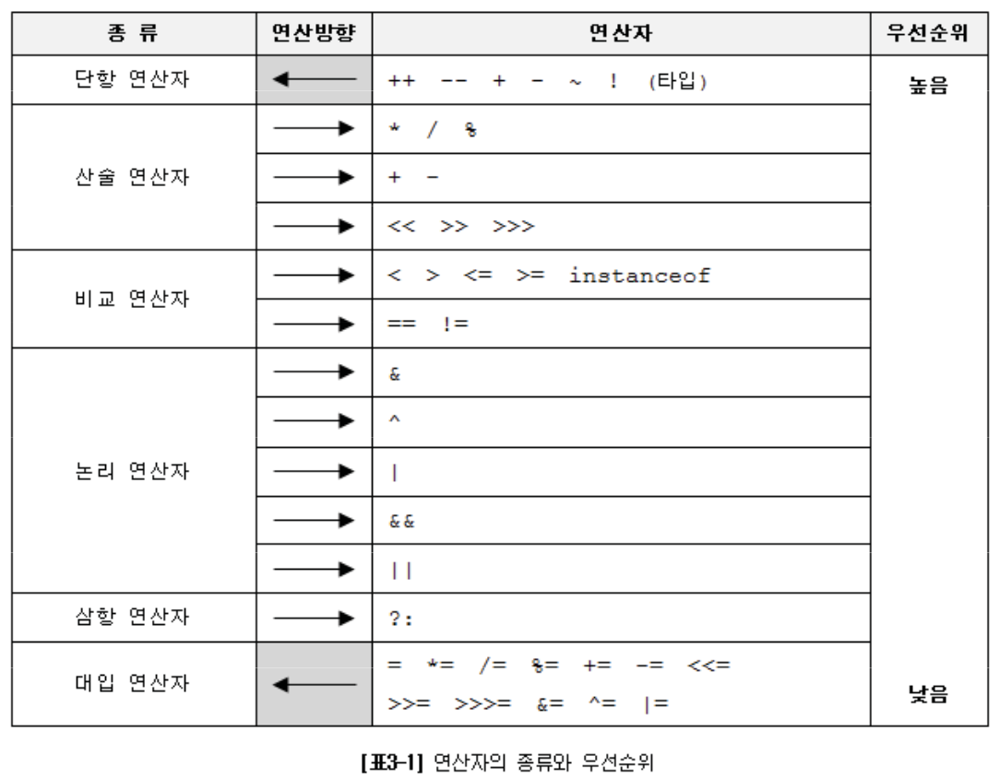
```
x = y = 3 // y = 3 부터 진행 후 x = y  진행
```

**연산자 우선순위, 결합법칙 정리**
1. 산술 > 비교 > 논리 > 대입. 대입은 가장 마지막에 수행
2. 단항(1) > 이항(2) > 삼항(3). 단항 연산자의 우선순위가 이항 연산자보다 높음
3. 단항 연산자와 대입 연산자를 제외한 모든 연산의 진행방향은 왼쪽에서 오른쪽

**증감 연산자**
- 증가 연산자(++) : 피연산자의 값을 1 증가시킨다.
- 감소 연산자(--) : 피연산자의 값을 1 감소시킨다.  
  
※ 증감연산자가 독립적으로 사용된 경우, 전위형과 후위형의 차이가 없다.

**형변환 연산자**
- 형변환 : 변수 또는 상수의 타입을 다른 타입으로 변환하는 것
- '(바꿔줄타입)피연산자' 형태로 사용  


**자동 형변환**
- 컴파일러가 자동으로 형변환을 해주는 것
- 리터럴의 타입보다 변수의 타입이 범위가 넓을 때 이루어짐  
※ 반대로 리터럴의 타입이 더 범위가 넓을 경우 Error 발생.  
-> 직접 형변환 해주어야 함. 
```
float f = 1234; // int 타입의 값을 float타입의 변수에 저장
float f = (float)1234; // 컴파일러가 자동으로 형변환을 해줌

int i = 3.14f; // Error 발생(int < float)
int i = (int)3.14f; // OK 'i = 3' 으로 저장 
```


**산술 변환**
- 산술 변환 : 연산 전에 피연산자의 타입을 일치시키는 것 
- 투 피연산자의 타입을 같게 일치시킨다.(보다 큰 타입으로 일치)  
	long + int -> long + long -> long  
	float + int -> float + float -> float  
	double + float -> double + double -> double  
- 피연산자의 타입이 int보다 작은 타입이면 int로 변환된다.  
	byte + short -> int + int -> int  
	char + short -> int + int -> int  
```
int a = 1_000_000; // 1,000,000  1백만 = 10의 6제곱 
int b = 2_000_000; // 2,000,000  2백만 = 10의 6제곱 
// 10의 12제곱. int의 범위는 10의 9제곱 
long c = a * b; // int*int 이므로 결과값은 int로 계산된 후 long에 들어감.
long d = (long)a * b; // 둘 중 하나 값에 형변환 해주어야 둘다 바뀐 채로 계산
		
System.out.println(c); // -1454759936
System.out.println(d); // 2,000,000,000,000
```

**반올림 - Math.round()**
- 실수를 소수점 첫 째자리에서 반올림한 정수를 반환
```
double pi = 3.141592;
double shortPi = Math.round(pi*1000)/1000.0; // 소수점 첫째짜리 반올림이므로
System.out.println(shortPi); // 3.142
```

**문자열의 비교**
- 문자열 비교에는 비교연산자 '==' 대신 equals()을 사용해야 한다.
```
// 1번 예시
String str1 = 'abc';
String str2 = 'abc';
System.out.println(str1 == str2); // true
System.out.println(str1.equals(str2)); // true

// 2번 예시
String str1 = new String('abc');
String str2 = new String('abc');
System.out.println(str1 == str2); // false <- 이런 경우 때문에 equals()를 써야한다.
System.out.println(str1.equals(str2)); // true 
```

**논리 연산자 &&, || tip!**
- 문자 ch는 숫자('0'~'9')이다.
	- '0' <= ch && ch <= '9' // 단일 문자의 조건을 물어볼 때는 유니코드를 생각할 것
- 문자 ch는 대문자 또는 소문자이다.
	- ('a' <= ch && ch <= 'z') || ('A' <= ch && ch <= 'Z')

**논리 부정 연산자 !**
- true 를 false로, false 를 true로 바꾼다.  
| x | !x |
| :----: | :----: |
| true | false |
| false | true |
<br/>

```
boolean b = true;
!!b -> !!true -> !false -> true
```
- '문자 ch 가 소문자가 아니다.' 를 표시할 때  


**조건 연산자**
- 조건식의 결과에 따라 연산결과를 달리한다.
- 유일한 3항 연산자로 피연산자가 3개
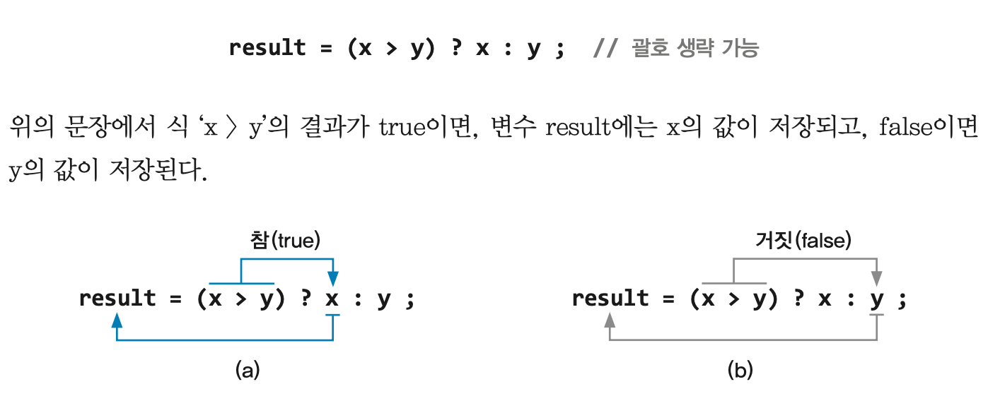
```
// 예시
result = (x > y) ? x : y ;
-> result = (5 > 3) ? 5 : 3 ;
-> result = (true) ? 5 : 3 ;
-> result = 5 ;

// 간단한 조건문은 조건 연산자로..
if ( x > y )
	result = x;
else
	result = y;

-> result = (x > y) ? x : y ;
```

**대입 연산자**
- 오른쪽 피연산자를 왼쪽 피연산자에 저장 후 저장된 값을 반환
- 오른쪽에서 왼쪽으로 진행
```
System.out.println(x = 3); // 변수 x에 3이 저장되고,
-> System.out.println(3);  // 연산결과인 3이 출력
```
- lvalue : 대입 연산자의 왼쪽 피연산자
- rvalue : 대입 연산자의 오른쪽 피연산자  
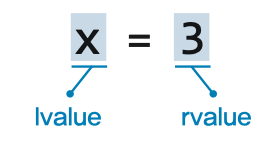

**복합 대입 연산자**
- 대입 연산자와 다른 연산자를 하나로 축약  
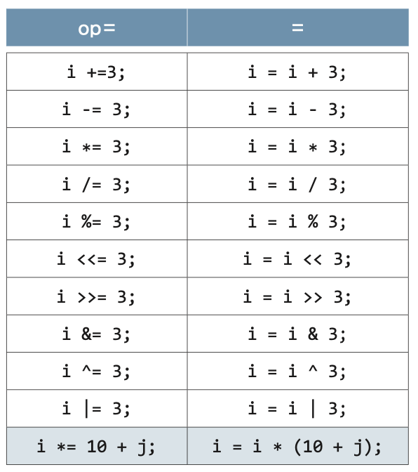


### **Ch4. 조건문과 반복문**
- 프로그램의 실행 흐름을 바꿔준다고 하여 '제어문(flow control statement)' 이라고도 함 
**조건문(if, switch)** : 조건을 만족할 때만 {}를 수행(0번에서최대 1번)  
**반복문(while, for)** : 조건을 만족하는 동안 {}를 수행(0번에서 최대 n번)  
  
※ 조건식의 다양한 예  
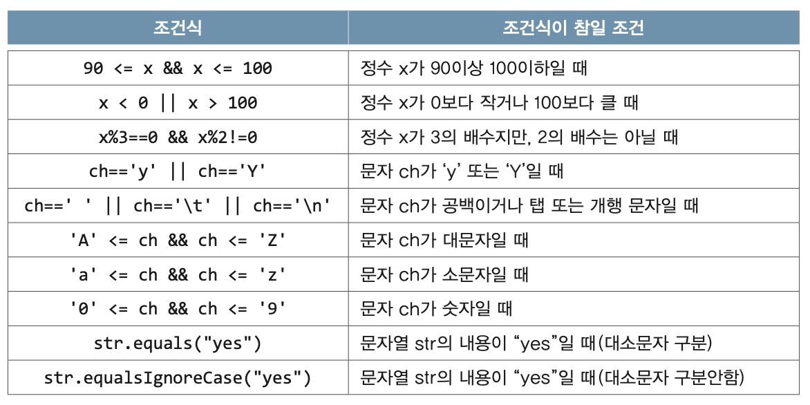

**블럭 {}**
- 여러 문장을 하나로 묶어주는 것
- 조건문에 종속된 문장이 하나인 경우, 생략 가능
- But, 하나 이상인 경우 둘째줄부터는 조건문에 속하지 않으므로 블럭 사용하자.
```
if(score > 60)
	System.out.println("합격입니다.");    // if문에 속한 문장 처리
	System.out.println("축하 드립니다."); // if문에 속한 문장이 아님
```

**if - else if문 예제**
- 리팩토링 개념으로 else 구문을 생략하기 위해 grade 초기값을 D로 지정하는 것이 인상깊어 남겨본다.
```
int score = 0;     // 점수를 저장하기 위한 변수 
char grade = 'D';  // 초기 값을 D로 지정해주므로써 else 구문 생략 가능 

System.out.print("점수를 입력하세요.> "); 
Scanner scanner = new Scanner(System.in);
score = scanner.nextInt(); // 화면을 통해 입력받은 숫자를 score에 저장

if(score >= 90) {          // score가 90점 보다 같거나 크면 A 학점
	grade = 'A';
} else if(score >= 80) {   // score가 80점 보다 같거나 크면 B 학점 
	grade = 'B';
} else if(score >= 70) {   // score가 70점 보다 같거나 크면 C 학점 
	grade = 'C';
} 
//else {             	   // 나머지는 D 학점 
//	grade = 'D';
//} 
System.out.println("당신의 학점은 " + grade + " 입니다.");
```

**중첩 if문 - if문 안의 if문**
- 들여쓰기에 관계 없이 else는 바로 직전에 if에 대응된다. 블럭을 사용해야하는 이유2.   
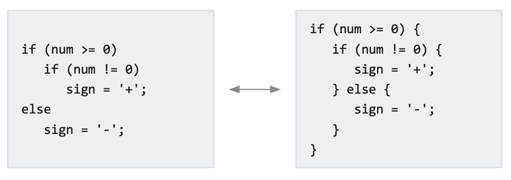

**switch 문**
- 처리해야 하는 경우의 수가 많을 때 유용한 조건문  

```
//switch문 예제

System.out.print("현재는 몇 월 인가요?> ");
Scanner scanner = new Scanner(System.in);
int month = scanner.nextInt();

switch(month) {
	case 3: case 4: case 5:
		System.out.println("현재 계절은 봄 입니다.");
		break;
	case 6: case 7: case 8:
		System.out.println("현재 계절은 여름 입니다.");
		break;
	case 9: case 10: case 11:
		System.out.println("현재 계절은 가을 입니다.");
		break;
	default:
		System.out.println("현재 계절은 겨울 입니다.");
```

**switch문의 제약조건**
- switch문의 조건식 결과는 정수 또는 문자열이어야 한다. (문자열은 1.7 버전부터 가능)
- case문의 값음 정수 상수(문자 포함, 변수X), 문자열만 가능하며, 중복되지 않아야 한다.  
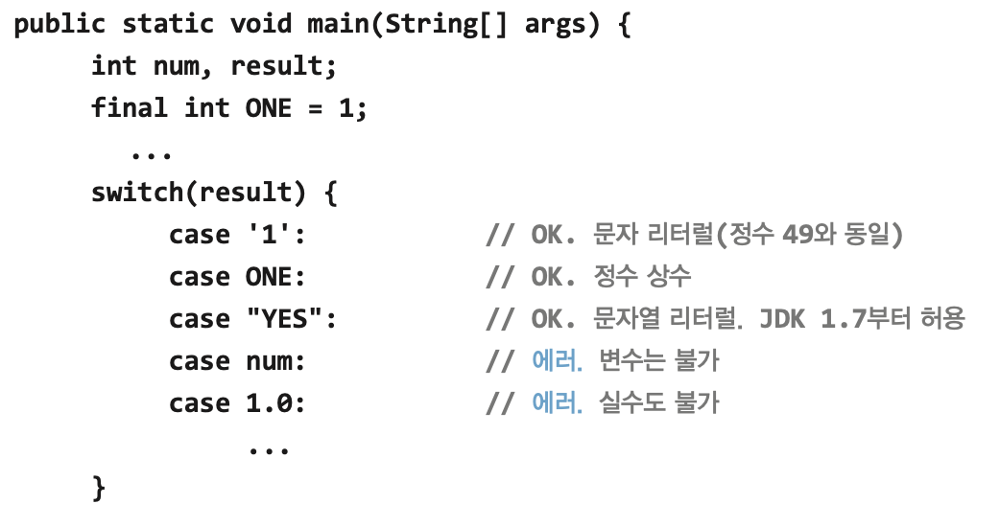

**임의의 정수 만들기**
- Math.random() - 0.0과 1.0 사이의 임의의 double값을 반환
- 0.0 <= Math.random() < 1.0
	1. 각 변에 원하는 개별 값을 곱한다.
	2. 각 변을 int형으로 변환한다.
	3. 각 변에 1을 더한다.
```
1 <= (int)(Math.random() * 3) + 1 < 4 // 1 ~ 3 중 임의의 정수
-5 <= (int)(Math.random() * 11) - 5 < 6 // -5 ~ 5 중 임의의 정수 
```

**for문**
- 조건을 만족하는 동안 블럭{}을 반복 -> 반복 횟수를 알 때 적합
- '초기화 -> 조건식 -> 수행될 문장 -> 증감식 -> 조건식 -> ...' 순으로 진행  

```
// for문 예제
for (int i = 0; i < 3; i++) {
System.out.println("Hello.");
}

for (int i = 0, j = 0; i < 10; i++, j++) {  // 동시에 두 개 이상의 변수도 선언 가능
System.out.println(i * j);
}

int sum = 0;
for (int i = 0; i < 5; i++){
	sum += i; // sum = sum + i
	System.out.println("1부터 %2d 까지의 합: %2d%n", i, sum);
```
```
// for문 예제2 (변수의 범위가 인상깊어 남김)
class Ex_for {
	public static void main(String[] args){
		int i = 1;  // scope(범위) - 선언 위치부터 선언된 블럭 끝까지 유효(범위는 좁을 수록 좋다.)

		for( ; ; ){ //조건식을 생략하면, true로 간주되어 무한 반복문이 됨
			System.out.println("Hello");
		}
	}
}
```

**중첩 for문 예제**
```
// 구구단
for(int i = 2; i < 10; i++) {
	System.out.println(i + " 단.");
	for(int j = 1; j < 10; j++) {
		System.out.printf("%d * %d = %2d%n",i,j,i*j);
	}
	System.out.println(" ");
}
```
```
// '*' 별찍기(같은 숫자)
for(int i = 0; i < 5; i++) {           // 줄 수
	for(int j = 0; j < 10; j++) {  // 별 개수
		System.out.print("*");
	}
	System.out.println();          // 줄바꿈
}

// '*' 별찍기(계단식)
for(int i = 1; i <= 10; i++) {
	for(int j = 1; j <= i; j++) {  // i를 조건문에 넣어주므로써 i,j가 같이 늘어날 수 있게 함.
		System.out.print('*');
	}
	System.out.println();
}
```

**while문**
- 조건을 만족시키는 동안 블럭{}을 반복 -> 반복 횟수를 모를 때 적합
- while문과 for문은 서로 바꿔서 쓸 수 있다.(100%)  

```
import java.util.*;

public class Ex4_9_while {

	public static void main(String[] args) {

		int num = 0, sum = 0;
		
		System.out.print("숫자를 입력하세요.(예 : 12345)> ");
		Scanner scanner = new Scanner(System.in);
		num = scanner.nextInt();
		
		while(num > 0) {
			sum += (num % 10);
			System.out.printf("자리수 : %2d, 합계 : %3d, 현재 숫자 : %10d%n", num%10, sum, num);
			num = num / 10;
	
		}
	}
}
```

**do-while 문**
- 블럭{}을 최소한 한 번 이상 반복 -> 사용자 입력 받을 때 유용
```
do {
	// 조건식의 연산결과가 참일 때 수행될 문장들을 적는다.(처음 한 번은 무조건 실행)
} while(조건식); <- 끝에 ';'을 잊지 않도록 주의
```

**break 문**
- 자신이 포함된 **하나의 반복문**을 벗어난다.
```
int sum = 0;
int i = 0;

while(true) {  // while 문에서 조건은 생략 불가.( for( ; ; ) 형태로는 사용 가능.)
	if(sum > 100) {
		break; // sum이 100 보다 크면 '자신이 속한 하나의 반복문'을 벗어난다.
	}
	++i;
	sum += i;
}
System.out.println("i = " + i);
System.out.println("sum = " + sum);
```

**continue 문**
- 자신이 포함된 반복문의 끝으로 이동 -> 다음 반복으로 넘어감
- 전체 반복 중에서 특정 조건 시 반복을 건너뛸 때 유용  
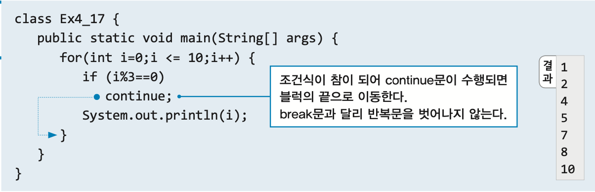
```
for(int i = 0; i <= 10; i++){
	if(i % 3 == 0){
		continue;
	}
	System.out.println(i);
}
```

**이름 붙은 반복문**
- 반복문에 이름을 붙여서 하나 이상의 반복문을 벗어날 수 있다.
- 보통 break 문을 통해 한꺼번에 빠져나오고 싶을 때 사용하며,
- continue에도 사용할 수는 있지만 잘 쓰지 않는다.  
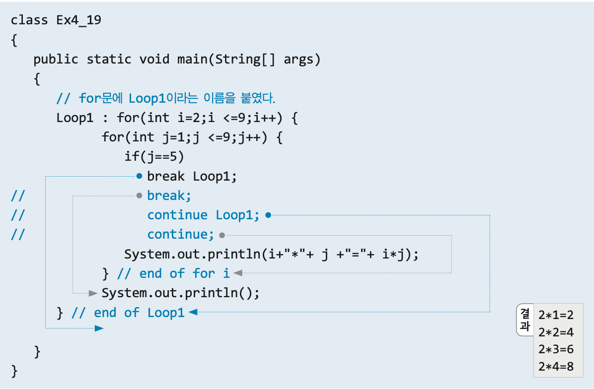

**조건문과 반복문, break, continue 통합 예제**
- 프로그램 전체적인 그림을 조건에 맞춰 먼저 구현하고 마지막에 주기능을 프로그래밍한 것이 인상 깊어 남긴다.
```
import java.util.*;

public class Ex4_14_menu {

	public static void main(String[] args) {

		int menu = 0, num = 0;
		Scanner scanner = new Scanner(System.in);

		outer: while (true) { // (무한)반복문 while에 outer라는 이름을 붙임
			System.out.println("(1) square");
			System.out.println("(2) square root");
			System.out.println("(3) log");
			System.out.print("원하는 메뉴(1~3)를 선택하세요.(종료:0)> ");

			String tmp = scanner.nextLine();
			menu = Integer.parseInt(tmp);

			if (menu == 0) { // 조건에 맞는 값인지 걸러주는 조건문
				System.out.println("프로그램을 종료합니다.");
				break;
			} else if (!(1 <= menu && menu <= 3)) {
				System.out.println("메뉴를 잘못 선택하셨습니다.(종료:0");
				continue;
			}

			for (;;) { // 입력한 조건에 따라 명령을 실행하는 (무한)반복문
				System.out.print("계산할 값을 입력하세요.(계산 종료:0, 전체 종료:99) > ");
				tmp = scanner.nextLine();
				num = Integer.parseInt(tmp);

				if (num == 0) { 
					break; // 계산 종료 for문을 벗어난다.(한껍데기만)
				} else if (num == 99) {
					System.out.println("프로그램을 종료합니다.");
					break outer; // outer로 지정한 반복문까지 벗어난다.
				}

				switch (menu) { // 명령 실행
				case 1:
					System.out.println("result : " + num + " square = " + num * num);
					break;
				case 2:
					System.out.println("result : " + num + " square root = " + Math.sqrt(num));
					break;
				case 3:
					System.out.println("result : " + num + " log = " + Math.log(num));
					break;
				}
			}
		}
	}
}
```


### **Ch.5 배열**

**배열이란?**
- 배열은 **같은 타입의 여러 변수**를 하나의 묶음으로 다루는 것

**배열의 선언**
- 배열을 다루기 위한 **참조변수**의 선언  
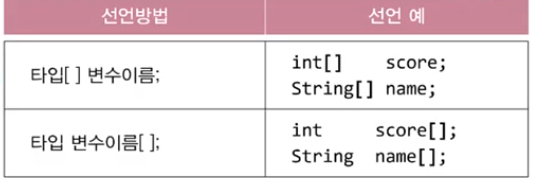  
※ '타입[] 변수이름;' 이 많이 쓰임. ('타입 변수이름[];' 의 경우 C style)  
```
타입[] 변수이름;           // 배열을 선언(배열을 다루기 위한 참조변수 선언)
변수이름 = new 타입[길이]; // 배열을 생성(실제 저장공간을 생성)

int[] score;               // int 타입의 배열을 다루기 위한 참조변수 score 선언
score = new int[5];        // int 타입의 값 5개를 저장할 수 있는 배열 생성
```

**배열의 인덱스**
- 배열의 인덱스(Index) : 각 요쇼에 자동으로 붙는 번호   
- "인덱스의 범위는 0부터 '배열길이-1' 까지"

**배열의 길이**
- 배열의 길이 : '배열이름.length'(int형 상수)  
- 배열은 한 번 생성하여 실행하는 동안 그 길이를 바꿀 수 없다.  
	- Why? : 배열은 메모리에 연속적으로 저장 -> 길이 변경 시 연속적 저장 불가할 수 있음.
	- 배열이 부족할 땐? : 새로운 배열을 만들어 기존 데이터를 복사한다.(다시 컴파일)
	- '배열이름.length' 사용 이유 : index 범위를 벗어나거나 틀리는 것을 방지하기 위해
**배열의 초기화** 
- 배열의 초기화란? : 배열의 각 요소에 처음으로 값을 저장하는 것
```
// OK
int[] score = new int[]{1,2,3,4,5,6};
int[] score = {1,2,3,4,5,6}; // 가장 간단하고 가장 많이 사용됨.
int[] score;
score = new int[]{1,2,3,4,5,6};

// Error
int[] score;
score = {1,2,3,4,5,6}
```

**배열의 출력**
```
// for문을 사용
for(int i = 0; i < arr.length; i++){
	System.out.println(arr[i]);
}

// Arrays.toString() 을 사용
System.out.println(Arrays.toString(arr)); // [arr[0], arr[1], arr[2], arr[3], arr[4]] 형태로 출력

// char[] 의 경우 예외를 용납함.
System.out.println(arrChar); // arrChar 가 char[] 인경우 문자열 형태로 출력됨.
-> 실제로 문자열은 문자(char)의 배열형태이다. 가장 마지막에는 \n이 들어감.
-> 문자열 data를 찾는 방식 : 문자열 가장 앞의 문자의 주소를 찾아가 \n이 있는 곳까지 읽음.
```

**배열의 활용 (예제)**
```
// max, min 값 찾기.
int[] arr = {99, 37, 77, 70, 12, 100, 50, 60};

int max = arr[0]; // max 초기화
int min = arr[0]; // min 초기화

for(int i = 0; i < arr.length; i++) {
	if(arr[i] > max) { 
		max = arr[i]; // 초기화된 값과 비교하여 더 크면 다시 저장
	} else if (arr[i] < min) {
		min = arr[i]; // 초기화된 값과 비교하여 더 작으면 다시 저장
	}
}
System.out.println("The max is " + max);
System.out.println("The min is " + min);
```
```
// 섞기 (Shuffle)
int[] arr = {0,1,2,3,4,5,6,7,8,9};
System.out.println(Arrays.toString(arr));

for(int i = 0; i < 100; i++) {
	int n = (int)(Math.random()*10);
				
	int tmp = arr[n]; // 두 값을 바꾸기 위해서는 빈 그릇이 필요하다.
	arr[n] = arr[0];
	arr[0] = tmp;
}
System.out.println(Arrays.toString(arr));
```
```
// lotto 번호 뽑기(shuffle 응용)
int[] lottoNum = new int[45]; // 공 45개를 위한 배열 선언
for(int i = 0; i < lottoNum.length; i++) { // 1~45번 공 넣기
	lottoNum[i] = i + 1;
}	
for(int j = 0; j < 6; j++) { // 인덱스 0~5 까지의 공을 random 공과 바꾼다.
	int n = (int)(Math.random()*45);
	
	int tmp = lottoNum[n];
	lottoNum[n] = lottoNum[j];
	lottoNum[j] = tmp;
}
System.out.print("This week's lotto numbers are ");
for(int k = 0; k < 6; k++) { // 바꾸어진 인덱스 0~5 까지의 공을 출력
	if(k == 5) {
		System.out.println(lottoNum[k]);
		break;
	}
	System.out.print(lottoNum[k] + ", ");
}
```

**String 배열의 선언과 생성**
- 여러개의 문자열을 저장할 수 있는 배열
- String 은 참조형 변수를 지정  
  
- String[] name = new String[3];  
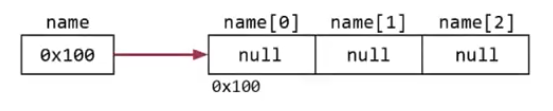  
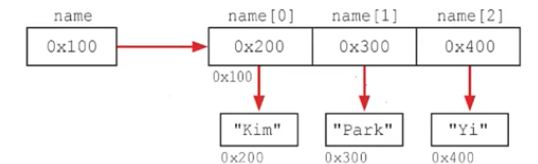  

**String 클래스**
- String 클래스는 char[]와 메서드(기능)를 결합한 것
	- 'String클래스 = char[] + 메서드(기능)'
- String 클래스는 내용을 변경할 수 없다.(read only)
	- 동일한 변수명에 다시 저장하면 새로운 문자열을 만들어 참조
- String 클래스의 주요 메서드  
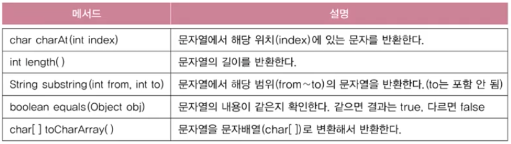  
```
String str = "ABCDE";

// 문자열 중 원하는 위치의 문자를 반환
char ch = str.charAt(2);
System.out.println(ch); // C index 2인 값을 뽑아냄

// 문자열 길이 반환
int leng = str.length();
System.out.println(leng); // 5 문자열의 길이

// 문자열 중 원하는 범위의 문자열을 반환
String str1 = str.substring(1,4);
String str2 = str.substring(1);
System.out.println(str1); // BCD index 1~3의 값을 반환
System.out.println(str2); // BCDE index 1부터 끝까지 반환

// 문자열의 내용이 같은지 확인
boolean bool = str.equals("ABCDE");
System.out.println(bool); // true

// 문자열을 문자배열로 변환하여 반환
char[] charArr = str.toCharArray();
System.out.println(Arrays.toString(charArr)); // [A, B, C, D, E]
```

**2차원 배열(배열의 배열)**
- 테이블 형태의 데이터를 저장하기 위한 배열
- 2차원 배열의 인덱스  
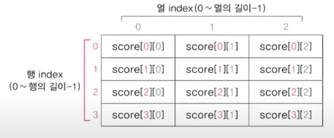  
```
int[][] score = new int[4][3]; // 4행 3열의 2차원 배열 score을 생성
score[0][0] = 100;
System.out.println(score[0][0])
```

- 2차원 배열의 초기화
```
// 가능
int[][] arr = new int[][]{{1,2,3},{4,5,6}};
int[][] arr = {{1,2,3},{4,5,6}};

// 권장 방안
int[][] arr = {
		{100, 100, 100},
		{20, 20, 20},
		{30, 30, 30},
		{40, 40, 40}
	      };
```  
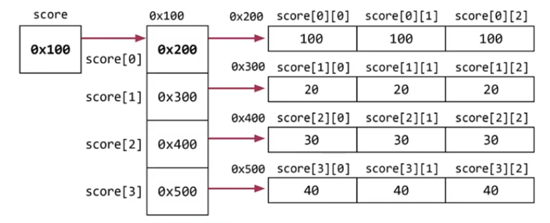  

- 2차원 배열 예제 : 2차원 배열은 2중 반복문과 함께 자주 사용
```
int[][] table = {
		{100,100,100},
		{20,20,20},
		{30,30,30},
		{40,40,40}
};

int sum = 0;
System.out.println(table.length);

// 2차원 배열의 경우 2중 반복문을 자주 사용한다.
for(int i = 0; i < table.length; i++) {
	for(int j = 0; j < table[i].length; j++) {
		System.out.println("score["+i+"]["+j+"]="+table[i][j]);
		sum += table[i][j];
	}
}
System.out.println("sum = " + sum);
```

**Arrays 클래스**
- 배열의 비교와 출력 : equals(), toString()
```
// 배열의 출력
int[] arr = {0,1,2,3,4};
int[][] arr2D = {{11,12},{21,22}};

System.out.println(Arrays.toString(arr)); // [0, 1, 2, 3, 4]
System.out.println(Arrays.deepToString(arr2D)); // [[11, 12], [21, 22]]

// 배열의 비교
String[][] str2D =  new String[][]{{"aaa", "bbb"}, {"AAA", "BBB"}};
String[][] str2D2 = new String[][]{{"aaa", "bbb"}, {"AAA", "BBB"}};

System.out.println(Arrays.equals(str2D, str2D2)); // false
System.out.println(Arrays.deepEquals(str2D, str2D2)); // true
```

- 배열의 복사 : copyOf(), copyOfRange()
```
int[] arr1 = {0,1,2,3,4};
int[] arr2 = Arrays.copyOf(arr1,arr.length); // [0,1,2,3,4]
int[] arr3 = Arrays.copyOf(arr1, 3); // [0,1,2]
int[] arr4 = Arrays.copyOf(arr1, 7); // [0,1,2,3,4,0,0]
int[] arr5 = Arrays.copyOfRange(arr1, 2, 3); // [2]
int[] arr6 = Arrays.copyOfRange(arr1, 0, 7); // [0,1,2,3,4,0,0]
int[][] arrs = {arr1,arr2,arr3,arr4,arr5,arr6};

for(int i = 0; i < 6; i++) {
	System.out.println(Arrays.toString(arrs[i]));
}
```

- 배열의 정렬 : sort()
```
int[] arr = {3,2,0,4,1};
Arrays.sort(arr); // [0,1,2,3,4]
System.out.println(Arrays.toString(arr));
```

### **Ch.6 객체지향 프로그래밍1**

**객체지향 언어**
- `80년대 초 소프트웨어의 위기 : 빠른 변화를 쫓아가지 못함
- 그 해결책으로 객체지향 언어를 도입(절차적 -> 객체지향)
- 코드의 재사용성을 높이고 유지보수를 용이하게 함, 중복된 코드 제거
- 객체지향 언어 = 프로그래밍 언어 + 객체지향개념(규칙)
- 객체지향언어(OOP: Object Oriented Programming)의 4대 핵심 개념
	1. 캡슐화
	2. 상속
	3. 추상화
	4. ★다형성★

**클래스와 객체**
- 클래스의 정의 : 클래스란 객체를 정의해 놓은 것
- 클래스의 용도 : 클래스는 객체를 생성하는데 사용
- 객체의 정의 : 실제로 존재하는 것. 사물 또는 개념
- 객체의 용도 : 객체가 가지고 있는 기능과 속성에 따라 다름  
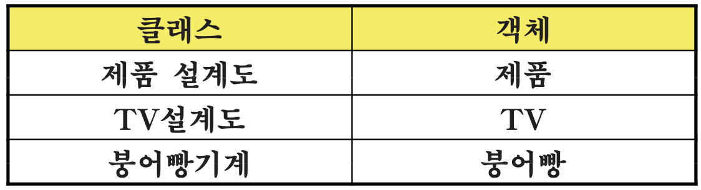

**객체의 구성요소 - 속성과 기능**
- 객체지향의 개념은 실제세계(HW)를 가상세계(SW)에 넣는 것
- 객체 = 속성(변수) + 기능(메서드)
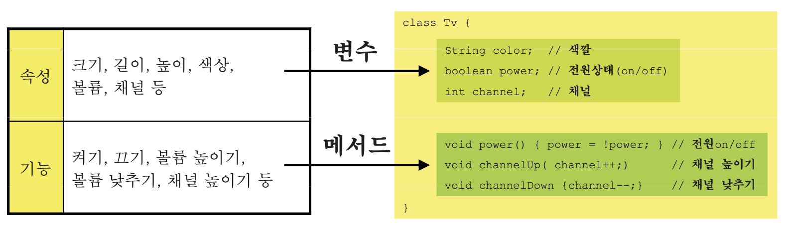

**객체와 인스턴스**
- 객체 : 모든 인스턴스를 대표하는 일반적 용어
- 인스턴스 : 특정 클래스로부터 생성된 객체(예: Tv 인스턴스)  
  
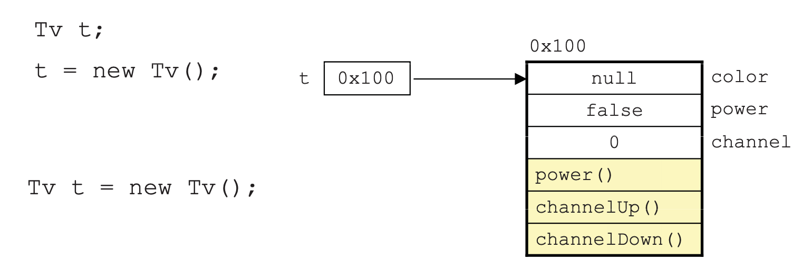

**클래스와 객체 Q&A**
Q. 클래스가 필요한 이유 - A. 객체를 생성하기 위해  
Q. 객체가 필요한 이유 - A. 사용하기 위해서  
Q. 객체를 사용한다는 것은? - A. 객체가 가진 속성과 기능을 사용하는 것  

**하나의 소스파일에 여러 클래스 작성** 
- 불가능하지 않으나, 가능하면 하나의 소스파일에는 하나의 클래스만 작성하는 것이 바람직
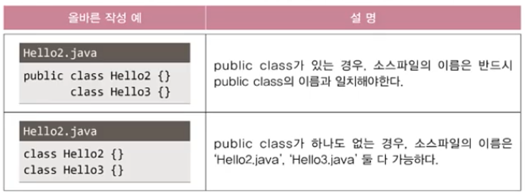  
  

**객체의 생성과 사용**
- 클래스를 작성하고, 객체의 생성 후,사용
- 클래스명 변수명; -> 클래스의 객체를 참조하기 위한 참조변수를 선언
- 변수명 = new 클래스명(); -> 클래스의 객체를 생성 후, 객체의 주소를 참조변수에 저장
- 하나의 인스턴스를 여러 개의 참조변수가 가리키는 경우는 가능
- 여러 인스턴스를 하나의 참조변수가 가리키는 경우는 불가능
```
// 1. 클래스 작성

class Tv {
	String color;  // 변수(색깔)
	boolean power; // 변수(전원상태)
	int channel;   // 변수(채널)

	void power() {power = !power;}  // 메서드(전원)
	void channerlUp() {channer++;}  // 메서드(채널+)
	void channelDown() {channel--;} // 메서드(채널-)
}

// 2. 객체의 생성
Tv t;                   // 'Tv클래스 타입'의 참조변수 t를 선언
t = new Tv();           // Tv인스턴스를 생성한 후, 생성된 Tv인스턴스의 주소를 t에 저장

// 3. 객체의 사용
t.channel = 7;          // Tv인스턴스의 멤버변수 Channel의 값을 7로 한다.
t.channelDown();        // Tv인스턴스의 메서드 ChannelDown()을 호출한다.
System.out.println("현재 채널은 " + t.channel + "입니다.");
```

**객체 배열**
- 객체 배열 == 참조변수의  배열
- 참조변수의 배열만 생성하고 객체를 생성하지 않는 경우가 많다. 주의할 것.
```
Tv[] tvArr = new Tv[3]; // 길이가 3인 Tv 타입의 참조변수 배열 생성

// 객체를 생성해서 배열의 각 요소에 저장★★
tvArr[0] = new Tv();
tvArr[1] = new Tv();
tvArr[2] = new Tv();
```

**클래스의 정의**
- 클래스의 3가지 정의(기능)
	1. 설계도
	2. 서로 관련된 데이터와 함수의 결합 
	3. 사용자가 직접 정의한 타입

- 클래스 == 데이터 + 함수  
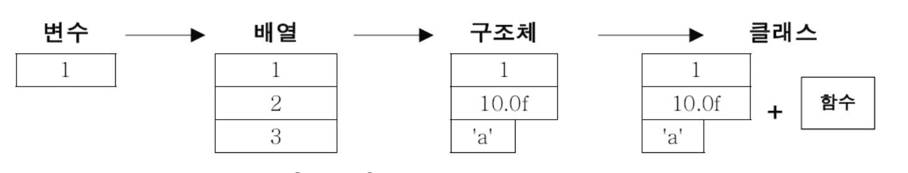  
> 변수 : 하나의 데이터를 저장할 수 있는 공간
> 배열 : 같은 종류의 여러 데이터를 하나로 저장할 수 있는 공간
> 구조체 : 서로 관련된 여러 데이터(종류 관계X)를 하나로 저장할 수 있는 공간
> 클래스 : 데이터와 함수의 결합(구조체 + 함수)

- 사용자 정의 타입(User-defined type)
	- 프로그래머가 직접 새로운 타입을 정의할 수 있음
	- 서로 관련된 값을 묶어서 하나의 타입으로 정의
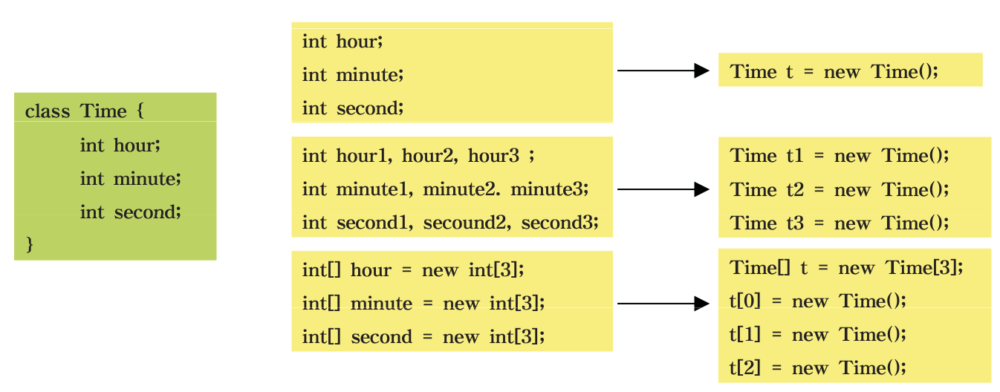

**선언위치에 따른 변수의 종류**
- 클래스 영역 
	- 클래스 변수(CV:class variable) : 아무때나 사용 가능. 객체 생성 필요 없음
	- 인스턴스 변수(IV:instance variable) : 인스턴스와 함께 생성, 소멸. 객체 생성 필요
- 클래스 영역 이외의 영역(메서드 생성자, 초기화 블럭 내부)
	- 지역 변수(LV:local variable) : 변수 선언문 수행 시 생성, 종료 시 소멸 
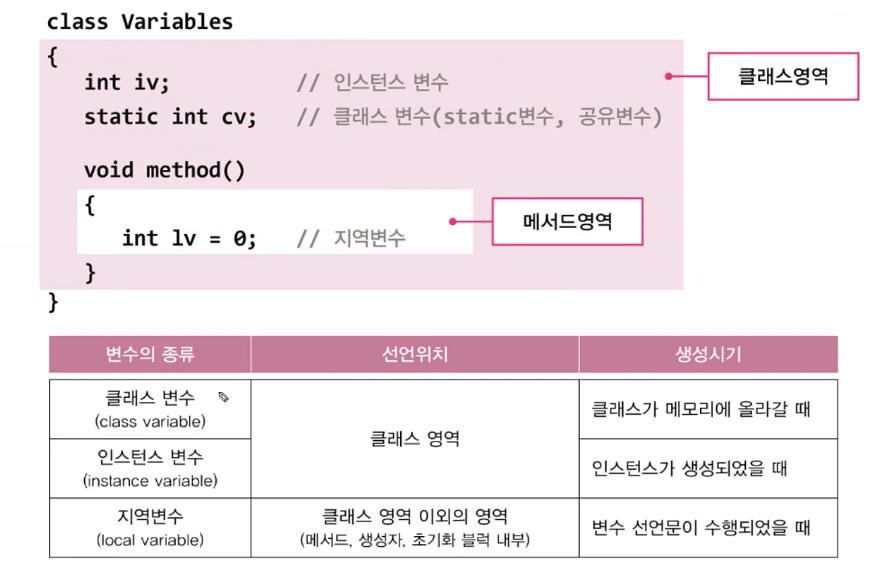

**클래스 변수와 인스턴스 변수**
- 클래스 변수
	- 공통 속성을 표현할 때 사용, 변수 정의 시 앞에 'static'을 붙임
	- 모든 인스턴스가 하나의 저장공간을 공유
- 인스턴스 변수
	- 개별 속성을 표현할 때 사용
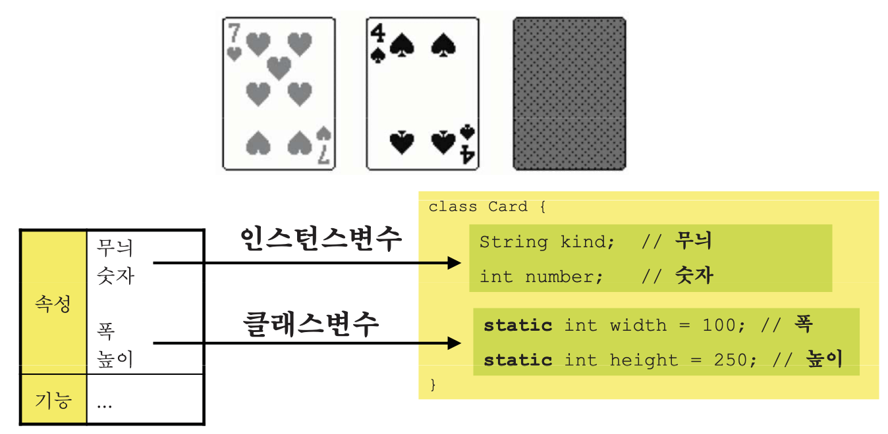

**메서드(Method)**
- 특정 작업을 수행하는 일련의 문장들을 묶어놓은 것
- 함수와 기능적으로 유사(거의 같음)하다. 
	- 메서드 : 클래스 안에 있어야함, 함수 : 클래스에 독립적
- 값을 입력 받아서 처리하고, 결과를 반환(출력)
- 메서드는 선언부와 구현부로 이루어짐  
	- 선언부 : 반환타입, 메서드이름, 입력 변수
	- 구현부 : 메서드 호출 시 수행될 코드
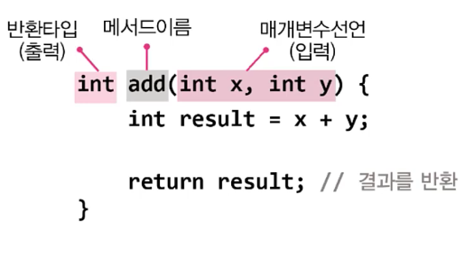  
- 메서드의 장점
	- 코드의 중복을 줄일 수 있다.
	- 코드의 관리가 쉽다.
	- 코드를 재사용할 수 있다.
	- 코드가 간결하여 이해하기 쉬워진다.
- 메서드 작성 시 참고사항
	- 메서드는 클래스 영역에만 정의 가능
	- 반복적으로 수행되는 여러 문장을 메서드로 작성
	- 하나의 메서드는 한 가지 기능만 수행하도록 작성
	- 반환값은 0~1개(여러개의 출력값은 배열 혹은 객체 이용)
	- 반환값이 없는 경우 반환 타입에 'void'라고 입력

**메서드 호출, 반환**
- 메서드이름(); -> 입력값이 없는 경우
- 메서드이름(값1, 값2, ...); -> 입력값이 있는 경우
```
print99danAll(); // void print99danAll()을 호출
int result = add(3, 5); // int add(int x, int y)를 호출하고, 결과(반환값)를 result에 저장
```
- return 문
	- 실행 중인 메서드를 종료하고 **메서드를 호출한 곳**으로 되돌아 감
	- 반환 타입이 **void 인 경우** 생략 가능
	- 조건문과 사용하는 경우 조건식이 참일 때(반환 가능할 때)만 실행됨
	- 반환값은 지정된 메서드 반환 타입과 타입이 일치해야 함(혹은 자동형변환 가능)

**호출 스택(Call Stack)**
- 스택(Stack) : 밑이 막힌 상자. 위에 차곡차곡 쌓인다.
- 메서드가 호출되면 수행에 필요한 만큼의 메모리를 스택에 할당받는다.
- 메서드가 수행을 마치고나면 사용했던 메모리를 반환하고 스택에서 제거된다.
- 호출스택의 제일 위에 있는 메서드가 현재 실행 중인 메서드이다.
- 아래에 있는 메서드가 바로 위의 메서드를 호출한 메서드이다.
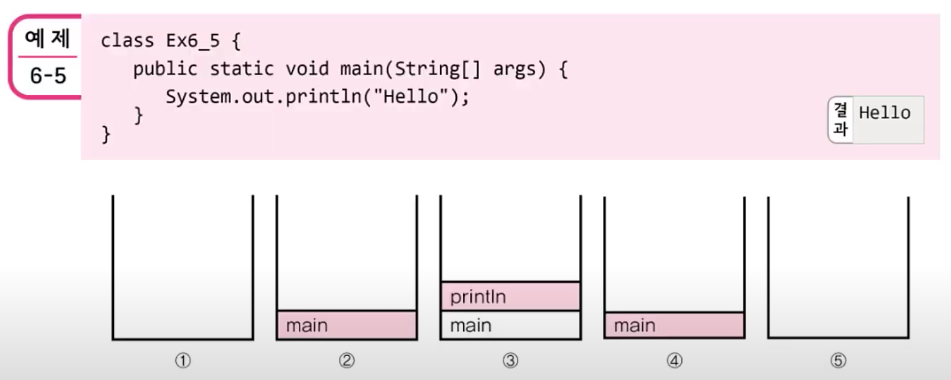
 

**기본형, 참조형 매개변수**
- 기본형 매개변수 : 변수의 값을 읽기만 할 수 있음(read only)
- 참조형 매개변수 : 변수의 값을 읽고 변경할 수 있음(read & write)
```
// 기본형 매개변수 예제

class Data{ int x; }

public class Ex6_6{

	public static void main(String[] args) {
		Data d = new Data();
		d.x = 10;
		System.out.println("main() : x = " + d.x);
		
		change(d.x);

		System.out.println("After change(d.x)");
		System.out.println("main() : x = " + d.x);
	}
	
	static void change(int x) { // 기본형 매개변수
		x = 1000;
		System.out.println("chang() : x = " + x);
	}
}
```
```
// 참조형 매개변수 예제

class Data2 { int x;}

public class Ex6_7 {
	public static void main(String[] args) {
		Data2 d = new Data2();
		d.x = 10;
		System.out.println("main() : x = " + d.x);
		
		change(d);

		System.out.println("after change(d)");
		System.out.println("main() : x = " + d.x);
		
	}

	static void change(Data2 a) { //참조형 매개변수(객체의 리모컨(객체 참조 주소)을 한꺼번에 넘겨 받음)
		a.x = 1000;
		System.out.println("change() : x = " + a.x);
	}
	
}
```
```
// 참조형 반환타입 예제
class Data3 {int x;}

public class Ex6_8 {
	
	public static void main(String[] args) {
		
		Data3 d = new Data3();
		d.x = 10;
		d.y = 100;
		
		Data3 d2 = copy(d); // copy(d)에서 반환된 객체를 d2에 저장
		
		System.out.println("d.x = " + d.x);
		System.out.println("d.y = " + d.y);
		System.out.println("d2.x = " + d2.x);
		System.out.println("d2.y = " + d2.y);
		
	}

	static Data3 copy(Data3 a) { // 참조형 반환타입 'Data3'
		
		Data3 tmp = new Data3(); // 새로운 객체 생성(매개형태)
		
		tmp = a; // 새로운 객체에 입력된 객체를 복사한다.
		
		return tmp; // 객체의 주소를 반환
	}
}
```

**static 메서드와 인스턴스 메서드**
- 인스턴스 메서드
	- 인스턴스 생성 후, '참조변수.메서드이름()'으로 호출
	- 인스턴스 멤버(IV(instance variable), IM(instance method))와 관련된 작업을 하는 메서드
	- 메서드 내에서 인스턴스 변수 사용 가능
- static 메서드(클래스 메서드)
	- 객체 생성 없이 '클래스이름.메서드이름()'으로 호출
	- 인스턴스 멤버(IV, IM)와 관련없는 작업을 하는 메서드
	- 메서드 내에서 인스턴스 변수 사용 불가 
```
class MyMath2 {
	long a, b;
	
	// 인스턴스 변수 a, b만을 이용해서 작업하므로 매개변수가 필요 없음(매개변수를 활용할 수도 있음)
	long add() {return a + b;} // a, b는 인스턴스 변수
	long diff() {return a - b;}
	long mult() { return a * b;}
	double div() {return a / b;}
	
	// 인스턴스 변수와 관계없이 매개변수만으로 작업이 가능
	static long add(long c, long d) {return c + d;} // a, b는 지역변수 
	static long diff(long c, long d) {return c - d;}
	static long mult(long c, long d) {return c * d;}
	static double div(long c, long d) {return c / d;}
	
}

public class Ex6_9 {
	public static void main(String[] args) {
		// 클래스 메서드 호출. 인스턴스 생성없이 호출 가능
		System.out.println(MyMath2.add(200L,100L));
		System.out.println(MyMath2.diff(200l, 100l));
		System.out.println(MyMath2.mult(200l, 100l));
		System.out.println(MyMath2.div(200L, 100L));
		
		MyMath2 mm = new MyMath2(); // 인스턴스를 생성
		mm.a = 100L;
		mm.b = 200L;
		// 인스턴스 메서드는 객체생성 후에만 호출이 가능
		System.out.println(mm.add());
		System.out.println(mm.diff());
		System.out.println(mm.mult());
		System.out.println(mm.div());
	}
}
```

**static을 언제 붙여야 할까?**
- 속성(멤버 변수) 중에서 **공통 속성**에 static을 붙인다.
- 클래스 변수(static 변수)는 인스턴스를 생성하지 않아도 사용할 수 있다.
- 클래스 메서드(static 메서드)는 인스턴스 변수를 사용할 수 없다.
- 메서드 내에서 인스턴스 변수를 사용하지 않는다면, static을 붙이는 것을 고려한다.

**메서드 간의 호출과 참조**
- 같은 클래스에 속한 멤버들 간에는 별도의 인스턴스를 생성하지 않고도 서로 참조 또는 호출 가능
- 단, 클래스 멤버가 인스턴스 멤버를 참조 또는 호출하고자 하는 경우 인스턴스 생성해야 함
- 인스턴스 멤버가 존재하는 시점에 클래스 멤버는 항상 존재하지만, 반대의 경우는 그렇지 않기 때문  
```
class TestClass {
	void instanceMethod() {} // 인스턴스 메서드
	static void staticMathod() {} // static 메서드

	void instanceMethod2() { // 인스턴스 메서드 
		instanceMethod(); // 다른 인스턴스 메서드를 호출한다.
		staticMethod(); // static 메서드를 호출한다.
	}

	static void staticMethod2() { // static 메서드
		instanceMethod(); // ★에러!!★ 인스턴스 메서드 호출 불가
		staticMethod(); // static 메서드는 호출 가능
	}
}
```   
```
class TestClass2 {
	int iv; // 인스턴스 변수
	static int cv; // 클래스 변수

	void instanceMethod() { // 인스턴스 메서드
		System.out.println(iv); // 인스턴스 변수 사용 가능
		System.out.println(cv); // 클래스 변수 사용 가능
	}

	static void staticMethod() { // 클래스 메서드
		System.out.println(iv); // ★에러!!★ 인스턴스 변수 사용 불가
		System.out.println(cv); // 클래서 변수는 사용 가능
	}
}
```

**오버로딩(overloading)**
- 한 클래스 안에 같은 이름의 메서드 여러 개를 정의하는 것
- 자료형에 따라 발생하는 에러를 방지하기 위해 동일 명령을 입력값의 자료형을 다양하게 하여 여러개 생성
- 오버로딩이 성립하기 위한 조건(모두 만족해야 함)
	- 메서드 이름이 같아야 한다.
	- 매개변수의 개수 또는 타입이 달라야 한다.
	- 반환 타입은 영향없다.
```
public class Ex6_10 {
	public static void main(String[] args) {
		
		MyMath3 mm = new MyMath3();
		
		System.out.println("mm.add(3,3)의 결과 : " + mm.add(3, 3));
		System.out.println("mm.add(3,3L)의 결과 : " + mm.add(3, 3L));
		System.out.println("mm.add(3L,3)의 결과 : " + mm.add(3L, 3));
		System.out.println("mm.add(3L,3L)의 결과 : " + mm.add(3L, 3L));
		
		int[] a = {100, 200, 300};
		
		System.out.println("mm.add(int[] a)의 결과 : " + mm.add(a));
		
	}
}

// 오버로딩의 올바른 예 - 매개변수는 다르지만 같은 의미의 기능 수행
class MyMath3 {
	int add(int a, int b) {
		System.out.print("int add(int a, int b) - ");
		return a + b;
	}

	long add(int a, long b) {
		System.out.print("int add(int a, long b) - ");
		return a + b;
	}
	
	long add(long a, int b) {
		System.out.print("int add(long a, int b) - ");
		return a + b;
	}
	
	long add(long a, long b) {
		System.out.print("long add(long a, long b) - ");
		return a + b;
	}

	int add(int[] a) {
		System.out.print("int add(int[] a) - ");
		int result = 0;
		for(int i = 0; i < a.length; i++) {
			result += a[i];
		}
		return result;
	}
}
```

**생성자(Constructor)**
- 인스턴스가 생성될 때마다 호출되는 '인스턴스 초기화 메서드'


