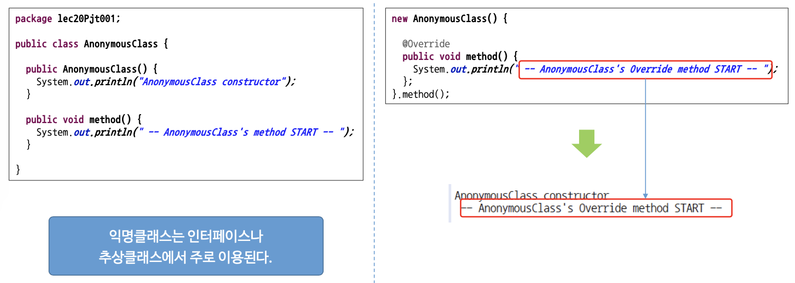

## 인프런 - 자바 프로그래밍 입문 강좌 정리
항해99 자바 스터디 공부 내용을 정리해봅니다.  
- 2배속으로 들어도 충분한 속도인 듯 합니다.
- 필요한 부분이 모두 다를 수 있어 어떤 내용을 포함하고 있는지 적어보았습니다.
- 은진님 말씀대로 실습은 직접 해보지는 않았고, 대신 해당 코드에서 필요해 보이는 부분의 기능만 눈여겨 보았습니다.(ex. Scanner, 'switch,case,**default'** 등)

## 목차
[0장 오리엔테이션](#0장-오리엔테이션)  
[1장 JAVA 기초 문법](#1장-JAVA-기초-문법)  
[2장 Java 객체](####2장-Java-객체)   
[3장 JAVA 상속 및 클래스](#3장-JAVA-상속-및-클래스)  

### 0장 오리엔테이션
- (0 ~ 20분) 자바 배경지식에 대해 공부하고 싶으신 분은 들으셔도 좋을 거 같습니다.
    - ※ 역사 말고 구동 원리는 1단원에 더 자세히 다룹니다.
- (~끝) JDK, eclipse 설치 및 Hello World 출력 진행합니다.

### 1장 JAVA 기초 문법
0~1장에서는 기본자료형, 특수문자와 서식문자, 연산자(증감, 삼항), 배열과 메모리 등의 강의가 좋았습니다.  
조건문, 반복문은 알고리즘 주차까지 많이 사용하여 형식만 파악하면 큰 무리는 없는 것 같습니다.  
- Java 프로그램의 실행 구조
    - 맨 뒤에 2분 정도 중요 내용 짚어줍니다. 먼저 보시고 이해가 잘 안된다 하시면 앞에 과정을 보시는 것도 좋을 듯 합니다.
- 변수
    - (0~9분) 변수 선언과 초기화에 대해 설명, 실습 합니다.
    - (~13분) 메모리 할당과 진법에 대해 설명합니다.(컴퓨터에 2진법으로 저장된다는 거)
    - (~16분) 변수에 저장된 데이터를 변경해봅니다.(i = 10 , i = 20, i = 30, i = 0)
    - ('~끝) 변수는 원하는 값을 상징적인 데이터로 만들어놓고 가져다 쓰기 위해 사용한다.' 가 요점
- 기본자료형
    - (0~7분) 기본자료형과 객체자료형(참조자료형)의 정의
    - (~13분) 기본자료형_정수형(byte,**char**,short,**int**,long),실수형(float,**double**),논리형(**boolean**)
    - (~15분) **문자열(String)은 객체자료형**
    - (~20분) 실습
    - (~끝) **형 변환_자동(묵시적) 형변환, 명시적 형변환**
- 특수 문자와 서식 문자
    - (0~6분) 특수 문자
      
    - (~9분) 주석_ 한 줄 // , 범위 /* */
    - (~끝) 서식 문자와 자리수 지정
      
      
- 연산자
    - 단항 연산자, 이항 연산자, 삼항 연산자에 대해 다룹니다.
      
- 배열
    - (0~3분) 배열에 대한 설명
    - (~12분) 배열의 선언과 초기화 설명/실습, java에서는 배열의 크기를 선언하면 이후 크기 변경 불가하다.
       
    - (~끝) 실습_배열, **Scanner 사용**
- 배열과 메모리
    - (0~5.5분) 배열과 그를 가리키는 주소에 메모리가 할당되는 원리를 설명합니다.
    - (~11분) 배열의 기본속성_★배열은 변수에 그 **주소(레퍼런스)**가 저장된다.★
    - (~끝) 다차원 배열에 대한 설명_2차원 배열까지만 많이 사용한다.
- 조건문
    - (0~12분) if 문에 대해 다룹니다.(if,else if,else)
    - (~끝) switch문에 대해 다룹니다.(switch, case, default)
    
- 반복문
    - (0~4분) 반복문에 대한 설명
    - (~9분) for 문 설명/실습
    - (~11분) while 문 설명
    - (~끝) **do ~ while 문 :** '일단 한 번은 실행하고 while문을 돌린다.'

### 2장 Java 객체
2장은 모두 필요한 개념이라는 생각이 들었습니다.  
- 객체 지향 프로그래밍이란 - java에 특정하지 않고 객체 지향 프로그래밍 개념에 대해 설명합니다.
    - (0~9분) 객체에 대해 설명합니다. 거창하지 않게 '객체는 존재하는 모든 것이다.' 하시는 강사님의 자세가 인상 깊네요.
    - (~16분) 클래스에 대해 설명합니다. 객체 생성에는 무조건 클래스가 필요합니다.
    - (~끝) 클래스의 구성요소인 속성(멤버 변수)와 기능(메서드)에 대해 설명합니다.
    - ※ 19분 경 부터 말씀하시는 객체 속성의 모듈화는 중요한 개념이라는 생각이 드네요.
- 클래스 제작과 객체 생성
    - (0~10분) 클래스 제작 설명. 멤버 변수, 메서드, **생성자**
    - (~17분) 위와 동일한 내용 실습.
    - (~22분) 객체 생성에 대한 설명. **new 연산자가 메모리에 객체(인스턴스)를 생성합니다.**
    - (~25분) 위와 동일한 내용 실습
    - (~끝) **생성자**의 원리에 대해 알 수 있습니다.
- 메서드
    - (0~12분) 메서드 선언 및 정의, 호출에 대한 설명/실습
    - (~16분) 매개 변수에 대해 설명합니다.
    - (~18분) 중복 메서드(overloading)에 대해 설명합니다.
    - (~끝) 접근자 public, private 에 대해 설명합니다. 이 외에도 protected, (default) 가 있습니다. 아무런 접근자도 붙이지 않은 경우 default 가 적용되어 괄호 표시 하였습니다.
      
- 객체와 메모리
    - (0~7분) 메모리에 객체를 생성하는 과정과 GC(Garbage Collector)에 의해 제거되는 과정을 설명합니다.
    - (~12분) 레퍼런스(가리킨다) 에 대해 설명/실습 합니다.
    - (~끝) null 과 NullPointerException 에 대해 설명합니다. 알고리즘 기간 linkedlist를 구현 시 pop, remove 기능에서 null을 지정하거나 node를 가리키지 않게 하는 작업을 떠올렸습니다.
- **생성자와 소멸자 그리고 this 키워드**
    - (0~5.5분) 디폴트 생성자(기본 생성자)에 대해 설명합니다. 기본 생성자('객체명()' 형태)는 자동으로 생성됩니다. 그렇지만, **직접 다른 형태의 생성자를 정의(오버로딩)할 경우, 기본 생성자는 자동 생성되지 않습니다.**
    - (~8.5분) 사용자 정의 생성자에 대해 설명합니다. 앞에서 배운 오버로딩을 사용합니다.
    - (~14분) 소멸자에 대해 설명합니다. gc가 알아서 관리해주기 때문에 신경쓸 일이 거의 없을 듯 합니다.
    - (~끝) this 키워드에 대해 설명합니다.
- 패키지와 static
    - (0~20분) 패키지에 대해 설명합니다. 정의, 이름 결정 요령, import 등(은진님 발표하신 내용도 나오네요^^)
    - (~끝) static에 대해 설명합니다. 일반적으로 생각하는 전역변수에 대해 떠올리면 이해하기 쉬울 것 같습니다. 포함된 실습은 static을 자주 사용하면 좋지 않은 점에 대해 생각하며 보면 좋을 듯 합니다.
- 데이터 은닉 (객체지향개념에서 '**캡슐화(encapsulation)**'에 해당하는 내용이라고 합니다.)
    - (0~7분) 멤버 변수를 private으로 설정하는 것에 대해 설명합니다. 저번주 주특기 기초 강의가 떠오르네요.
    - () setter, getter 에 대해 설명합니다. 우리가 스프링에서 @Getter, @Setter 로 생략했던 setter, getter 메서드에 대해 자세히 살펴볼 수 있습니다. 스프링 공부하다보면 무척 많이 등장하는 듯하여 잘 알아두면 좋을 것 같습니다.

### 3장 JAVA 상속 및 클래스
- 상속
    - (0~5분) 부모 클래스를 상속받은 자식 클래스는 부모 클래스의 속성과 기능도 이용할 수 있다. 상위 클래스의 속성과 기능을 따로 정의하지 않아도 내 것 처럼 사용할 수 있다.
    - (~9분) 상속의 필요성 : 기존의 검증된 class를 이용해 빠르고 쉽게 새로운 class를 만들 수 있다.
    - (~19분) 상속 방법 : extends 키워드를 이용해 상속 구현
        - **childClass를 통해 객체를 생성하면 parentClass가 먼저 생성되고 이후 childClass가 생성된다.**
          
        - Java는 **'단일상속'만 가능**하다.
    - (~끝) 자식 클래스는 부모 클래스의 모든 자원을 사용할 수 있지만, **private 접근자의 속성과 메서드는 사용할 수 없다.**
    - ※ 상속관계를 나타낼 때 '다이어그램'을 많이 사용하는데, 이 때 자손클래스가 조상클래스를 화살표로 가리키는 형태로 나타낸다.
- 상속 특징
    - (0~7분) 메서드 오버라이드(override)
        - 부모 클래스의 기능을 자식 클래스에서 **'재정의'**해서 사용한다.
          
    - (~15분) 자료형(타입) : **클래스도 자료형이다. 부모 클래스를 데이터 타입으로하여 자손 클래스들을 생성하거나 불러올 수 있다.**
    - (~17분) Object 클래스 : 모든 클래스의 최상위 클래스는 Object 클래스이다.
    - (~끝) super 클래스 : 상위 클래스를 호출할 때 super 키워드를 이용한다.
      
- 내부 클래스와 익명 클래스
    - (0~7분) 내부(inner) 클래스
        - 클래스 안에 또 다른 클래스를 선언하는 것으로 이렇게 하면 두 클래스의 멤버에 쉽게 접근할 수 있다.
        - 로직이 복잡해져 실무에서 많이 사용되지는 않는다.
    - (~끝) 익명(anonymous) 클래스
        - 이름이 없는 클래스로 주로 메서드를 재정의하는 목적으로 사용된다.
          
        - 인터페이스나 추상클래스에 주로 사용되는 방식
- **인터페이스(Interface)**
    - (0~5분) 인터페이스란?
        - 클래스와 달리 객체를 생성할 수는 없으며, 클래스에서 구현해야 하는 **작업 명세서**이다.
          
    - (~18.5분) 인터페이스 사용이유 및 구현
        - 인터페이스 사용 이유는 많지만, 가장 큰 이유는 **다양한 자료형(타입)을 가질 수 있기 때문**이다.
        - class 대신 interface 키워드를 사용하며, extends 대신 implements 키워드를 이용한다. 구현 시 구현하는 **인터페이스의 모든 메서드는 재정의(override)가 필요**하다.
        - 인터페이스의 경우 다형성(다중 구현)을 지원한다.
          
        - **객체 생성 시 어떤 인터페이스를 타입으로 정의하느냐에 따라 사용할 수 있는 메서드도 있고, 사용 불가한 메서드도 있다.**
    - (~끝) 장난감 인터페이스 : Interface를 이용하면 객체가 다양한 자료형(타입)을 가질 수 있다. 스타크래프트 유닛들로 예시를 들은 경우도 보았었습니다.^^
        - Toy는 모두 움직인다 'move()'. 그러나 Toy의 종류 별로 다르게 움직인다.
- 추상클래스
    - 추상클래스란? **추상메서드를 가진 클래스.** 클래스의 공통된 부분을 뽑아 별도의 클래스(추상클래스)로 만들어 놓고, 이것을 상속해서 사용한다. 
    - (~4분) 추상 클래스(abstract class)의 특징
        - 멤버변수를 가진다.
        - abstract 클래스를 상속하기 위해서는 extends를 이용한다.
        - abstract 메서드를 가지며, **상속한 클래스에서 반드시 구현해야한다.**
        - 일반 메서드도 가질 수 있다.
        - 일반 클래스와 마찬가지로 생성자도 있다.
    - (~15분) 2가지 실습
    - (~끝) 인터페이스 vs 추상클래스
      
- 람다식 : 함수 지향 프로그래밍 방법. 요즘들어 인기를 얻고 있다?
    - 람다식이란? 익명 함수(anonymous function)를 이용해서 익명 객체를 생성하기 위한 식이다.
      
```
package lec23Pjt001;
public interface LambdaInterface1 {
	public void method(String s1, String s2, String s3);
}
```
```
package lec23Pjt001;
public interface LambdaInterface2 {
	public void method(String s1);
}
```
```
package lec23Pjt001;
public interface LambdaInterface3 {
	public void method();
}
```
```
package lec23Pjt001;
public interface LambdaInterface4 {
	public int method(int x, int y);
}
```
```
package lec23Pjt001;

public class MainClass {
	public static void main(String[] args) {
		// 매개변수와 실행문만으로 작성한다.(접근자, 반환형, return 키워드 생략)
		LambdaInterface1 li1 = (String s1, String s2, String s3) -> { System.out.println(s1 + " " + s2 + " " + s3); };
		li1.method("Hello", "java", "World"); // Hello java World
		// 매개변수가 1개이거나 타입이 같을 때, 타입을 생략할 수 있다.
		LambdaInterface2 li2 = (s1) -> { System.out.println(s1); }; 
		li2.method("Hello"); // Hello
		// 실행문이 1개일 때, '{}'를 생략할 수 있다.
		LambdaInterface2 li3 = (s1) -> System.out.println(s1); // 
		li3.method("Hello"); // Hello
		// 매개변수와 실행문이 1개일 때, '()'와 '{}'를 생략할 수 있다.
		LambdaInterface2 li4 = s1 -> System.out.println(s1);
		li4.method("Hello"); // Hello
		// 매개변수가 없을 때, '()'만 작성한다.
		LambdaInterface3 li5 = () -> System.out.println("no parameter");
		li5.method(); // no parameter
		// 반환값이 없는 경우
		LambdaInterface4 li6 = (x, y) -> {
			int result = x + y;
			return result;
		};
		System.out.printf("li6.method(10, 20) : %d\n", li6.method(10, 20)); // li6.method(10, 20) : 30
		li6 = (x, y) -> {
			int result = x * y;
			return result;
		};
		System.out.printf("li6.method(10, 20) : %d\n", li6.method(10, 20)); // li6.method(10, 20) : 200
		li6 = (x, y) -> {
			int result = x - y;
			return result;
		};
		System.out.printf("li6.method(10, 20) : %d\n", li6.method(10, 20)); // li6.method(10, 20) : -10
	}
}
```
- 문자열 클래스 : 설명(0~11분), 실습(~끝)
    - String 객체와 메모리 : 문자열을 다루는 String 클래스(객체)는 데이터가 변하면 메모리 상의 변화가 많아 속도가 느리다.
      
    - StringBuffer, StringBuilder : String 클래스의 단점을 보완한 클래스로 데이터가 변경되면 메모리에서 기존 객체를 재활용한다.
      
- Collections
    - List : List는 인터페이스로 이를 구현한 클래스는 인덱스를 이용해서 데이터를 관리한다. ArrayList가 가장 많이 사용된다.
      
    - Map : Map은 인터페이스로 이를 구현한 클래스는 key를 이용해서 데이터를 관리한다. HashMap 으로 구현해 많이 사용된다.
      

    
