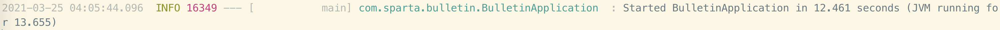
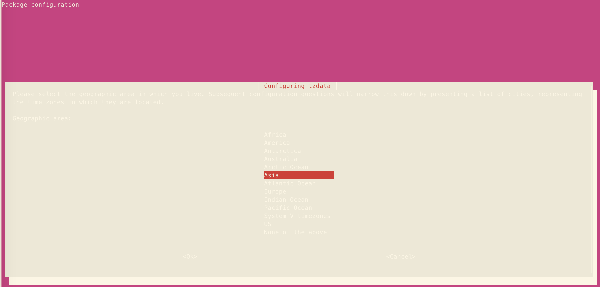
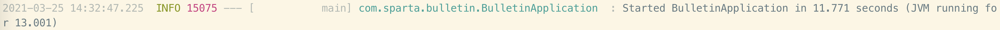

## ubuntu 에서 timezone 확인/수정하기
**항해99 천재승님께서 slack에 질문을 올려주셨다.**  
**내용은 Java Spring을 통해 구현한 CRUD 게시판이 AWS EC2서버에서 작성할 때와 로컬서버에서 작성할 때가 작성시간이 다르다는 것이었다.**  
**흥미로운 주제라 알아보고 정리해본다.**  

### 문제 : 서버에서 jar 파일을 돌릴 시 시간이 다르게 작동한다.
- EC2서버에서 실행할 때와 로컬서버에서 실행할 때의 시간이 다르다.
1. EC2 linux 서버 실행(약 9시간 빠르다.)  
  
2. 로컬 서버 실행(한 시간 정도 뒤에 글쓰려고 찍은거라 10시간 차이가 난다^^;)
  

### 들어가기 전에..
- 이것저것 찾아보다 알게된 배경지식이다. 해당 문제를 해결하기 위해 필요한 지식이라 적어놓았다.
- JDK 1.8 부터 java.time 패키지가 추가되었다고 한다. 사실 이전부터 쓰였다는 Calendar, Date 클래스와의 명확한 차이까지는 모르겠고, 더 좋은 패키지라고 한다. 해서, 앞으로는 java.time 패키지를 사용할 것이라는 점과 이전부터 계속 사용되고 있던 Calendar, Date 로 변환이 가능하다는 점만 알아두고 넘어가겠다.
- Java의 `java.time 패키지`의 `LocalDateTime 클래스`는 파일이 돌아가는 컴퓨터에 저장된 `timezone`을 읽어 현재시간을 반환한다.

### ubuntu로 timezone 확인하기
- 아마도 내 EC2 서버의 timezone이 한국으로 안되어있는 것 같다. timezone을 확인해보자.

1. `timedatectl` 명령어 사용하기  
  
**입력**  
```
ubuntu@ip-000:~$ timedatectl
```  
**출력**  
```
                      Local time: Thu 2021-03-25 13:46:10 KST
                  Universal time: Thu 2021-03-25 04:46:10 UTC
                        RTC time: Thu 2021-03-25 04:46:11
                       Time zone: Asia/Seoul (KST, +0900)
       System clock synchronized: yes
systemd-timesyncd.service active: yes
                 RTC in local TZ: no
```

2. `cat /etc/timezone` 명령어 사용하기  
  
**입력**  
```
ubuntu@ip-000:~$ cat /etc/timezone
```  
**출력**  
```
Etc/UTC
```

3. `ls -l /etc/localtime` 명령어 사용하기  
  
**입력**  
```
ubuntu@ip-000:~$ ls -l /etc/localtime
```  
**출력**  
```
lrwxrwxrwx 1 root root 30 Mar 25 13:42 /etc/localtime -> /usr/share/zoneinfo/Asia/Seoul
```

- 이상하다. timezone이 어떤 것은 Asia/Seoul 이고 어떤 것은 Etc/UTC 이다.. 
- 일단, java 파일 실행 시 etc/UTC 를 읽어서 시간이 달리 표현되는 것 같다. 구글링을 통해 /etc/timezone 을 바꿔보자.

### ubuntu로 timezone 변경하기
1. `sudo dpkg-reconfigure tzdata` 로 timezone 데이터를 변경하기
    - 이거 좀 신기하다.. linux 내장 패키지 같은데 아래와 같은 화면에서 대륙과 도시를 선택해 /etc/timezone 정보를 변경할 수 있다.
  

2. `sudo timedatectl set-timezone your_time_zone` 을 통해 변경하기
    - 위에서 `timedatectl`로 볼 수 있었던 정보들을 수정하는 방법이다.
    - 이 방법으로는 /etc/timezone 은 바꿀 수는 없었다.  
  
**입력**  
```
sudo timedatectl set-timezone Africa/Lagos
```  
**출력**  
```  
                      Local time: Thu 2021-03-25 06:25:31 WAT
                  Universal time: Thu 2021-03-25 05:25:31 UTC
                        RTC time: Thu 2021-03-25 05:25:32
                       Time zone: Africa/Lagos (WAT, +0100) //아프리카로 바뀐 것을 볼 수 있다.
       System clock synchronized: yes
systemd-timesyncd.service active: yes
                 RTC in local TZ: no
```

### 결론
- AWS에서 제공하는 linux 서버에는 2가지 파일 형태(`timedatectl`와 `/etc/timezone`로 확인할 수 있는) timezone이 존재한다.
- java.time 패키지 안에 `LocalDateTime`클래스는 `/etc/timezone`의 `timezone`을 읽어 `now()` 메서드의 반환값을 만든다.
- 위 1번 방법의 영향으로 jar 파일 실행 시 timezone을 제대로 인식함을 볼 수 있었다.
  
- 추가로, ubuntu로 시간 조정을 하는 것 외에 java 파일에 timezone을 주입하는 방법이 따로 있는데, 이는 별도로 정리해보자.

### 의문..
- 그럼 내 EC2서버에 local time 시간 설정은 언제된거지??
    - [스파르타코딩클럽](https://spartacodingclub.kr/)에서 python을 이용한 미니프로젝트를 할 때, `initial_ec2.sh`파일을 제공했었다. 프로젝트를 잘 돌릴 수 있게 초기세팅을 해주는 것이었는데, 이 파일이 시간 정보를 변경해준 것이었다.
    - 확인을 위해 EC2에서 서버를 새로 받아 초기 세팅을 다시 해보았는데, 실제로 처음 서버에 접속했을 때는 `timedatectl`을 통해 확인한 값들이 모두 UTC에 맞춰져 있었다. 이후 `initial_ec2.sh` 파일을 돌린 이후에는 KST로 바뀌는 것을 볼 수 있었다.


#### ※ 참고자료
- [Blog-boxcorea '리눅스 timedatectl'](https://blog.boxcorea.com/wp/archives/2839)
- [https://linuxize.com/post/how-to-set-or-change-timezone-on-ubuntu-20-04/](https://linuxize.com/post/how-to-set-or-change-timezone-on-ubuntu-20-04/)
- [블로그 DEOK.ME '리눅스에서 Timezone 변경하기'](https://www.deok.me/entry/Ubuntu-%EC%97%90%EC%84%9C-Timezone-%ED%99%95%EC%9D%B8-%EB%B0%8F-%EB%B3%80%EA%B2%BD%ED%95%98%EA%B8%B0)


