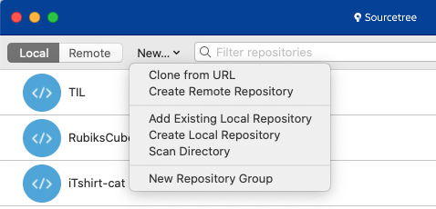

# **git, github 정리**
### **git 그리고 github에 대해 기억할 것들을 기록합니다.**

### **git에 대한 이해**
- git은 바뀌는 부분만이 아니라 변경된 파일 전체를 저장한다.
	- git은 일종의 스냅샷과 같다.
- branch는 '포인터'이다. 포인터가 커밋을 가리키고 있는 것!
- 브랜치 사이를 넘나드는 특수한 포인터는 'HEAD' 이다.
	- 'HEAD' 가 과거의 커밋을 가리키게 하면 그 버전의 data들을 보여준다.

### **git 사용법**
**CLI 명령어**
1. 로컬 저장소
- git init : git 세팅(git 폴더 생성)
- 내 정보 등록(github id, name)
	- git config --global user.email "beadoer1@gmail.com"
	- git config --global user.name "beadoer1"
- git add 파일명 : commit할 파일 선택 -> 소스트리에서 파일 클릭하는 것
- git commit -m "message" : commit('-m'은 message 약자)
- git log : 여태까지 commit 한 log 확인
- git checkout 커밋id : 해당 commit으로 이동(파일이 당시 파일로 변경됨)
- git checkout - : 최신 commit으로 이동
2. 원격 저장소
- git remote add origin https://github.com/beadoer1/gitTest 
	-> 'remote add origin' 이 로컬저장소에 원격저장소 주소를 알려준다.
- git push origin master : 로컬 저잘소의 commit data를 원격 저장소(origin)에 반영시킨다(push)
- git clone https://github.com/beadoer1/gitTest.git .
	- 원격 저장소의 data를 내 폴더(아무 폴더나 가능)  
	- 한 칸 뛰고 '.' 주의 : 안 찍으면 폴더가 저장됨
- git pull origin master 
	- 원격 저장소(origin)에 새로운 commit이 있으면 그걸 내 로컬저장소로 받아온다(pull)

**GUI(소스트리)를 통한 git 관리**
- GUI를 통한 git 관리는 '.git'에 저장된 정보를 시각화하여 관리하는 것!

1. 시작(생성 및 소스트리로 불러오기)
- Clone : 원격저장소를 내 컴퓨터에 받아오고(로컬저장소 자동 생성) 소스트리에도 추가
- Add : 내 컴퓨터에서 이미 만든 로컬저장소를 소스트리에 추가
- Create : 내 컴퓨터의 폴더에 새로운 로컬저장소를 생성(git init)
  

